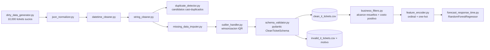

[ 🇺🇸 [Read in English](README.md) ] | [ 🇨🇱 Español ]

# IT Data Wrangling Pipeline


Proyecto de **Ingeniería y Limpieza de Datos Avanzada** aplicado a operaciones de soporte TI/SaaS. Genera un dataset sintético de tickets de soporte con los defectos típicos de datos reales de producción, y lo convierte en un dataset limpio, tipado, validado y listo para ML mediante un pipeline modular de limpieza -- cerrando el ciclo con un modelo de pronóstico baseline real entrenado sobre la propia salida del pipeline.

## Impacto de Negocio e Indicadores Clave (KPIs)

Números de una corrida real (`python -m src.pipeline`, dataset de 10.000 tickets generados por `dirty_data_generator.py`):

| Métrica | Resultado | Qué significa |
|---|---|---|
| Filas procesadas | 9.950 (de 10.000 generadas) | Deduplicación fuzzy de nombres de empresa colapsó filas duplicadas-con-variación antes de la validación |
| Filas válidas tras limpieza | 8.446 (84,9%) | Pasan el esquema `pydantic` completo: tipos, formato de email, vocabulario cerrado, rango plausible de costo |
| Filas inválidas, expuestas para revisión | 1.504 (15,1%), con motivo registrado | Ningún dato se descarta en silencio -- cada fila rechazada lleva su `validation_error` para auditoría |
| Tickets casi-duplicados detectados | 285 pares candidatos | Mismo cliente + categoría, creados minutos aparte, nombre de empresa casi idéntico -- un patrón de doble-envío que el dedup exacto no atrapa |
| Outliers winsorizados | 245 en `cost` (IQR global), 1.398 en `response_time_hours` (IQR por categoría) | Ver el hallazgo honesto sobre IQR vs. datos sesgados más abajo |
| **Modelo de pronóstico (RandomForest) vs. baseline de media** | MAE 20,29h vs. 31,47h (**-35,5%**) | R²=0,380 -- el dataset limpio, filtrado y codificado lleva señal real y aprovechable para un modelo downstream |
| Suite de tests | 37/37 pasando | Cubre los 9 módulos: generación, limpieza, tratamiento de outliers, detección de duplicados, filtrado, codificación, validación |

## Objetivo

Los datos de operaciones TI casi nunca llegan limpios: distintos sistemas de origen escriben fechas en formatos diferentes, los campos de texto libre acumulan typos y duplicados, los montos llegan en el formato de moneda de quien los ingresó, y los payloads JSON de metadata varían de forma libre entre eventos. Este proyecto demuestra un pipeline profesional para llevar ese tipo de datos "sucios" a un esquema limpio, validado y listo para análisis o carga a un data warehouse — separando explícitamente lo que se puede corregir de lo que debe quedar marcado como inválido para revisión humana, en vez de forzar un valor inventado. Va un paso más allá de la limpieza sola: los datos limpios se filtran a un alcance apropiado para modelar, se codifican a features listas para ML, y efectivamente se usan para entrenar y evaluar un modelo de pronóstico real, así que "listo para ML" es una propiedad demostrada, no solo una afirmación.

## Arquitectura del proyecto



```
it-data-wrangling-pipeline/
├── data/
│   ├── raw/                          # messy_it_tickets.csv (generado, no versionado)
│   └── processed/                    # CSVs de limpio/invalido/casi-duplicados (no versionados)
├── notebooks/
│   └── 01_dirty_data_eda.ipynb       # Diagnóstico de los defectos del dataset crudo
├── src/
│   ├── generators/
│   │   └── dirty_data_generator.py   # Genera el dataset sintético sucio (causal: categoria+prioridad -> tiempo de respuesta)
│   ├── cleaners/
│   │   ├── json_normalizer.py        # Aplana JSON anidado de profundidad variable
│   │   ├── datetime_cleaner.py       # Normaliza fechas/timezones a UTC ISO 8601
│   │   ├── string_cleaner.py         # Espacios, monedas, unificación fuzzy de nombres
│   │   ├── missing_data_imputer.py   # Media condicional por categoría / interpolación
│   │   ├── outlier_handler.py        # Winsorización IQR, global y por grupo
│   │   └── duplicate_detector.py     # Detección de tickets casi-duplicados (doble-envío)
│   ├── filters/
│   │   └── business_filters.py       # Filtrado de alcance: tickets resueltos, costo positivo, rango de fechas
│   ├── features/
│   │   └── feature_encoder.py        # Codificación ordinal (prioridad) + one-hot (categoría/estado)
│   ├── models/
│   │   └── forecast_response_time.py # Baseline RandomForest vs. media, MAE/R²/importancia real
│   ├── validators/
│   │   └── schema_validator.py       # Esquema pydantic: separa filas válidas de inválidas
│   └── pipeline.py                   # Orquesta el flujo completo crudo -> limpio -> listo-para-ML
├── tests/                            # Pruebas unitarias (pytest) de cada módulo de arriba
├── requirements.txt
├── LICENSE
├── README.md
└── README.es.md
```

## Dataset sintético

`src/generators/dirty_data_generator.py` produce `data/raw/messy_it_tickets.csv` con 10,000 tickets de soporte (~20 empresas cliente distintas) que incluyen intencionalmente:

- **Fechas y timezones mezclados**: al menos 6 formatos de fecha distintos (ISO, `dd/mm/aaaa`, `mm/dd/aaaa` en 12h, nombre de mes, etc.) combinados con offsets numéricos y abreviaciones de timezone (`UTC`, `Z`, `EST`, `PST`, `CET`).
- **`user_metadata`**: JSON anidado de profundidad variable (0 a 3 niveles), con listas, o vacío/`null`.
- **Typos y duplicados de empresa**: mayúsculas/minúsculas inconsistentes, sufijos legales (`Inc.`, `LLC`, `Corp.`), espacios dobles, sustitución de caracteres, y filas duplicadas-con-variación que representan doble captura del mismo ticket.
- **Monedas mezcladas**: `"$1,200.50"` (formato US), `"1200,50 €"` (formato europeo), código de moneda como sufijo (`"1,050.75 USD"`), y algunos reembolsos negativos.
- **Faltantes inconsistentes**: `NaN` real, strings placeholder (`"null"`, `"N/A"`, `"-"`, `"?"`), y filas completamente vacías simulando exports corruptos.

## Módulos de limpieza (`src/cleaners/`)

| Módulo | Qué hace |
|---|---|
| `json_normalizer.py` | Aplana `user_metadata` a columnas planas (`user_metadata_browser_name`, etc.), tolerando cualquier profundidad y valores nulos/malformados. |
| `datetime_cleaner.py` | Parsea cualquiera de los formatos/timezones del dataset y normaliza a UTC en ISO 8601. Limitación honesta y documentada: sin metadata de locale, una fecha como `"07/09/2024"` es genuinamente ambigua (día/mes vs. mes/día) — se asume un criterio consistente y solo se reintenta con el otro si el primero falla por completo. |
| `string_cleaner.py` | Recorta/colapsa espacios, parsea montos con separador decimal mixto a `float`, normaliza capitalización de campos categóricos, y usa `rapidfuzz` (`fuzz.WRatio` + `utils.default_process`) para colapsar variantes/typos de un mismo nombre de empresa a un valor canónico. |
| `missing_data_imputer.py` | Dos estrategias de imputación numérica: media condicional por categoría (`cost` según `category`) e interpolación lineal respetando orden temporal (`response_time_hours` según `created_at`). |
| `outlier_handler.py` | Winsorización IQR (Tukey) -- global para `cost`, **por categoría** para `response_time_hours` (ver el hallazgo honesto más abajo sobre por qué necesitan tratamiento distinto). |
| `duplicate_detector.py` | Detecta tickets casi-duplicados (mismo `customer_email` + `category`, creados en minutos, `company_name` casi idéntico) -- una firma de doble-envío que `DataFrame.duplicated()` exacto no atrapa porque `ticket_id` siempre difiere y el `company_name` reenviado suele llevar un typo. Marca pares candidatos para revisión; nunca fusiona ni elimina automáticamente. |

Deliberadamente **no** todo faltante se imputa: nombre de empresa, agente o categoría faltante no tiene un valor "correcto" que inventar, así que esas filas quedan expuestas por el validador de esquema en vez de rellenarse con un placeholder silencioso.

## Validación de esquema (`src/validators/schema_validator.py`)

Un modelo `pydantic` (`CleanTicketSchema`) define el contrato de una fila limpia: tipos, formato de email, vocabulario cerrado para `priority`/`status`/`category`, y rango plausible de `cost`. `validate_dataframe()` separa el DataFrame limpio en `(filas_válidas, filas_inválidas)` — esta última con una columna `validation_error` para auditoría, en vez de descartar silenciosamente los problemas que la limpieza automática no pudo resolver con confianza.

## Filtrado de datos (`src/filters/business_filters.py`)

Distinto de la validación de esquema: una fila filtrada no está mal, simplemente está fuera de alcance para un análisis específico. `filter_resolved_tickets()` conserva solo tickets con `resolved_at` real (el `response_time_hours` de un ticket abierto es un placeholder interpolado, no un resultado real -- entrenar un pronóstico sobre eso filtraría valores imputados hacia el target). `filter_positive_cost()` descarta reembolsos (costo negativo, un evento de negocio real y válido, pero un proceso distinto a "costo de resolver un ticket"). `filter_by_date_range()` restringe a una ventana de análisis. `apply_ml_scope_filters()` encadena los dos filtros que efectivamente usa el modelo de pronóstico de abajo.

## Codificación de features (`src/features/feature_encoder.py`)

El paso que convierte un DataFrame validado y filtrado en algo que scikit-learn puede entrenar. `priority` se codifica **ordinal** (`low=0 ... critical=3`) porque la severidad tiene un orden real que un modelo debería ver como continuo; `category`/`status` se codifican **one-hot** porque no tienen orden natural y una codificación ordinal inventaría una relación falsa entre ellas.

## Modelo de pronóstico (`src/models/forecast_response_time.py`)

Un `RandomForestRegressor` baseline real, entrenado sobre la salida limpia → filtrada → codificada, prediciendo `response_time_hours`. Este es el punto de todo el pipeline hecho concreto: no "los datos están listos para ML" como afirmación, sino un modelo entrenado con métricas medidas, fuera de muestra.

`category` y `priority` están **causalmente** ligadas a `response_time_hours` en el generador (`dirty_data_generator.py::_resolution_hours` -- Billing/Account se resuelven rápido, Bug Report/Feature Request son trabajo de ingeniería y tardan más; los tickets Critical se escalan y resuelven más rápido, los Low se postergan), específicamente para que este modelo tenga señal real que recuperar, no ruido que sobreajustar.

| Métrica | Valor |
|---|---|
| Filas de train / test | 5.856 / 1.465 |
| MAE del RandomForest | **20,29h** |
| MAE del baseline de media | 31,47h |
| **Mejora de MAE sobre el baseline** | **35,5%** |
| R² del RandomForest | 0,380 |

**Importancias de features principales**: `priority_encoded` (0,282) y `category_Feature Request`/`Bug Report`/`Technical` (0,193/0,136/0,056 combinadas) dominan -- confirmando que el modelo recuperó la estructura causal realmente inyectada, verificado contra una verdad conocida en vez de solo confiado.

**Dos hallazgos honestos, no suavizados**:
- **`cost` muestra importancia 0,282, casi empatada con `priority`, a pesar de no tener *ningún* vínculo causal con `response_time_hours` en el generador** (`cost` se genera de forma independiente). Es un artefacto conocido de la `feature_importances_` basada en impureza por defecto de scikit-learn, que sesga hacia features continuas de alta cardinalidad incluso cuando no llevan señal real -- documentado aquí en vez de confundido con un driver genuino. Un pase de importancia por permutación o SHAP sería el siguiente paso correcto para confirmar la contribución real (cercana a cero) de `cost`.
- **El IQR por categoría igual winsoriza ~16% de los valores de `response_time_hours`**, más que el ~2,5% de `cost` bajo un único IQR global. Pasar de IQR global a IQR por categoría (ver `outlier_handler.py`) arregló el problema peor (una regla global marcando categorías enteras de escala alta como anómalas), pero dentro de cada categoría el ruido multiplicativo log-normal usado para generar variabilidad realista ticket-a-ticket igual produce una cola derecha más pesada de lo que una regla IQR lineal espera -- una limitación real y documentada de los métodos basados en IQR sobre distribuciones sesgadas, no ajustada para que el número se vea mejor.

## Instalación

```bash
python -m venv .venv
source .venv/bin/activate      # En Windows: .venv\Scripts\activate
pip install -r requirements.txt
```

## Uso

Generar el dataset sucio:

```bash
python -m src.generators.dirty_data_generator
```

Ejecutar el pipeline completo de limpieza:

```bash
python -m src.pipeline
```

Descarga/genera nada por sí mismo — lee `data/raw/messy_it_tickets.csv`, aplica todos los cleaners en orden (incluida detección de casi-duplicados y winsorización de outliers), imputa lo que se puede imputar con criterio, valida el esquema resultante, e imprime un resumen. Escribe `data/processed/clean_it_tickets.csv` (filas válidas), `data/processed/invalid_it_tickets.csv` (filas rechazadas, con el motivo), y `data/processed/near_duplicate_candidates.csv` (pares candidatos a doble-envío).

Entrenar y evaluar el modelo de pronóstico baseline (necesita `clean_it_tickets.csv`, es decir, correr primero el pipeline):

```bash
python -m src.models.forecast_response_time
```

Pruebas unitarias:

```bash
pytest tests/
```

## Stack técnico

- **pandas / numpy** — manipulación y transformación de datos
- **pydantic** — validación de esquema con tipado fuerte
- **rapidfuzz** — coincidencia difusa para unificación de nombres y detección de casi-duplicados
- **scikit-learn** — modelo de pronóstico baseline RandomForest
- **openpyxl** — soporte de lectura/escritura de Excel
- **matplotlib / seaborn** — visualización exploratoria
- **pytest** — pruebas unitarias

## Licencia

MIT — ver [LICENSE](LICENSE).

## Autor

**Pablo Reyes** — [github.com/Rxyxs](https://github.com/Rxyxs)
