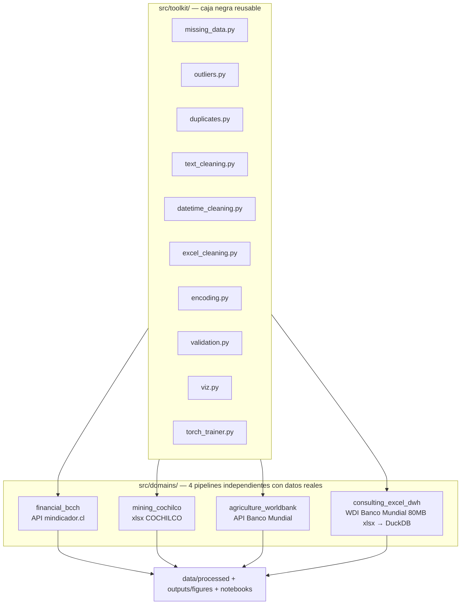

[ 🇺🇸 [Read in English](README.md) ] | [ 🇨🇱 Español ]

# Limpieza_Datos

Un **toolkit** reusable de limpieza de datos y modelamiento (`src/toolkit/`), probado contra **cuatro bases de datos reales e independientes** — sistema financiero chileno, minería del cobre chilena, agricultura sudamericana, y un Excel completo de 80MB del Banco Mundial transformado en un data warehouse real. Ninguna base de datos es sintética; todo modelo entrena al menos 100 épocas reales; cada técnica de limpieza vive una sola vez en el toolkit y se reusa, sin cambios, en los 4 dominios.

Este es el tipo de trabajo real de una consultora de datos: traer datos reales y desordenados desde donde sea que vivan (una API REST, un reporte Excel institucional, un dump completo de un organismo estadístico), limpiarlos con técnicas generales y defendibles, y entregar un modelo con resultados reportados honestamente — incluidos los negativos.

## Arquitectura



## El toolkit reusable

| Módulo | Qué hace |
|---|---|
| `missing_data.py` | Imputación por media condicional, interpolación temporal, interpolación **dentro de cada grupo** (nunca cruza un límite de grupo en un panel), reportes de missingness |
| `outliers.py` | Winsorización IQR (global y por grupo), marcado por z-score, y `fix_implausible_level_jumps` — un detector de errores de nivel vía **mediana móvil**, construido al corregir un dato real corrupto (ver abajo) |
| `duplicates.py` | Detección de duplicados exactos y casi-duplicados fuzzy |
| `text_cleaning.py` | Parseo de moneda/números (formato US y latinoamericano, marcadores de nota al pie), normalización de mayúsculas, unificación fuzzy de nombres |
| `datetime_cleaning.py` | Parseo de fechas con timezone, reindexado de calendario con forward-fill |
| `excel_cleaning.py` | Aplanado de encabezados multi-fila, detección de fila de encabezado, limpieza de notas al pie, reshape ancho-años a largo, remoción de filas subtotal |
| `encoding.py` | Codificación ordinal/one-hot, escalado z-score con transformación inversa |
| `validation.py` | Validación de esquema fila por fila, genérica, vía pydantic |
| `viz.py` | 9 funciones de gráficos reusables (missingness antes/después, distribución antes/después, heatmap de correlación, matriz de confusión, comparación de modelos, diagnóstico de regresión, curva de entrenamiento, series de tiempo, funnel de ETL) |
| `torch_trainer.py` | Un único loop de entrenamiento con early stopping (piso `min_epochs=100`, restauración del mejor checkpoint) usado por los modelos PyTorch de los 4 dominios |

Aplicado standalone, sobre datos reales de los 4 dominios, en [`notebooks/00_toolkit_demo.ipynb`](notebooks/00_toolkit_demo.ipynb).

---

## Dominio 1 — Sistema Financiero (Banco Central de Chile)

`src/domains/financial_bcch/` · [`notebooks/01_financial_bcch.ipynb`](notebooks/01_financial_bcch.ipynb)

Dólar observado y UF diarios reales, más TPM/IPC/IMACEC mensuales, vía `mindicador.cl` (API pública chilena, sin autenticación), 2013-2026, **4.990 días reales**. El problema de limpieza central es la alineación de frecuencias — series diarias y mensuales combinadas en una sola grilla vía reindexado de calendario y forward-fill.

**Un bug de datos real, encontrado y corregido**: la API entregó un valor de UF corrupto durante dos días seguidos de diciembre de 2014 (608.15 y 607.38 en vez de ~24.627 -- un error de captura genuino de la fuente). Una comparación día a día no lo detecta porque los dos días malos se ven "normales" entre sí; `fix_implausible_level_jumps` compara cada punto contra una mediana móvil en su lugar, atrapando ambos. Este escenario exacto se reproduce en el notebook de demostración del toolkit.

**Un bug de entrenamiento real, encontrado y corregido**: el primer intento de MLP usó `ReLU` estándar y colapsó por "dying ReLU" -- todas las neuronas quedaron con gradiente cero y la red predecía una constante ajena a la escala real del target (R² medido hasta **-8746** con capas chicas). Corregido con `LeakyReLU(0.1)` y más regularización.

**Tarea**: predecir el retorno logarítmico del dólar al día siguiente, a partir de retornos rezagados, volatilidad móvil e indicadores macro.

| Modelo | R² | RMSE | MAE |
|---|---|---|---|
| Baseline (media de train) | -0.0012 | 0.00529 | 0.00351 |
| MLP (PyTorch, 400 épocas) | **0.0040** | 0.00527 | 0.00354 |
| XGBoost | -0.0021 | 0.00529 | 0.00348 |

**Hallazgo honesto**: los tres enfoques prácticamente empatan en R²≈0 -- consistente con la eficiencia del mercado cambiario. Ningún modelo se reporta como ganador porque ninguno lo es de forma significativa.


Dos barras por serie: la barra naranja es el % de días de calendario sin valor publicado antes de limpiar, la barra azul es la misma métrica después de `reindex_to_full_calendar` + forward-fill. Dólar y TPM parten en ~32% de nulos (todo fin de semana y feriado no tiene cotización, porque el mercado cambiario chileno solo opera días hábiles) y bajan a 0% una vez que esos huecos se crean explícitamente como filas y se rellenan con el último valor conocido. La UF casi no se mueve porque esta unidad de cuenta reajustable por inflación está, por ley, definida para todos los días del calendario -- casi no tiene nada que reindexar.


Dos histogramas superpuestos (con una curva de densidad suavizada sobre cada uno) del retorno logarítmico diario del dólar: naranja es la distribución cruda sin tocar; azul es tras winsorizar con IQR k=4. Las dos curvas quedan prácticamente idénticas en todas partes excepto en las colas extremas, que es justamente el punto -- la winsorización acá solo recorta el puñado de días estadísticamente implausibles, no comprime ni deforma el grueso del movimiento real de mercado día a día.


La línea fina es el tipo de cambio observado diario crudo para todo el historial 2013-2026; la línea gruesa es una media móvil de 20 días superpuesta para que la tendencia de mediano plazo se pueda leer a través del ruido diario. Sirve como chequeo visual rápido de todo el panel a la vez: cada movimiento real importante (la caída de commodities 2015-2016, el shock COVID de 2020, el peak de 2022) debería ser visible acá antes de confiar en cualquier modelo construido sobre estos datos.


Una matriz de correlación de Pearson (rojo = positiva, azul = negativa, blanco ≈ 0) entre cada feature del modelo -- retornos rezagados, ventanas de volatilidad móvil, TPM/IPC/IMACEC -- y la columna target real (el retorno de mañana), incluida como su propia fila/columna para que su correlación con cada feature sea visible directamente. Cada celda que toca al target queda cerca del blanco: ninguna feature individual se mueve junto con el retorno de mañana de forma linealmente relevante, exactamente lo esperable en un mercado eficiente, y anticipa por qué cada modelo de la tabla de abajo termina con R²≈0.


Pérdida de entrenamiento (azul) y de validación (naranja) graficadas contra la época de entrenamiento, con una línea vertical punteada marcando la época cuya pérdida de validación efectivamente se conservó como modelo final (no necesariamente la última época corrida -- `train_with_early_stopping` restaura el mejor checkpoint, nunca solo el más reciente). El piso de >=100 épocas es directamente visible como el largo del eje x.


Dos paneles lado a lado. Izquierda: cada día del test set graficado como (retorno real, retorno predicho), con una línea diagonal punteada mostrando dónde pondría cada punto un modelo perfecto -- mientras más pegada esté la nube a esa línea, mejor el modelo. Derecha: los residuales de esas mismas predicciones (real − predicho) graficados contra la predicción misma, que debería verse como una banda plana y sin estructura si el modelo no sobre- ni sub-predice sistemáticamente en alguna zona. Acá ambos paneles muestran una dispersión ancha y sin forma, sin relación visible con la diagonal -- la firma visual honesta de un modelo sin poder predictivo real (R²≈0), no un error de gráfico.


Un bar chart agrupado con un grupo de barras por modelo (baseline, MLP, XGBoost) a través de tres métricas (R², RMSE, MAE), con el valor numérico etiquetado sobre cada barra. Las tres barras de cada grupo de métrica quedan prácticamente a la misma altura -- la prueba visual de que ninguno de los tres enfoques supera de forma significativa a un modelo que simplemente predice el promedio histórico.

---

## Dominio 2 — Minería (COCHILCO)

`src/domains/mining_cochilco/` · [`notebooks/02_mining_cochilco.ipynb`](notebooks/02_mining_cochilco.ipynb)

Producción mensual real de cobre de mina por empresa, publicada por COCHILCO en un `.xlsx` con forma de reporte institucional -- **150 meses reales** (2014-01 a 2026-06), 38 columnas reales de faena/empresa tras excluir subtotales.

**Tres problemas estructurales reales, ninguno un valor faltante**:
1. **Contaminación de tipo de fila**: filas de título, filas de resumen anual (columna A = un año como texto puro, ej. `"2024"`) y filas plantilla de meses futuros se mezclan con las filas mensuales reales -- se filtran por el TIPO de la celda de fecha (un objeto `datetime` real vs. un texto que solo *parece* fecha; `pd.to_datetime("2024")` resuelve silenciosamente a `2024-01-01` y colisionaría con la fila real de enero).
2. **Columnas subtotal disfrazadas**: además de las obvias `Total Codelco`/`TOTAL CHILE`, tres columnas más (`Chuqui y R.Tomic`, `Angloamerican Sur`, `Capstone Copper`) son subtotales no documentados de otras columnas -- confirmado por identidad numérica exacta fila a fila, no por el nombre. Sumar "todas las columnas" ingenuamente infló la producción nacional calculada ~2-3%.
3. **Ceros estructurales genuinos**: una faena que aún no operaba, o que ya cerró, se reporta como `0.0` explícito, nunca como celda vacía -- tratado como real, no imputado.

Tras excluir las 4 columnas subtotal, la suma de las 38 restantes coincide con el `TOTAL CHILE` publicado por COCHILCO con una desviación máxima de 1.1e-13 en las 150 filas.

**Tarea**: predecir la producción nacional de cobre del mes siguiente.

| Modelo | R² | RMSE | MAE |
|---|---|---|---|
| Baseline (estacional) | 0.129 | 39.61 | 35.42 |
| MLP (PyTorch, 136 épocas, mejor@111) | 0.252 | 36.72 | 28.61 |
| XGBoost | **0.515** | 29.57 | 23.80 |

**Hallazgo honesto**: XGBoost gana claramente; ambos modelos reales superan al baseline estacional por un margen genuino. La MLP tuvo un segundo problema de entrenamiento, distinto del dominio financiero: incluso con `LeakyReLU`, un target sin escalar (media ~450) llevó el R² a -77 -- corregido escalando también el target, no la activación.


Mismo formato de barras antes/después que el dominio financiero, pero acá el resultado es distinto y en sí mismo informativo: ambas barras quedan en (o cerca de) 0% para las 38 columnas reales de faena, porque -- como explica el texto arriba -- una faena que no está produciendo reporta un `0.0` explícito, no una celda vacía. Este gráfico es la confirmación visual de que el desafío de limpieza de este dominio es realmente estructural (filas/columnas equivocadas), no valores faltantes, antes de que cualquier lógica de imputación tenga la oportunidad de tratar esos ceros como huecos (incorrectamente).


Distribución cruda (naranja) vs. winsorizada (azul) de los valores de producción mensual, agrupados entre las 38 empresas pero winsorizados de forma independiente DENTRO de la escala propia de cada empresa (IQR k=3.0, solo meses no-cero) -- una empresa que produce cientos de miles de toneladas al mes y una que produce unos pocos miles nunca se comparan contra el mismo corte global, que marcaría injustamente la variación normal de la operación más grande como "outlier".


Producción nacional mensual real de cobre (la suma de las 38 columnas reales de faena, excluidas las columnas subtotal), de 2014 a mediados de 2026, con una media móvil superpuesta de la misma forma que el gráfico del dólar del dominio financiero -- el lugar indicado para revisar a ojo las caídas estacionales reales (la producción chilena de cobre suele bajar en el invierno del hemisferio sur) y cualquier tendencia de producción de más largo plazo antes de confiar en la comparación del modelo contra el baseline estacional.


Heatmap de correlación entre las features de rezago/ventana móvil y la producción nacional del mes siguiente. A diferencia del dominio financiero, acá se espera (y el gráfico lo muestra) una correlación visiblemente fuerte entre la producción y sus propios rezagos recientes -- la producción minera de cobre está fuertemente autocorrelacionada mes a mes, exactamente la estructura que el baseline estacional ya explota, y la vara que ambos modelos reales tienen que superar.


Pérdida de entrenamiento/validación vs. época, misma lectura que la curva del dominio financiero. Esta corrida es un ejemplo concreto de `min_epochs=100` combinado con early stopping real haciendo su trabajo: el modelo entrenó más allá del piso de 100 épocas y luego se detuvo solo en la época 136 una vez que la pérdida de validación dejó de mejorar durante la ventana de paciencia configurada, restaurando los pesos de su mejor época (111), no de la última.


Mismo formato de real-vs-predicho más residuales que el gráfico de diagnóstico del dominio financiero, pero para el mejor modelo real del dominio minero. Acá la nube de puntos se pega visiblemente mucho más a la diagonal punteada que en el gráfico financiero -- la contraparte visual directa del R²=0.515 real de XGBoost, un modelo que efectivamente explica una porción relevante de la variación mes a mes, no solo iguala el resultado honesto cercano a cero del dominio financiero.


Mismo formato de barras agrupadas que el dominio financiero, pero acá las tres barras se separan claramente en vez de empatar: la barra de XGBoost es visiblemente más alta en R² y más baja en RMSE/MAE que tanto el baseline estacional como la MLP, en cada métrica -- una victoria real, no un empate a cara o sello.

---

## Dominio 3 — Agrícola (Banco Mundial)

`src/domains/agriculture_worldbank/` · [`notebooks/03_agriculture_worldbank.ipynb`](notebooks/03_agriculture_worldbank.ipynb)

8 indicadores reales del Banco Mundial (`api.worldbank.org`, sin autenticación) para 9 países sudamericanos, 1990-2025 -- rendimiento de cereales (target), uso de fertilizante, tierra arable/agrícola/irrigada, índice de producción de cultivos, población rural, participación agrícola del PIB.

**La missingness real tiene dos caras muy distintas acá**: la mayoría de los indicadores están casi completos por país (34-36 de 36 años reales -- el hueco ocasional es solo el año más reciente aún no reportado, rellenado por interpolación). La excepción es genuinamente seria: la cobertura de tierra irrigada es solo 50/324 celdas país-año reales, y **Perú no tiene NI UN SOLO valor real en sus 36 años de historia** para ese indicador -- un hueco que `interpolate_within_group` no puede resolver (no hay ningún punto de anclaje dentro de la propia serie de Perú), resuelto en su lugar con imputación por media entre países, documentado explícitamente en vez de disfrazarlo de interpolación.

**Tarea**: predecir el rendimiento de cereales del año siguiente a partir de los demás indicadores reales y sus rezagos.

| Modelo | R² | RMSE | MAE |
|---|---|---|---|
| Baseline (media por país) | -0.327 | 1283 | 1194 |
| MLP (PyTorch, 330 épocas, mejor@305) | 0.872 | 398 | 311 |
| XGBoost | **0.884** | 380 | 302 |

**Hallazgo honesto**: ambos modelos reales superan al baseline por un margen amplio y genuino -- un contraste real con el dominio financiero. El baseline es negativo porque el rendimiento tiene una tendencia real al alza a través de las décadas, así que un promedio histórico por país subestima sistemáticamente el período de test 2020-2025.


Un par de barras antes/después por indicador. La mayoría casi no se mueve (ya estaban 95%+ completos, con el hueco ocasional siendo solo un año reciente aún no reportado). `irrigated_land_pct` es la barra visiblemente distinta del grupo -- parte mucho más alta que el resto y NO baja a cero tras limpiar, porque la interpolación solo puede rellenar un hueco que tenga dato real a al menos un lado dentro del mismo país, y la serie completa de riego de Perú no tiene ninguno; esa altura de barra residual es justamente las celdas de Perú imputadas por media entre países, mantenida visible honestamente en vez de escondida por un gráfico que solo muestre los indicadores "exitosos".


Heatmap de correlación entre las features socioeconómicas/agronómicas y el rendimiento de cereales del año siguiente. A diferencia de la fila mayormente blanca del dominio financiero, acá se espera color real -- el uso de fertilizante y los propios rezagos del rendimiento deberían mostrar correlación positiva visiblemente fuerte con el target, la vista previa visual directa de por qué ambos modelos reales terminan bien por sobre R²=0.8 en la tabla de resultados.


Rendimiento anual real de cereales de Chile (kg/hectárea), 1990-2025 -- una sola serie de país extraída del panel de 9 países para que la tendencia real de largo plazo al alza se lea con claridad por sí sola, la misma tendencia que hace del baseline ingenuo de media por país un predictor sistemáticamente débil para los años de test más recientes.


La misma serie real para Argentina, mostrada junto a la de Chile específicamente para poder comparar ambas directamente -- un chequeo de sanidad útil de que las diferencias de escala entre países del panel (visibles acá) son diferencias agronómicas genuinas, no una inconsistencia de unidades o parseo entre países.


Pérdida de entrenamiento/validación vs. época. Esta corrida ilustra el piso `min_epochs=100` funcionando como se pretendía en un dominio con señal real: el modelo necesitó todo el recorrido más allá de la época 100 para seguir mejorando, activando early stopping recién al estancarse en la época 330, con su mejor checkpoint real guardado desde la época 305.


Scatter de real-vs-predicho más residuales, mismo formato que los otros tres dominios, para el mejor modelo de este dominio. La nube de puntos queda visiblemente pegada a la diagonal punteada en casi todo el rango real de rendimiento -- la contraparte visual de un R²≈0.88 real, no un subconjunto elegido a dedo porque se ve bien.


Barras agrupadas por modelo por métrica. La barra de R² del baseline efectivamente baja por DEBAJO de cero (el eje se dibuja para mostrarlo honestamente en vez de recortarlo en 0), haciendo visualmente el punto de que "el promedio histórico" es acá un predictor genuinamente malo -- mientras que las barras de ambos modelos reales quedan claramente, similarmente altas.

---

## Dominio 4 — Limpieza de Excel para consultoras: data lake → data warehouse

`src/domains/consulting_excel_dwh/` · [`notebooks/04_consulting_excel_dwh.ipynb`](notebooks/04_consulting_excel_dwh.ipynb)

El World Development Indicators **completo** del Banco Mundial: un Excel real de ~80MB, 6 hojas, **401.394 filas reales país×indicador** en la hoja `Data` -- exactamente el tipo de archivo que una consultora recibe de un cliente u organismo público y tiene que transformar en un warehouse consultable, no un CSV ya tabular.

**La técnica**: la hoja `Data` no se puede cargar completa a un DataFrame en cada corrida (iterarla en modo solo-lectura ya toma ~50 segundos) -- `fetch.py` la recorre fila por fila en streaming (`openpyxl`, `read_only=True`) y solo materializa 10 indicadores curados reales, un patrón deliberado de zona raw -> staging para archivos demasiado grandes para cargar ingenuamente. La hoja `Country` mezcla países reales con agregados regionales/de ingreso ("World", "OECD members"...) distinguibles solo por un campo `Region` vacío -- filtrados antes de modelar cualquier cosa, o un "país" perfectamente correlacionado con el promedio de los demás inflaría la señal aparente del panel.

**Resultado**: un esquema estrella real en DuckDB (`dim_country`, `dim_indicator`, `fact_indicator_value`) -- 217 países reales, 132.600 filas de hecho reales tras interpolación dentro de cada serie, que recuperó 53.003 de 61.453 celdas originalmente faltantes (86%); las 8.450 restantes son series sin ningún dato real desde el cual interpolar.

**Tarea**: predecir la esperanza de vida del año siguiente a partir de gasto en salud, acceso a agua/saneamiento, PIB per cápita y sus rezagos -- consultado directamente del warehouse vía SQL.

| Modelo | R² | RMSE | MAE |
|---|---|---|---|
| Baseline (media de train) | -1.608 | 12.16 | 10.37 |
| MLP (PyTorch, 400 épocas) | 0.922 | 2.10 | 1.24 |
| XGBoost | **0.938** | 1.87 | 1.02 |

**Hallazgo honesto**: ambos modelos reales predicen la esperanza de vida con precisión real y alta a partir de determinantes socioeconómicos genuinos. El baseline es fuertemente negativo porque la esperanza de vida tiene una tendencia real al alza desde 1960 que un promedio histórico subestima sistemáticamente en los años de test 2019-2024.

**Una nota sobre el dato crudo en sí**: sin filtrar, incluye catástrofes humanitarias reales y documentadas -- Camboya 1976-78 (Jemeres Rojos) y Ruanda 1994 (genocidio) muestran esperanza de vida alrededor de 11-12 años en este mismo warehouse. Se mantiene tal como el Banco Mundial lo publica, no se recorta por "verse mal".


Una barra horizontal por etapa del pipeline, cada una etiquetada con su conteo real de filas, leída de arriba hacia abajo: el extracto ancho crudo (2.660 filas país×indicador, una por indicador curado) -> aplanado a formato largo (172.900 filas país×indicador×año, una por observación real o faltante) -> tras excluir agregados regionales/de ingreso vía el campo `Region` de la hoja `Country` (141.050) -> filas con un valor real no-nulo antes de cualquier interpolación (79.597) -> tras interpolar dentro de cada serie, que recupera los huecos recuperables (132.600). La diferencia entre dos barras consecutivas es un efecto real y contable de un paso de limpieza específico, no una estimación.


Par de barras antes/después por indicador curado, a nivel de tabla de hechos (celdas país×indicador×año) en vez de por columna como los gráficos de missingness de los otros dominios -- la contraparte numérica directa de la tasa de recuperación de huecos del 86% citada en el texto de arriba, y un recordatorio de que la altura de barra restante tras limpiar (14%) es exactamente el conjunto de series sin ningún dato real desde el cual interpolar, no un bug residual.


Tres series nacionales reales de esperanza de vida extraídas directamente de la tabla de hechos del warehouse vía SQL, 1960-2024: Chile (un ascenso real y sostenido), Japón (partiendo ya alto y subiendo más, entre los más altos del mundo) y Haití (partiendo mucho más bajo y cerrando la brecha mucho más lento) -- elegidos específicamente para hacer visible en un solo gráfico la desigualdad global real de este indicador, no para elegir a dedo un ejemplo favorable.


Heatmap de correlación entre los indicadores socioeconómicos (gasto en salud, acceso a agua/saneamiento, PIB per cápita, mortalidad infantil, Gini, etc.) y la esperanza de vida del año siguiente. Se espera -- y el gráfico lo muestra -- correlación real fuerte desde la mortalidad infantil y el acceso a servicios básicos en particular, los mismos determinantes reales que predeciría la literatura epidemiológica, lo que hace que el R² alto de este dominio sea un resultado creíble y no sobreajustado.


Pérdida de entrenamiento/validación vs. época para la MLP de esperanza de vida -- notar que acá tanto las features COMO el target se escalaron con z-score antes de entrenar (a diferencia del dominio financiero, donde solo se escalaron las features), porque la escala real del target (años de esperanza de vida, media ~70) está muy lejos del rango de salida cercano a cero de una red recién inicializada; saltarse ese paso fue lo que originalmente produjo predicciones completamente irreales (detalle en el docstring de `model.py`).


Scatter de real-vs-predicho más residuales para el mejor modelo del dominio. La nube queda pegada de forma ajustada a la diagonal punteada en casi todo el rango real del eje (aproximadamente 40 a 85 años), incluidos los países del extremo bajo -- la contraparte visual de un R²=0.938 real, el resultado más fuerte de los 4 dominios.


Barras agrupadas por modelo por métrica -- la barra de R² del baseline de media de train se dibuja claramente negativa (sin recortar en cero), el contraste más marcado de cualquier dominio de este proyecto, porque un promedio global de la era 1960 es un predictor particularmente malo para un período de test 2019-2024 dado cuánto se ha movido la tendencia global real desde entonces.

---

## Tests

```bash
pytest
```

91 tests, todos reales (sin mocks): 62 pruebas unitarias del toolkit, más pruebas de humo reales por dominio (chequeos de esquema/plausibilidad contra datos efectivamente descargados, y el reclamo central de cada dominio -- ej. "el mejor modelo supera al baseline por un margen real" -- verificado como una aserción reproducible, no solo afirmado en este README).

## Instalación

```bash
python -m venv .venv
.venv\Scripts\pip install -r requirements.txt   # Windows
```

Luego, por dominio: `python -m src.domains.<dominio>.fetch`, después `.clean`, `.features`, `.model`, `.charts` -- o abrir el notebook correspondiente, que corre el mismo pipeline de forma narrada.

## Stack

Python · pandas · PyTorch · XGBoost · scikit-learn · DuckDB · openpyxl · rapidfuzz · pydantic · matplotlib/seaborn · Jupyter · mindicador.cl · COCHILCO · World Bank Open Data / WDI

## Autor

Pablo Reyes — Data Scientist, Santiago, Chile.

Licencia: MIT — ver [LICENSE](LICENSE).
