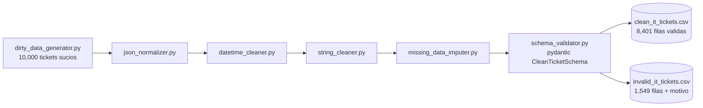

[ 🇺🇸 [Read in English](README.md) ] | [ 🇨🇱 Español ]

# IT Data Wrangling Pipeline


Proyecto de **Ingeniería y Limpieza de Datos Avanzada** aplicado a operaciones de soporte TI/SaaS. Genera un dataset sintético de tickets de soporte con los defectos típicos de datos reales de producción, y lo convierte en un dataset limpio, tipado y validado mediante un pipeline modular de limpieza.

## Impacto de Negocio e Indicadores Clave (KPIs)

Números de una corrida real (`python -m src.pipeline`, dataset de 10.000 tickets generados por `dirty_data_generator.py`):

| Métrica | Resultado | Qué significa |
|---|---|---|
| Filas procesadas | 9.950 (de 10.000 generadas) | Deduplicación fuzzy de nombres de empresa colapsó filas duplicadas-con-variación antes de la validación |
| Filas válidas tras limpieza | 8.401 (84,4%) | Pasan el esquema `pydantic` completo: tipos, formato de email, vocabulario cerrado, rango plausible de costo |
| Filas inválidas, expuestas para revisión | 1.549 (15,6%), con motivo registrado | Ningún dato se descarta en silencio -- cada fila rechazada lleva su `validation_error` para auditoría |
| Suite de tests | 18/18 pasando | Un test unitario por módulo de limpieza (`json_normalizer`, `datetime_cleaner`, `string_cleaner`, `missing_data_imputer`) |

## Objetivo

Los datos de operaciones TI casi nunca llegan limpios: distintos sistemas de origen escriben fechas en formatos diferentes, los campos de texto libre acumulan typos y duplicados, los montos llegan en el formato de moneda de quien los ingresó, y los payloads JSON de metadata varían de forma libre entre eventos. Este proyecto demuestra un pipeline profesional para llevar ese tipo de datos "sucios" a un esquema limpio, validado y listo para análisis o carga a un data warehouse — separando explícitamente lo que se puede corregir de lo que debe quedar marcado como inválido para revisión humana, en vez de forzar un valor inventado.

## Arquitectura del proyecto



```
it-data-wrangling-pipeline/
├── data/
│   ├── raw/                          # messy_it_tickets.csv (generado, no versionado)
│   └── processed/                    # clean_it_tickets.csv + invalid_it_tickets.csv (no versionados)
├── notebooks/
│   └── 01_dirty_data_eda.ipynb       # Diagnóstico de los defectos del dataset crudo
├── src/
│   ├── generators/
│   │   └── dirty_data_generator.py   # Genera el dataset sintético sucio
│   ├── cleaners/
│   │   ├── json_normalizer.py        # Aplana JSON anidado de profundidad variable
│   │   ├── datetime_cleaner.py       # Normaliza fechas/timezones a UTC ISO 8601
│   │   ├── string_cleaner.py         # Espacios, monedas, unificación fuzzy de nombres
│   │   └── missing_data_imputer.py   # Media condicional por categoría / interpolación
│   ├── validators/
│   │   └── schema_validator.py       # Esquema pydantic: separa filas válidas de inválidas
│   └── pipeline.py                   # Orquesta el flujo completo crudo -> limpio
├── tests/
│   └── test_cleaners.py              # Pruebas unitarias (pytest) de cada módulo de limpieza
├── requirements.txt
├── LICENSE
├── README.md
└── README.es.md
```

## Dataset sintético

`src/generators/dirty_data_generator.py` produce `data/raw/messy_it_tickets.csv` con 10,000 tickets de soporte (~20 empresas cliente distintas) que incluyen intencionalmente:

- **Fechas y timezones mezclados**: al menos 6 formatos de fecha distintos (ISO, `dd/mm/aaaa`, `mm/dd/aaaa` en 12h, nombre de mes, etc.) combinados con offsets numéricos y abreviaciones de timezone (`UTC`, `Z`, `EST`, `PST`, `CET`).
- **`user_metadata`**: JSON anidado de profundidad variable (0 a 3 niveles), con listas, o vacío/`null`.
- **Typos y duplicados de empresa**: mayúsculas/minúsculas inconsistentes, sufijos legales (`Inc.`, `LLC`, `Corp.`), espacios dobles, sustitución de caracteres, y filas duplicadas-con-variación que representan doble captura del mismo ticket.
- **Monedas mezcladas**: `"$1,200.50"` (formato US), `"1200,50 €"` (formato europeo), código de moneda como sufijo (`"1,050.75 USD"`), y algunos reembolsos negativos.
- **Faltantes inconsistentes**: `NaN` real, strings placeholder (`"null"`, `"N/A"`, `"-"`, `"?"`), y filas completamente vacías simulando exports corruptos.

## Módulos de limpieza (`src/cleaners/`)

| Módulo | Qué hace |
|---|---|
| `json_normalizer.py` | Aplana `user_metadata` a columnas planas (`user_metadata_browser_name`, etc.), tolerando cualquier profundidad y valores nulos/malformados. |
| `datetime_cleaner.py` | Parsea cualquiera de los formatos/timezones del dataset y normaliza a UTC en ISO 8601. Limitación honesta y documentada: sin metadata de locale, una fecha como `"07/09/2024"` es genuinamente ambigua (día/mes vs. mes/día) — se asume un criterio consistente y solo se reintenta con el otro si el primero falla por completo. |
| `string_cleaner.py` | Recorta/colapsa espacios, parsea montos con separador decimal mixto a `float`, normaliza capitalización de campos categóricos, y usa `rapidfuzz` (`fuzz.WRatio` + `utils.default_process`) para colapsar variantes/typos de un mismo nombre de empresa a un valor canónico. |
| `missing_data_imputer.py` | Dos estrategias de imputación numérica: media condicional por categoría (`cost` según `category`) e interpolación lineal respetando orden temporal (`response_time_hours` según `created_at`). |

Deliberadamente **no** todo faltante se imputa: nombre de empresa, agente o categoría faltante no tiene un valor "correcto" que inventar, así que esas filas quedan expuestas por el validador de esquema en vez de rellenarse con un placeholder silencioso.

## Validación de esquema (`src/validators/schema_validator.py`)

Un modelo `pydantic` (`CleanTicketSchema`) define el contrato de una fila limpia: tipos, formato de email, vocabulario cerrado para `priority`/`status`/`category`, y rango plausible de `cost`. `validate_dataframe()` separa el DataFrame limpio en `(filas_válidas, filas_inválidas)` — esta última con una columna `validation_error` para auditoría, en vez de descartar silenciosamente los problemas que la limpieza automática no pudo resolver con confianza.

## Instalación

```bash
python -m venv .venv
source .venv/bin/activate      # En Windows: .venv\Scripts\activate
pip install -r requirements.txt
```

## Uso

Generar el dataset sucio:

```bash
python -m src.generators.dirty_data_generator
```

Ejecutar el pipeline completo de limpieza:

```bash
python -m src.pipeline
```

Descarga/genera nada por sí mismo — lee `data/raw/messy_it_tickets.csv`, aplica todos los cleaners en orden, imputa lo que se puede imputar con criterio, valida el esquema resultante, e imprime un resumen. Escribe `data/processed/clean_it_tickets.csv` (filas válidas) y `data/processed/invalid_it_tickets.csv` (filas rechazadas, con el motivo).

Pruebas unitarias:

```bash
pytest tests/
```

## Stack técnico

- **pandas / numpy** — manipulación y transformación de datos
- **pydantic** — validación de esquema con tipado fuerte
- **rapidfuzz** — coincidencia difusa para unificación de nombres
- **openpyxl** — soporte de lectura/escritura de Excel
- **matplotlib / seaborn** — visualización exploratoria
- **pytest** — pruebas unitarias

## Licencia

MIT — ver [LICENSE](LICENSE).

## Autor

**Pablo Reyes** — [github.com/Rxyxs](https://github.com/Rxyxs)
