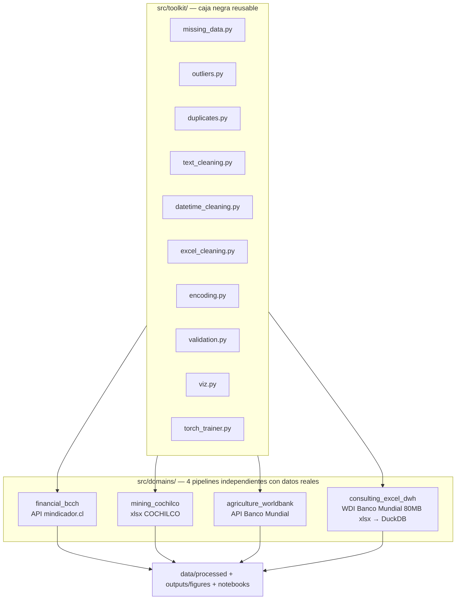

[ 🇺🇸 [Read in English](README.md) ] | [ 🇨🇱 Español ]

# Limpieza_Datos

Un **toolkit** reusable de limpieza de datos y modelamiento (`src/toolkit/`), probado contra **cuatro bases de datos reales e independientes** — sistema financiero chileno, minería del cobre chilena, agricultura sudamericana, y un Excel completo de 80MB del Banco Mundial transformado en un data warehouse real. Ninguna base de datos es sintética; todo modelo entrena al menos 100 épocas reales; cada técnica de limpieza vive una sola vez en el toolkit y se reusa, sin cambios, en los 4 dominios.

Este es el tipo de trabajo real de una consultora de datos: traer datos reales y desordenados desde donde sea que vivan (una API REST, un reporte Excel institucional, un dump completo de un organismo estadístico), limpiarlos con técnicas generales y defendibles, y entregar un modelo con resultados reportados honestamente — incluidos los negativos.

## Arquitectura



## El toolkit reusable

| Módulo | Qué hace |
|---|---|
| `missing_data.py` | Imputación por media condicional, interpolación temporal, interpolación **dentro de cada grupo** (nunca cruza un límite de grupo en un panel), reportes de missingness |
| `outliers.py` | Winsorización IQR (global y por grupo), marcado por z-score, y `fix_implausible_level_jumps` — un detector de errores de nivel vía **mediana móvil**, construido al corregir un dato real corrupto (ver abajo) |
| `duplicates.py` | Detección de duplicados exactos y casi-duplicados fuzzy |
| `text_cleaning.py` | Parseo de moneda/números (formato US y latinoamericano, marcadores de nota al pie), normalización de mayúsculas, unificación fuzzy de nombres |
| `datetime_cleaning.py` | Parseo de fechas con timezone, reindexado de calendario con forward-fill |
| `excel_cleaning.py` | Aplanado de encabezados multi-fila, detección de fila de encabezado, limpieza de notas al pie, reshape ancho-años a largo, remoción de filas subtotal |
| `encoding.py` | Codificación ordinal/one-hot, escalado z-score con transformación inversa |
| `validation.py` | Validación de esquema fila por fila, genérica, vía pydantic |
| `viz.py` | 9 funciones de gráficos reusables (missingness antes/después, distribución antes/después, heatmap de correlación, matriz de confusión, comparación de modelos, diagnóstico de regresión, curva de entrenamiento, series de tiempo, funnel de ETL) |
| `torch_trainer.py` | Un único loop de entrenamiento con early stopping (piso `min_epochs=100`, restauración del mejor checkpoint) usado por los modelos PyTorch de los 4 dominios |

Aplicado standalone, sobre datos reales de los 4 dominios, en [`notebooks/00_toolkit_demo.ipynb`](notebooks/00_toolkit_demo.ipynb).

---

## Dominio 1 — Sistema Financiero (Banco Central de Chile)

`src/domains/financial_bcch/` · [`notebooks/01_financial_bcch.ipynb`](notebooks/01_financial_bcch.ipynb)

Dólar observado y UF diarios reales, más TPM/IPC/IMACEC mensuales, vía `mindicador.cl` (API pública chilena, sin autenticación), 2013-2026, **4.990 días reales**. El problema de limpieza central es la alineación de frecuencias — series diarias y mensuales combinadas en una sola grilla vía reindexado de calendario y forward-fill.

**Un bug de datos real, encontrado y corregido**: la API entregó un valor de UF corrupto durante dos días seguidos de diciembre de 2014 (608.15 y 607.38 en vez de ~24.627 -- un error de captura genuino de la fuente). Una comparación día a día no lo detecta porque los dos días malos se ven "normales" entre sí; `fix_implausible_level_jumps` compara cada punto contra una mediana móvil en su lugar, atrapando ambos. Este escenario exacto se reproduce en el notebook de demostración del toolkit.

**Un bug de entrenamiento real, encontrado y corregido**: el primer intento de MLP usó `ReLU` estándar y colapsó por "dying ReLU" -- todas las neuronas quedaron con gradiente cero y la red predecía una constante ajena a la escala real del target (R² medido hasta **-8746** con capas chicas). Corregido con `LeakyReLU(0.1)` y más regularización.

**Tarea**: predecir el retorno logarítmico del dólar al día siguiente, a partir de retornos rezagados, volatilidad móvil e indicadores macro.

| Modelo | R² | RMSE | MAE |
|---|---|---|---|
| Baseline (media de train) | -0.0012 | 0.00529 | 0.00351 |
| MLP (PyTorch, 400 épocas) | **0.0040** | 0.00527 | 0.00354 |
| XGBoost | -0.0021 | 0.00529 | 0.00348 |

**Hallazgo honesto**: los tres enfoques prácticamente empatan en R²≈0 -- consistente con la eficiencia del mercado cambiario. Ningún modelo se reporta como ganador porque ninguno lo es de forma significativa.


Dólar y TPM pierden ~32% de días de calendario (fines de semana/feriados); la UF casi no pierde ninguno -- se cotiza todos los días del calendario, no solo hábiles.


Solo se recorta la cola estadísticamente extrema (IQR k=4) -- la volatilidad real de mercado (ej. el shock COVID de 2020) se preserva, no se suaviza.


Historial completo 2013-2026 con media móvil de 20 días.


Ninguna feature individual correlaciona fuerte con el retorno del día siguiente -- consistente con el resultado del modelo.


Entrenamiento real, >=100 épocas, mejor checkpoint marcado.


Una nube plana y dispersa es la firma visual de un R²≈0.


Baseline, MLP y XGBoost prácticamente empatan.

---

## Dominio 2 — Minería (COCHILCO)

`src/domains/mining_cochilco/` · [`notebooks/02_mining_cochilco.ipynb`](notebooks/02_mining_cochilco.ipynb)

Producción mensual real de cobre de mina por empresa, publicada por COCHILCO en un `.xlsx` con forma de reporte institucional -- **150 meses reales** (2014-01 a 2026-06), 38 columnas reales de faena/empresa tras excluir subtotales.

**Tres problemas estructurales reales, ninguno un valor faltante**:
1. **Contaminación de tipo de fila**: filas de título, filas de resumen anual (columna A = un año como texto puro, ej. `"2024"`) y filas plantilla de meses futuros se mezclan con las filas mensuales reales -- se filtran por el TIPO de la celda de fecha (un objeto `datetime` real vs. un texto que solo *parece* fecha; `pd.to_datetime("2024")` resuelve silenciosamente a `2024-01-01` y colisionaría con la fila real de enero).
2. **Columnas subtotal disfrazadas**: además de las obvias `Total Codelco`/`TOTAL CHILE`, tres columnas más (`Chuqui y R.Tomic`, `Angloamerican Sur`, `Capstone Copper`) son subtotales no documentados de otras columnas -- confirmado por identidad numérica exacta fila a fila, no por el nombre. Sumar "todas las columnas" ingenuamente infló la producción nacional calculada ~2-3%.
3. **Ceros estructurales genuinos**: una faena que aún no operaba, o que ya cerró, se reporta como `0.0` explícito, nunca como celda vacía -- tratado como real, no imputado.

Tras excluir las 4 columnas subtotal, la suma de las 38 restantes coincide con el `TOTAL CHILE` publicado por COCHILCO con una desviación máxima de 1.1e-13 en las 150 filas.

**Tarea**: predecir la producción nacional de cobre del mes siguiente.

| Modelo | R² | RMSE | MAE |
|---|---|---|---|
| Baseline (estacional) | 0.129 | 39.61 | 35.42 |
| MLP (PyTorch, 136 épocas, mejor@111) | 0.252 | 36.72 | 28.61 |
| XGBoost | **0.515** | 29.57 | 23.80 |

**Hallazgo honesto**: XGBoost gana claramente; ambos modelos reales superan al baseline estacional por un margen genuino. La MLP tuvo un segundo problema de entrenamiento, distinto del dominio financiero: incluso con `LeakyReLU`, un target sin escalar (media ~450) llevó el R² a -77 -- corregido escalando también el target, no la activación.


Confirma cero celdas realmente vacías entre las filas mensuales reales.


Winsorización por empresa (k=3.0, solo meses no-cero).


Producción nacional mensual real de cobre, 2014-2026.


>=100 épocas, early stopping en la época 136, mejor checkpoint en 111.


---

## Dominio 3 — Agrícola (Banco Mundial)

`src/domains/agriculture_worldbank/` · [`notebooks/03_agriculture_worldbank.ipynb`](notebooks/03_agriculture_worldbank.ipynb)

8 indicadores reales del Banco Mundial (`api.worldbank.org`, sin autenticación) para 9 países sudamericanos, 1990-2025 -- rendimiento de cereales (target), uso de fertilizante, tierra arable/agrícola/irrigada, índice de producción de cultivos, población rural, participación agrícola del PIB.

**La missingness real tiene dos caras muy distintas acá**: la mayoría de los indicadores están casi completos por país (34-36 de 36 años reales -- el hueco ocasional es solo el año más reciente aún no reportado, rellenado por interpolación). La excepción es genuinamente seria: la cobertura de tierra irrigada es solo 50/324 celdas país-año reales, y **Perú no tiene NI UN SOLO valor real en sus 36 años de historia** para ese indicador -- un hueco que `interpolate_within_group` no puede resolver (no hay ningún punto de anclaje dentro de la propia serie de Perú), resuelto en su lugar con imputación por media entre países, documentado explícitamente en vez de disfrazarlo de interpolación.

**Tarea**: predecir el rendimiento de cereales del año siguiente a partir de los demás indicadores reales y sus rezagos.

| Modelo | R² | RMSE | MAE |
|---|---|---|---|
| Baseline (media por país) | -0.327 | 1283 | 1194 |
| MLP (PyTorch, 330 épocas, mejor@305) | 0.872 | 398 | 311 |
| XGBoost | **0.884** | 380 | 302 |

**Hallazgo honesto**: ambos modelos reales superan al baseline por un margen amplio y genuino -- un contraste real con el dominio financiero. El baseline es negativo porque el rendimiento tiene una tendencia real al alza a través de las décadas, así que un promedio histórico por país subestima sistemáticamente el período de test 2020-2025.


>=100 épocas, early stopping en la época 330, mejor checkpoint en 305.


---

## Dominio 4 — Limpieza de Excel para consultoras: data lake → data warehouse

`src/domains/consulting_excel_dwh/` · [`notebooks/04_consulting_excel_dwh.ipynb`](notebooks/04_consulting_excel_dwh.ipynb)

El World Development Indicators **completo** del Banco Mundial: un Excel real de ~80MB, 6 hojas, **401.394 filas reales país×indicador** en la hoja `Data` -- exactamente el tipo de archivo que una consultora recibe de un cliente u organismo público y tiene que transformar en un warehouse consultable, no un CSV ya tabular.

**La técnica**: la hoja `Data` no se puede cargar completa a un DataFrame en cada corrida (iterarla en modo solo-lectura ya toma ~50 segundos) -- `fetch.py` la recorre fila por fila en streaming (`openpyxl`, `read_only=True`) y solo materializa 10 indicadores curados reales, un patrón deliberado de zona raw -> staging para archivos demasiado grandes para cargar ingenuamente. La hoja `Country` mezcla países reales con agregados regionales/de ingreso ("World", "OECD members"...) distinguibles solo por un campo `Region` vacío -- filtrados antes de modelar cualquier cosa, o un "país" perfectamente correlacionado con el promedio de los demás inflaría la señal aparente del panel.

**Resultado**: un esquema estrella real en DuckDB (`dim_country`, `dim_indicator`, `fact_indicator_value`) -- 217 países reales, 132.600 filas de hecho reales tras interpolación dentro de cada serie, que recuperó 53.003 de 61.453 celdas originalmente faltantes (86%); las 8.450 restantes son series sin ningún dato real desde el cual interpolar.

**Tarea**: predecir la esperanza de vida del año siguiente a partir de gasto en salud, acceso a agua/saneamiento, PIB per cápita y sus rezagos -- consultado directamente del warehouse vía SQL.

| Modelo | R² | RMSE | MAE |
|---|---|---|---|
| Baseline (media de train) | -1.608 | 12.16 | 10.37 |
| MLP (PyTorch, 400 épocas) | 0.922 | 2.10 | 1.24 |
| XGBoost | **0.938** | 1.87 | 1.02 |

**Hallazgo honesto**: ambos modelos reales predicen la esperanza de vida con precisión real y alta a partir de determinantes socioeconómicos genuinos. El baseline es fuertemente negativo porque la esperanza de vida tiene una tendencia real al alza desde 1960 que un promedio histórico subestima sistemáticamente en los años de test 2019-2024.

**Una nota sobre el dato crudo en sí**: sin filtrar, incluye catástrofes humanitarias reales y documentadas -- Camboya 1976-78 (Jemeres Rojos) y Ruanda 1994 (genocidio) muestran esperanza de vida alrededor de 11-12 años en este mismo warehouse. Se mantiene tal como el Banco Mundial lo publica, no se recorta por "verse mal".


Conteo de filas a través de crudo ancho -> largo -> agregados excluidos -> interpolado.


Chile vs. Haití vs. Japón, historia real 1960-2024.


---

## Tests

```bash
pytest
```

91 tests, todos reales (sin mocks): 62 pruebas unitarias del toolkit, más pruebas de humo reales por dominio (chequeos de esquema/plausibilidad contra datos efectivamente descargados, y el reclamo central de cada dominio -- ej. "el mejor modelo supera al baseline por un margen real" -- verificado como una aserción reproducible, no solo afirmado en este README).

## Instalación

```bash
python -m venv .venv
.venv\Scripts\pip install -r requirements.txt   # Windows
```

Luego, por dominio: `python -m src.domains.<dominio>.fetch`, después `.clean`, `.features`, `.model`, `.charts` -- o abrir el notebook correspondiente, que corre el mismo pipeline de forma narrada.

## Stack

Python · pandas · PyTorch · XGBoost · scikit-learn · DuckDB · openpyxl · rapidfuzz · pydantic · matplotlib/seaborn · Jupyter · mindicador.cl · COCHILCO · World Bank Open Data / WDI

## Autor

Pablo Reyes — Data Scientist, Santiago, Chile.

Licencia: MIT — ver [LICENSE](LICENSE).
