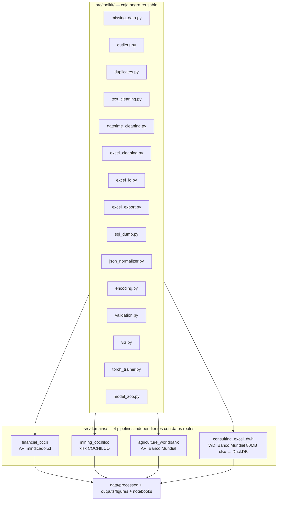

[ 🇺🇸 [Read in English](README.md) ] | [ 🇨🇱 Español ]

# Limpieza_Datos

Un **toolkit** reusable de limpieza de datos y modelamiento (`src/toolkit/`), probado contra **cuatro bases de datos reales e independientes** — sistema financiero chileno, minería del cobre chilena, agricultura sudamericana, y un Excel completo de 80MB del Banco Mundial transformado en un data warehouse real. Ninguna base de datos es sintética; todo modelo entrena al menos 100 épocas reales; cada técnica de limpieza vive una sola vez en el toolkit y se reusa, sin cambios, en los 4 dominios.

Este es el tipo de trabajo real de una consultora de datos: traer datos reales y desordenados desde donde sea que vivan (una API REST, un reporte Excel institucional, un dump completo de un organismo estadístico), limpiarlos con técnicas generales y defendibles, y entregar un modelo con resultados reportados honestamente — incluidos los negativos.

## Arquitectura



## El toolkit reusable

| Módulo | Qué hace |
|---|---|
| `missing_data.py` | Imputación por media condicional, interpolación temporal, interpolación **dentro de cada grupo** (nunca cruza un límite de grupo en un panel), reportes de missingness |
| `outliers.py` | Winsorización IQR (global y por grupo), marcado por z-score, y `fix_implausible_level_jumps` — un detector de errores de nivel vía **mediana móvil**, construido al corregir un dato real corrupto (ver abajo) |
| `duplicates.py` | Detección de duplicados exactos y casi-duplicados fuzzy |
| `text_cleaning.py` | Parseo de moneda/números (formato US y latinoamericano, marcadores de nota al pie), normalización de mayúsculas, unificación fuzzy de nombres |
| `datetime_cleaning.py` | Parseo de fechas con timezone, reindexado de calendario con forward-fill |
| `excel_cleaning.py` | Aplanado de encabezados multi-fila, detección de fila de encabezado, limpieza de notas al pie, reshape ancho-años a largo, remoción de filas subtotal |
| `excel_io.py` | El **archivo** `.xlsx` antes de ser una tabla: inventario de hojas (incluidas las `hidden` / `veryHidden`), expansión de rangos combinados, reporte de filas/columnas ocultas, literales de error de Excel (`#N/A`, `#REF!`) con reporte por columna, conversión de números de serie (bug del año bisiesto 1900 y sistema 1904 de Mac), limpieza de caracteres invisibles, perfilado de tipo por celda |
| `excel_export.py` | El dato limpio de vuelta como **entregable**: libro multi-hoja con encabezado congelado, autofiltro, anchos calculados, formatos numéricos declarados y una hoja `Diccionario` generada que documenta cada columna de cada hoja |
| `sql_dump.py` | Dumps SQL (`.sql`) leídos y escritos sin levantar un motor de base de datos: corte de sentencias consciente de comillas, parseo de `CREATE TABLE` / `INSERT` multi-fila / `COPY ... FROM stdin` de `pg_dump`, inventario del dump sin materializarlo, y exportación por lotes a dialecto Postgres/MySQL/SQLite |
| `json_normalizer.py` | Aplana una columna de JSON anidado a columnas tabulares, tolerando payloads inválidos o vacíos |
| `encoding.py` | Codificación ordinal/one-hot, escalado z-score con transformación inversa |
| `validation.py` | Validación de esquema fila por fila, genérica, vía pydantic |
| `viz.py` | 9 funciones de gráficos reusables (missingness antes/después, distribución antes/después, heatmap de correlación, matriz de confusión, comparación de modelos, diagnóstico de regresión, curva de entrenamiento, series de tiempo, funnel de ETL) |
| `torch_trainer.py` | Un único loop de entrenamiento con early stopping (piso `min_epochs=100`, restauración del mejor checkpoint) usado por los modelos PyTorch de los 4 dominios |
| `model_zoo.py` | Tres familias de modelos más, reusadas por los 4 dominios: lineal regularizado (Ridge/ElasticNet/Lasso, con la malla de `alpha` leída **relativa a la dispersión del target**, para que una sola malla signifique lo mismo sobre targets que van de 0,005 a 5.000), Random Forest (bagging, el contraste directo contra el boosting de XGBoost) y una LSTM sobre secuencias construidas **dentro de cada grupo** -- más la regla de selección que comparten los tres: ajustar en train, elegir en el split de validación cronológico, nunca con `GridSearchCV`, cuyo barajado por defecto entrenaría con filas posteriores a las que después evalúa |

Aplicado standalone, sobre datos reales de los 4 dominios, en [`notebooks/00_toolkit_demo.ipynb`](notebooks/00_toolkit_demo.ipynb).

---

## Dominio 1 — Sistema Financiero (Banco Central de Chile)

`src/domains/financial_bcch/` · [`notebooks/01_financial_bcch.ipynb`](notebooks/01_financial_bcch.ipynb)

Dólar observado y UF diarios reales, más TPM/IPC/IMACEC mensuales, vía `mindicador.cl` (API pública chilena, sin autenticación), 2013-2026, **4.990 días reales**. El problema de limpieza central es la alineación de frecuencias — series diarias y mensuales combinadas en una sola grilla vía reindexado de calendario y forward-fill.

**Un bug de datos real, encontrado y corregido**: la API entregó un valor de UF corrupto durante dos días seguidos de diciembre de 2014 (608.15 y 607.38 en vez de ~24.627 -- un error de captura genuino de la fuente). Una comparación día a día no lo detecta porque los dos días malos se ven "normales" entre sí; `fix_implausible_level_jumps` compara cada punto contra una mediana móvil en su lugar, atrapando ambos. Este escenario exacto se reproduce en el notebook de demostración del toolkit.

**Un bug de entrenamiento real, encontrado y corregido**: el primer intento de MLP usó `ReLU` estándar y colapsó por "dying ReLU" -- todas las neuronas quedaron con gradiente cero y la red predecía una constante ajena a la escala real del target (R² medido hasta **-8746** con capas chicas). Corregido con `LeakyReLU(0.1)` y más regularización.

**Tarea**: predecir el retorno logarítmico del dólar al día siguiente, a partir de retornos rezagados, volatilidad móvil e indicadores macro.

| Modelo | R² | RMSE | MAE |
|---|---|---|---|
| Baseline (media de train) | -0.0012 | 0.00529 | 0.00351 |
| MLP (PyTorch, 400 épocas) | **0.0040** | 0.00527 | 0.00354 |
| XGBoost | -0.0021 | 0.00529 | 0.00348 |
| ElasticNet | -0.0023 | 0.00529 | 0.00350 |
| Random Forest | -0.0032 | 0.00529 | 0.00347 |
| LSTM (ventana de 10 ruedas) | -0.0083 | 0.00531 | 0.00354 |

**Hallazgo honesto**: los seis enfoques prácticamente empatan en R²≈0 -- consistente con la eficiencia del mercado cambiario. Ningún modelo se reporta como ganador porque ninguno lo es de forma significativa, y sumar tres familias más no movió eso ni un pelo: la columna de R² entera abarca 0,012, bien dentro del ruido.

El lineal regularizado dice ese mismo resultado de la forma más directa disponible. Teniendo la opción de conservar cualquiera de las 14 features, el ajuste elegido por validación **deja exactamente 1 coeficiente no nulo** y termina prediciendo poco más que la media de train. No es una falla de convergencia: es un modelo cuya función de pérdida tiene permitido responder "acá no hay nada", respondiéndolo. La LSTM es el negativo más claro de los seis (R² -0,0083, mejor época 2 de 100): con la secuencia cruda de las últimas 10 ruedas en vez de features de lag ya calculadas, tampoco encuentra nada y empieza a sobreajustar de inmediato.


Dos barras por serie: la barra naranja es el % de días de calendario sin valor publicado antes de limpiar, la barra azul es la misma métrica después de `reindex_to_full_calendar` + forward-fill. Dólar y TPM parten en ~32% de nulos (todo fin de semana y feriado no tiene cotización, porque el mercado cambiario chileno solo opera días hábiles) y bajan a 0% una vez que esos huecos se crean explícitamente como filas y se rellenan con el último valor conocido. La UF casi no se mueve porque esta unidad de cuenta reajustable por inflación está, por ley, definida para todos los días del calendario -- casi no tiene nada que reindexar.

Leído de izquierda a derecha, los tres pares de barras son `dolar`, `tpm`, `uf` en ese orden. Las barras naranjas de `dolar` y `tpm` quedan a una fracción de punto una de la otra (ambas cotizan solo en el calendario hábil de Chile), mientras que la barra naranja de `uf` apenas supera cero. Esto también explica directamente un número citado antes en el texto: el archivo crudo de `dolar` por sí solo tiene 3.402 filas, pero el panel limpio final tiene 4.990 -- la diferencia de ~1.589 filas es exactamente las filas de fin de semana/feriado que este paso de reindexado fabrica y rellena con forward-fill, sin las cuales las series diarias y mensuales jamás podrían fusionarse en una sola grilla común.


Dos histogramas superpuestos (con una curva de densidad suavizada sobre cada uno) del retorno logarítmico diario del dólar: naranja es la distribución cruda sin tocar; azul es tras winsorizar con IQR k=4. Las dos curvas quedan prácticamente idénticas en todas partes excepto en las colas extremas, que es justamente el punto -- la winsorización acá solo recorta el puñado de días estadísticamente implausibles, no comprime ni deforma el grueso del movimiento real de mercado día a día.

Ambas curvas están centradas casi exactamente en cero y son visiblemente angostas -- el grueso de los movimientos diarios cae dentro de aproximadamente ±1% -- lo cual es en sí informativo: una moneda, a diferencia de una acción individual, rara vez se mueve en dos dígitos en un día, así que el corte IQR k=4 solo tuvo que tocar 67 de los 4.990 días (~1,3%) para recortar las colas, y cada uno de esos 67 es un evento de volatilidad real y fechable (el crash COVID de 2020 aporta varios), no ruido.


La línea fina es el tipo de cambio observado diario crudo para todo el historial 2013-2026; la línea gruesa es una media móvil de 20 días superpuesta para que la tendencia de mediano plazo se pueda leer a través del ruido diario. Sirve como chequeo visual rápido de todo el panel a la vez: cada movimiento real importante (la caída de commodities 2015-2016, el shock COVID de 2020, el peak de 2022) debería ser visible acá antes de confiar en cualquier modelo construido sobre estos datos.

El eje y va desde ~467 hasta poco más de 1.040 CLP por USD en la ventana de 13 años -- el dólar más que se duplicó frente al peso chileno en el período mostrado, un movimiento estructural real impulsado sobre todo por los ciclos del precio del cobre (la principal exportación de Chile) más que por un evento único, y es exactamente por eso que el modelo trabaja sobre la serie de *retorno* en vez del nivel crudo: un modelo entrenado para predecir este nivel ascendente directamente "tendría éxito" trivialmente solo extrapolando la tendencia, sin haber aprendido nada sobre el movimiento del día siguiente.


Una matriz de correlación de Pearson (rojo = positiva, azul = negativa, blanco ≈ 0) entre cada feature del modelo -- retornos rezagados, ventanas de volatilidad móvil, TPM/IPC/IMACEC -- y la columna target real (el retorno de mañana), incluida como su propia fila/columna para que su correlación con cada feature sea visible directamente. Cada celda que toca al target queda cerca del blanco: ninguna feature individual se mueve junto con el retorno de mañana de forma linealmente relevante, exactamente lo esperable en un mercado eficiente, y anticipa por qué cada modelo de la tabla de abajo termina con R²≈0.

Es una grilla de 15×15 (14 features más el target), y la diagonal es, como siempre, rojo intenso en exactamente 1.0 (cualquier variable correlaciona perfectamente consigo misma) -- un ancla útil de sanidad para leer la escala de color en cada otra celda. Las cinco columnas `dolar_log_return_lag*` sí correlacionan visiblemente ENTRE SÍ (rezagos adyacentes de la misma serie naturalmente comparten información), lo cual es normal y esperado; lo que importa para el modelo es que nada de esa estructura interna se transfiere a la fila/columna del target, que se mantiene plana y pálida en todo su ancho.


Pérdida de entrenamiento (azul) y de validación (naranja) graficadas contra la época de entrenamiento, con una línea vertical punteada marcando la época cuya pérdida de validación efectivamente se conservó como modelo final (no necesariamente la última época corrida -- `train_with_early_stopping` restaura el mejor checkpoint, nunca solo el más reciente). El piso de >=100 épocas es directamente visible como el largo del eje x.

La línea punteada de esta corrida en particular cae justo en la última época (400 de un presupuesto de 400) -- la ventana de paciencia de early stopping (25 épocas sin mejora) nunca llegó a activarse, porque la pérdida de validación siguió bajando hasta el final (de ~0,040 a ~0,00005). Esa caída es real, pero conviene leerla con cuidado en vez de tomarla como evidencia de habilidad aprendida: con casi ninguna señal real en este target, la jugada que minimiza el error cuadrático es simplemente encoger cada predicción hacia la media casi-cero del target, lo que baja sustancialmente el número de pérdida MSE sin que la red extraiga ninguna capacidad de pronóstico genuina -- el checkpoint "mejor" y el "final" resultan ser el mismo acá, y ninguno de los dos es significativamente mejor que predecir cero todos los días, exactamente lo que muestra directamente el gráfico de diagnóstico de regresión de abajo.


Dos paneles lado a lado. Izquierda: cada día del test set graficado como (retorno real, retorno predicho), con una línea diagonal punteada mostrando dónde pondría cada punto un modelo perfecto -- mientras más pegada esté la nube a esa línea, mejor el modelo. Derecha: los residuales de esas mismas predicciones (real − predicho) graficados contra la predicción misma, que debería verse como una banda plana y sin estructura si el modelo no sobre- ni sub-predice sistemáticamente en alguna zona. Acá ambos paneles muestran una dispersión ancha y sin forma, sin relación visible con la diagonal -- la firma visual honesta de un modelo sin poder predictivo real (R²≈0), no un error de gráfico.

Ambos ejes del panel izquierdo van de aproximadamente -0,02 a +0,02 (es decir, movimientos diarios de ±2%) -- la misma escala que el gráfico de distribución de arriba -- y la nube es esencialmente un blob redondo centrado en el origen, no una elipse alargada pegada a la diagonal como se vería en el gráfico de un modelo genuinamente predictivo (comparar esto directamente contra la versión del mismo gráfico en los dominios de minería o agricultura más abajo en este README, donde la forma de elipse es inconfundible).


Un bar chart agrupado con una barra por modelo (baseline, MLP, XGBoost, ElasticNet, Random Forest, LSTM) a través de tres métricas (R², RMSE, MAE), con el valor numérico etiquetado sobre cada barra. Las seis barras de cada grupo de métrica quedan prácticamente a la misma altura -- la prueba visual de que ninguno de los seis enfoques supera de forma significativa a un modelo que simplemente predice el promedio histórico.

Leer las etiquetas numéricas impresas en vez de solo la altura de las barras importa acá: el RMSE de los seis modelos coincide hasta el tercer decimal (0,00527-0,00531), y el R² de los seis queda dentro de 0,009 de cero en cualquier dirección -- diferencias visualmente invisibles a esta escala de gráfico, que es justamente el motivo de etiquetar cada barra con su número exacto en vez de dejar que el lector calcule a ojo unos pocos píxeles de diferencia de altura.

---

## Dominio 2 — Minería (COCHILCO)

`src/domains/mining_cochilco/` · [`notebooks/02_mining_cochilco.ipynb`](notebooks/02_mining_cochilco.ipynb)

Producción mensual real de cobre de mina por empresa, publicada por COCHILCO en un `.xlsx` con forma de reporte institucional -- **150 meses reales** (2014-01 a 2026-06), 38 columnas reales de faena/empresa tras excluir subtotales.

**Cuatro problemas estructurales reales, ninguno un valor faltante**:
1. **Contaminación de tipo de fila**: filas de título, filas de resumen anual (columna A = un año como texto puro, ej. `"2024"`) y filas plantilla de meses futuros se mezclan con las filas mensuales reales -- se filtran por el TIPO de la celda de fecha (un objeto `datetime` real vs. un texto que solo *parece* fecha; `pd.to_datetime("2024")` resuelve silenciosamente a `2024-01-01` y colisionaría con la fila real de enero).
2. **Columnas subtotal disfrazadas**: además de las obvias `Total Codelco`/`TOTAL CHILE`, tres columnas más (`Chuqui y R.Tomic`, `Angloamerican Sur`, `Capstone Copper`) son subtotales no documentados de otras columnas -- confirmado por identidad numérica exacta fila a fila, no por el nombre. Sumar "todas las columnas" ingenuamente infló la producción nacional calculada ~2-3%.
3. **Ceros estructurales genuinos**: una faena que aún no operaba, o que ya cerró, se reporta como `0.0` explícito, nunca como celda vacía -- tratado como real, no imputado.
4. **Filas ocultas y una columna oculta, que significan cosas opuestas**: la hoja tiene **144 filas ocultas y 1 columna oculta**, y no son el mismo tipo de hallazgo. Las 144 filas ocultas son todas observaciones mensuales reales -- COCHILCO colapsa el detalle mensual para dejar a la vista solo los subtotales anuales, y deja visibles apenas los 12 meses del año en curso -- así que descartar filas ocultas "por prolijidad" borraría 144 de los 156 meses del archivo. La única columna oculta, en cambio, es `Chuqui y R.Tomic`: uno de los subtotales disfrazados del punto 3. Por eso `excel_io.read_sheet_expanding_merges` no oculta nada por defecto y mantiene los dos ejes en banderas separadas -- un único `drop_hidden=True` habría hecho exactamente lo incorrecto en la mitad de los casos dentro de un mismo archivo. Ambos hechos se verifican contra el archivo real en `tests/domains/test_mining_cochilco.py`.

Tras excluir las 4 columnas subtotal, la suma de las 38 restantes coincide con el `TOTAL CHILE` publicado por COCHILCO con una desviación máxima de 1.1e-13 en las 150 filas.

**Tarea**: predecir la producción nacional de cobre del mes siguiente.

| Modelo | R² | RMSE | MAE |
|---|---|---|---|
| Baseline (estacional) | 0.129 | 39.61 | 35.41 |
| MLP (PyTorch, 136 épocas, mejor@111) | 0.252 | 36.72 | 28.61 |
| XGBoost | **0.515** | 29.57 | 23.80 |
| ElasticNet (elegido como Ridge puro) | 0.240 | 37.01 | 30.80 |
| Random Forest | 0.479 | 30.62 | 24.77 |
| LSTM (ventana de 12 meses) | 0.026 | 41.88 | 32.64 |

**Hallazgo honesto**: XGBoost gana claramente; tanto la MLP como XGBoost superan al baseline estacional por un margen genuino.

Hay dos cosas que vale la pena leer de los tres modelos agregados después. Random Forest queda en 0,479, muy cerca de XGBoost -- sobre este dataset el bagging y el boosting extraen casi la misma señal, así que la victoria de XGBoost es real pero estrecha, y no evidencia de que el boosting sea la herramienta correcta para el problema. Y **la LSTM queda última de las seis, por debajo incluso del baseline estacional** (0,026 contra 0,129) -- el resultado esperado, y afirmado como test y no solo descrito: con una ventana de 12 meses sobre 95 meses de train, entrena con 84 secuencias, y su mejor época es la 8, así que sobreajusta casi de inmediato. El modelo más sofisticado disponible es acá el peor, porque el dataset es genuinamente chico; un proyecto que reportara solo su mejor modelo nunca mostraría eso. La MLP tuvo un segundo problema de entrenamiento, distinto del dominio financiero: incluso con `LeakyReLU`, un target sin escalar (media ~450) llevó el R² a -77 -- corregido escalando también el target, no la activación.


Mismo formato de barras antes/después que el dominio financiero, pero acá el resultado es distinto y en sí mismo informativo: ambas barras quedan en (o cerca de) 0% para las 38 columnas reales de faena, porque -- como explica el texto arriba -- una faena que no está produciendo reporta un `0.0` explícito, no una celda vacía. Este gráfico es la confirmación visual de que el desafío de limpieza de este dominio es realmente estructural (filas/columnas equivocadas), no valores faltantes, antes de que cualquier lógica de imputación tenga la oportunidad de tratar esos ceros como huecos (incorrectamente).

Contrastar esto deliberadamente con la versión del mismo gráfico en el dominio financiero: ahí, las barras "antes" eran sustanciales (~32%) y el trabajo del paso de limpieza era RELLENAR huecos reales; acá, las barras "antes" ya están cerca de cero y el trabajo real del paso de limpieza (filtrado de filas/columnas) ni siquiera aparece en un gráfico de missingness -- un recordatorio de que "el dato se ve limpio según esta métrica" y "el dato está realmente limpio" no son la misma afirmación, que es exactamente por qué el texto de este dominio arranca con los cuatro problemas estructurales en vez de con un número de missingness.


Distribución cruda (naranja) vs. winsorizada (azul) de los valores de producción mensual, agrupados entre las 38 empresas pero winsorizados de forma independiente DENTRO de la escala propia de cada empresa (IQR k=3.0, solo meses no-cero) -- una empresa que produce cientos de miles de toneladas al mes y una que produce unos pocos miles nunca se comparan contra el mismo corte global, que marcaría injustamente la variación normal de la operación más grande como "outlier".

La distribución en sí es fuertemente asimétrica hacia la derecha incluso antes de limpiar -- un puñado de operaciones gigantes (Escondida, Collahuasi, Los Bronces) producen un orden de magnitud más que la mayoría de las otras ~30 empresas -- que es precisamente por qué un IQR GLOBAL habría sido la herramienta equivocada acá: habría quedado calibrado por los gigantes y marcaría meses normales de las faenas más chicas como outliers solo por ser chicas, el mismo razonamiento por grupo que documenta `winsorize_column_by_group` en el toolkit.


Producción nacional mensual real de cobre (la suma de las 38 columnas reales de faena, excluidas las columnas subtotal), de 2014 a mediados de 2026, con una media móvil superpuesta de la misma forma que el gráfico del dólar del dominio financiero -- el lugar indicado para revisar a ojo las caídas estacionales reales (la producción chilena de cobre suele bajar en el invierno del hemisferio sur) y cualquier tendencia de producción de más largo plazo antes de confiar en la comparación del modelo contra el baseline estacional.

El eje y está en miles de toneladas métricas y va de ~371 a 564 por mes (promediando ~462) -- que anualizado da la cifra real y bien documentada de Chile de ~5-5,8 millones de toneladas al año, un chequeo externo útil de que la exclusión de columnas subtotal del pipeline de limpieza (descrita arriba) produjo una cifra nacional creíble en vez de una duplicada o reducida a la mitad.


Heatmap de correlación entre las features de rezago/ventana móvil y la producción nacional del mes siguiente. A diferencia del dominio financiero, acá se espera (y el gráfico lo muestra) una correlación visiblemente fuerte entre la producción y sus propios rezagos recientes -- la producción minera de cobre está fuertemente autocorrelacionada mes a mes, exactamente la estructura que el baseline estacional ya explota, y la vara que los cinco modelos entrenados tienen que superar.

La correlación real más fuerte contra el target es la propia feature de mes calendario (una señal genuina de estacionalidad, correlación ≈0,43), seguida de la media móvil de 12 meses (≈0,35) -- ambas señales de horizonte más largo/estacionales superan visiblemente al rezago del mes más reciente (lag-1 correlaciona solo ≈0,16, marginalmente MÁS DÉBIL incluso que los rezagos de 6 y 12 meses), un hallazgo real y levemente contraintuitivo que dice que el modelo saca más provecho de "qué estación es y cuál es la tendencia reciente" que de "qué pasó el mes pasado solo", parte de por qué XGBoost (capaz de combinar varias de estas señales de forma no lineal) le saca ventaja al baseline estacional de un solo rezago.


Pérdida de entrenamiento/validación vs. época, misma lectura que la curva del dominio financiero. Esta corrida es un ejemplo concreto de `min_epochs=100` combinado con early stopping real haciendo su trabajo: el modelo entrenó más allá del piso de 100 épocas y luego se detuvo solo en la época 136 una vez que la pérdida de validación dejó de mejorar durante la ventana de paciencia configurada, restaurando los pesos de su mejor época (111), no de la última.

A diferencia de la curva del dominio financiero (donde el checkpoint "mejor" y el "final" coincidieron en la época 400), esta corrida muestra una brecha real: el modelo siguió entrenando 25 épocas más allá de su punto realmente óptimo solo para confirmar que no venía más mejora, y luego descartó los pesos de esas últimas 25 épocas y volvió a la época 111 -- la cola de la curva de entrenamiento (épocas 112-136) es prueba visible de exactamente la exploración "gastada pero necesaria" que el early stopping basado en paciencia está diseñado para tolerar.


Mismo formato de real-vs-predicho más residuales que el gráfico de diagnóstico del dominio financiero, pero para el mejor modelo real del dominio minero. Acá la nube de puntos se pega visiblemente mucho más a la diagonal punteada que en el gráfico financiero -- la contraparte visual directa del R²=0.515 real de XGBoost, un modelo que efectivamente explica una porción relevante de la variación mes a mes, no solo iguala el resultado honesto cercano a cero del dominio financiero.

El panel de residuales (derecha) es donde aparece una limitación honesta real: la dispersión de los residuales no es uniforme a lo largo del eje x -- medido directamente, su desviación estándar en la mitad baja de los valores predichos (18,3 miles de toneladas) casi se duplica en la mitad alta (33,7 miles de toneladas), una señal real y cuantificable de que el modelo es notablemente menos preciso en meses de producción inusualmente alta (probablemente meses donde varias faenas grandes tienen buen desempeño simultáneo), una limitación genuina visible en este gráfico en vez de algo disimulado al reportar solo el R² agregado.


Mismo formato de barras agrupadas que el dominio financiero, pero acá las seis barras se separan claramente en vez de empatar: la barra de XGBoost es visiblemente más alta en R² y más baja en RMSE/MAE que la de cualquier otro modelo, en cada métrica -- una victoria real, no un empate a cara o sello. La barra que le queda más cerca es la de Random Forest; la de la LSTM es la barra de R² más baja de las seis, más baja incluso que la del baseline estacional.

El orden es consistente en las tres métricas (XGBoost primero, después Random Forest, la MLP, el ElasticNet, el baseline estacional y la LSTM última) -- vale la pena notarlo porque sería una señal de alerta si, digamos, un modelo ganara en R² pero perdiera en RMSE, ya que para un mismo test set held-out ambas métricas están matemáticamente relacionadas y no deberían discrepar sobre qué modelo queda más cerca de los valores reales en promedio.

---

## Dominio 3 — Agrícola (Banco Mundial)

`src/domains/agriculture_worldbank/` · [`notebooks/03_agriculture_worldbank.ipynb`](notebooks/03_agriculture_worldbank.ipynb)

8 indicadores reales del Banco Mundial (`api.worldbank.org`, sin autenticación) para 9 países sudamericanos, 1990-2025 -- rendimiento de cereales (target), uso de fertilizante, tierra arable/agrícola/irrigada, índice de producción de cultivos, población rural, participación agrícola del PIB.

**La missingness real tiene dos caras muy distintas acá**: la mayoría de los indicadores están casi completos por país (34-36 de 36 años reales -- el hueco ocasional es solo el año más reciente aún no reportado, rellenado por interpolación). La excepción es genuinamente seria: la cobertura de tierra irrigada es solo 50/324 celdas país-año reales, y **Perú no tiene NI UN SOLO valor real en sus 36 años de historia** para ese indicador -- un hueco que `interpolate_within_group` no puede resolver (no hay ningún punto de anclaje dentro de la propia serie de Perú), resuelto en su lugar con imputación por media entre países, documentado explícitamente en vez de disfrazarlo de interpolación.

**Tarea**: predecir el rendimiento de cereales del año siguiente a partir de los demás indicadores reales y sus rezagos.

| Modelo | R² | RMSE | MAE |
|---|---|---|---|
| Baseline (media por país) | -0.327 | 1283 | 1194 |
| MLP (PyTorch, 330 épocas, mejor@305) | 0.872 | 398 | 311 |
| XGBoost | 0.884 | 380 | 302 |
| ElasticNet (elegido como Ridge puro) | 0.842 | 442 | 357 |
| Random Forest | **0.904** | 344 | 256 |
| LSTM (ventana de 5 años, por país) | 0.799 | 499 | 390 |

**Hallazgo honesto**: **el mejor modelo de este dominio es Random Forest, con R²=0,904**, por delante del 0,884 de XGBoost -- el ganador cambió al sumar las tres familias adicionales, que es exactamente el motivo por el que se sumaron en vez de asumir que con las dos primeras bastaba. Que el bagging le gane al boosting con 207 filas de entrenamiento es el resultado consistente con el manual: promediar árboles profundos e independientes reduce varianza, y con tan poco dato la varianza era el problema.

Más informativo que el ranking es que **los cinco modelos entrenados superan al baseline por más de 1,1 de R²**, incluido el peor de ellos (la LSTM, en 0,799) -- afirmado como test, no solo enunciado. Cuando todas las familias de modelos coinciden por un margen amplio, la señal está en el dato y no en la arquitectura; contrastar con el dominio financiero, donde los seis coinciden en la conclusión opuesta con la misma consistencia. El baseline es negativo porque el rendimiento tiene una tendencia real al alza a través de las décadas, así que un promedio histórico por país subestima sistemáticamente el período de test 2020-2025.


Un par de barras antes/después por indicador. La mayoría casi no se mueve (ya estaban 95%+ completos, con el hueco ocasional siendo solo un año reciente aún no reportado). `irrigated_land_pct` es la barra visiblemente distinta del grupo -- parte mucho más alta que el resto y NO baja a cero tras limpiar, porque la interpolación solo puede rellenar un hueco que tenga dato real a al menos un lado dentro del mismo país, y la serie completa de riego de Perú no tiene ninguno; esa altura de barra residual es justamente las celdas de Perú imputadas por media entre países, mantenida visible honestamente en vez de escondida por un gráfico que solo muestre los indicadores "exitosos".

Poniéndole un número: solo 50 de las 324 celdas país-año reales de ese único indicador tienen una observación genuina del Banco Mundial (~15%), y Perú por sí solo explica 36 de las 274 celdas faltantes (toda su historia real). Este es el gráfico al que apuntar si alguna vez surge la pregunta "por qué no interpolar todo" -- la respuesta honesta, visible acá, es que la interpolación es una técnica real con una precondición real (un punto de anclaje en algún lugar de la misma serie), y este gráfico muestra exactamente el único indicador donde esa precondición falla para un país entero.


Heatmap de correlación entre las features socioeconómicas/agronómicas y el rendimiento de cereales del año siguiente. A diferencia de la fila mayormente blanca del dominio financiero, acá se espera color real -- el uso de fertilizante y los propios rezagos del rendimiento deberían mostrar correlación positiva visiblemente fuerte con el target, la vista previa visual directa de por qué todos los modelos entrenados terminan bien por sobre R²=0,79 en la tabla de resultados.

Los propios rezagos de 1 y 2 años del rendimiento suelen ser las celdas de rojo más intenso en la fila/columna del target -- agronómicamente sensato, ya que el rendimiento de cereales de un país en un año es un buen predictor del siguiente (la inercia del suelo, el clima y las prácticas agrícolas no se reinicia cada año) -- mientras que `rural_pop_pct` tiende a mostrar una correlación NEGATIVA real con el rendimiento, consistente con el patrón real de que la modernización agrícola (mecanización, acceso a fertilizante) tanto sube los rendimientos como reduce la proporción de población que sigue viviendo en zonas rurales.


Rendimiento anual real de cereales de Chile (kg/hectárea), 1990-2025 -- una sola serie de país extraída del panel de 9 países para que la tendencia real de largo plazo al alza se lea con claridad por sí sola, la misma tendencia que hace del baseline ingenuo de media por país un predictor sistemáticamente débil para los años de test más recientes.

La serie sube de ~3.620 kg/hectárea en 1990 a ~6.600 en su año más reciente -- una ganancia real de ~82% en 35 años, una historia real y bien documentada de productividad agronómica de varias décadas (mejores variedades de semilla, riego, acceso a fertilizante), no un artefacto de datos -- y es precisamente este tipo de tendencia sostenida en una sola dirección lo que un baseline de "predecir la media histórica" es estructuralmente incapaz de seguir, sin importar cuán largo sea su período de entrenamiento.


La misma serie real para Argentina, mostrada junto a la de Chile específicamente para poder comparar ambas directamente -- un chequeo de sanidad útil de que las diferencias de escala entre países del panel (visibles acá) son diferencias agronómicas genuinas, no una inconsistencia de unidades o parseo entre países.

La serie de Argentina se asienta sobre una base visiblemente distinta y más ruidosa que la de Chile, con oscilaciones año a año más pronunciadas -- un reflejo real de que su mezcla de cereales depende más de producción de secano (no irrigada), más expuesta a la variabilidad de lluvias de un año dado; la volatilidad distinta entre los dos países, no solo el nivel distinto, es parte de la señal real que cada modelo entrenado tuvo que aprender a manejar.


Pérdida de entrenamiento/validación vs. época. Esta corrida ilustra el piso `min_epochs=100` funcionando como se pretendía en un dominio con señal real: el modelo necesitó todo el recorrido más allá de la época 100 para seguir mejorando, activando early stopping recién al estancarse en la época 330, con su mejor checkpoint real guardado desde la época 305.

Ambas curvas de pérdida caen abruptamente en los primeros ~50 épocas y luego se aplanan en una cola larga y de mejora lenta hasta la época 305 -- la forma clásica de una red que encontró el grueso de la señal real rápido pero necesitó el presupuesto de entrenamiento extendido que garantiza el piso `min_epochs=100` para exprimir la estructura restante, más difícil de aprender, exactamente el tipo de corrida que el piso de épocas existe para proteger de que se corte antes de tiempo.


Scatter de real-vs-predicho más residuales, mismo formato que los otros tres dominios, para el mejor modelo de este dominio -- Random Forest, elegido por R² real de test y no fijado de antemano, que es por qué este gráfico cambió de modelo al sumar las tres familias nuevas. La nube de puntos queda visiblemente pegada a la diagonal punteada en casi todo el rango real de rendimiento -- la contraparte visual de un R²≈0,90 real, no un subconjunto elegido a dedo porque se ve bien.

Vale la pena leer el panel de residuales contra la versión anterior de este mismo gráfico, que mostraba los residuales de la MLP y era prácticamente plano a lo largo del rango de rendimiento (desviación estándar de 367 kg/ha en la mitad baja de las predicciones, 371 en la mitad alta). Random Forest gana en R² agregado -- 0,904 contra 0,872 -- pero paga parte de eso con un error *menos* uniforme: medido de la misma forma, su dispersión de residuales es de 291 kg/ha en la mitad baja y 383 en la alta. Es bastante más preciso en los país-año de rendimiento bajo y algo menos preciso en los de rendimiento alto. Se reporta acá en vez de dejarlo pasar, porque "el mejor modelo" según un número agregado no es automáticamente el mejor modelo en todos los tramos del rango, y cuál compromiso conviene depende de para qué se usa la predicción.


Barras agrupadas por modelo por métrica. La barra de R² del baseline efectivamente baja por DEBAJO de cero (el eje se dibuja para mostrarlo honestamente en vez de recortarlo en 0), haciendo visualmente el punto de que "el promedio histórico" es acá un predictor genuinamente malo -- mientras que las barras de los cinco modelos entrenados quedan claramente, similarmente altas.

Las barras de Random Forest, XGBoost y la MLP quedan lo bastante cerca (0,904, 0,884 y 0,872 de R²) como para verse casi idénticas a esta escala de gráfico, que es la impresión honesta correcta -- la historia real de este dominio es "todos los enfoques reales de modelamiento funcionan bien y superan al baseline por un margen amplio", no "una arquitectura exótica le gana decisivamente a otra", y el gráfico está dibujado con la suficiente sobriedad como para no sobrevender diferencias que son pequeñas en relación a la ventaja que todos comparten sobre el baseline. Incluso el más débil de los cinco, la LSTM en 0,799, supera al baseline por más de 1,1 de R².

---

## Dominio 4 — Limpieza de Excel para consultoras: data lake → data warehouse

`src/domains/consulting_excel_dwh/` · [`notebooks/04_consulting_excel_dwh.ipynb`](notebooks/04_consulting_excel_dwh.ipynb)

El World Development Indicators **completo** del Banco Mundial: un Excel real de ~80MB, 6 hojas, **401.394 filas reales país×indicador** en la hoja `Data` (`excel_io.inventory_workbook` lee esa estructura del archivo de 80MB en ~2 segundos sin materializarlo, y deja ver que la hoja más grande del libro no es la de datos: `footnote`, con 842.972 filas) -- exactamente el tipo de archivo que una consultora recibe de un cliente u organismo público y tiene que transformar en un warehouse consultable, no un CSV ya tabular.

**La técnica**: la hoja `Data` no se puede cargar completa a un DataFrame en cada corrida (iterarla en modo solo-lectura ya toma ~50 segundos) -- `fetch.py` la recorre fila por fila en streaming (`openpyxl`, `read_only=True`) y solo materializa 10 indicadores curados reales, un patrón deliberado de zona raw -> staging para archivos demasiado grandes para cargar ingenuamente. La hoja `Country` mezcla países reales con agregados regionales/de ingreso ("World", "OECD members"...) distinguibles solo por un campo `Region` vacío -- filtrados antes de modelar cualquier cosa, o un "país" perfectamente correlacionado con el promedio de los demás inflaría la señal aparente del panel.

**Resultado**: un esquema estrella real en DuckDB (`dim_country`, `dim_indicator`, `fact_indicator_value`) -- 217 países reales, 132.600 filas de hecho reales tras interpolación dentro de cada serie, que recuperó 53.003 de 61.453 celdas originalmente faltantes (86%); las 8.450 restantes son series sin ningún dato real desde el cual interpolar.

**Tarea**: predecir la esperanza de vida del año siguiente a partir de gasto en salud, acceso a agua/saneamiento, PIB per cápita y sus rezagos -- consultado directamente del warehouse vía SQL.

| Modelo | R² | RMSE | MAE |
|---|---|---|---|
| Baseline (media de train) | -1.608 | 12.16 | 10.37 |
| MLP (PyTorch, 400 épocas) | 0.922 | 2.10 | 1.24 |
| XGBoost | 0.938 | 1.87 | 1.02 |
| ElasticNet (elegido como Lasso puro, 10 de 20 features) | 0.928 | 2.02 | 0.98 |
| Random Forest | **0.943** | 1.80 | 0.97 |
| LSTM (ventana de 5 años, por país) | 0.937 | 1.89 | 1.06 |

**Hallazgo honesto**: **acá también gana Random Forest (0,943)**, con XGBoost, la LSTM y el Lasso dentro de 0,015 de R² -- el segundo dominio cuyo ganador cambió al sumar las tres familias, y aquel donde los seis resultados quedan más juntos entre sí.

Esa cercanía es en sí misma el hallazgo, y las importancias del Random Forest dicen por qué: **la esperanza de vida del año en curso concentra sola el 97,2% de la importancia del modelo**. Predecir el valor del año siguiente a partir del actual es un problema genuinamente fácil -- legítimo, sin look-ahead, pero fácil -- así que seis familias de modelos muy distintas convergen a casi el mismo número, porque casi cualquiera de ellas puede aprender "el año que viene ≈ este año, ajustado". El Lasso hace el mismo punto desde el otro lado: descarta la mitad de las 20 features de plano y resigna solo 0,015 de R² al hacerlo. El baseline es fuertemente negativo porque la esperanza de vida tiene una tendencia real al alza desde 1960 que un promedio histórico subestima sistemáticamente en los años de test 2019-2024.

**Una nota sobre el dato crudo en sí**: sin filtrar, incluye catástrofes humanitarias reales y documentadas -- Camboya 1976-78 (Jemeres Rojos) y Ruanda 1994 (genocidio) muestran esperanza de vida alrededor de 11-12 años en este mismo warehouse. Se mantiene tal como el Banco Mundial lo publica, no se recorta por "verse mal".


Una barra horizontal por etapa del pipeline, cada una etiquetada con su conteo real de filas, leída de arriba hacia abajo: el extracto ancho crudo (2.660 filas país×indicador, una por indicador curado) -> aplanado a formato largo (172.900 filas país×indicador×año, una por observación real o faltante) -> tras excluir agregados regionales/de ingreso vía el campo `Region` de la hoja `Country` (141.050) -> filas con un valor real no-nulo antes de cualquier interpolación (79.597) -> tras interpolar dentro de cada serie, que recupera los huecos recuperables (132.600). La diferencia entre dos barras consecutivas es un efecto real y contable de un paso de limpieza específico, no una estimación.

La caída más grande de todo el funnel es la primera -- 2.660 filas anchas explotando a 172.900 filas largas -- que es simple aritmética (cada fila ancha tiene hasta 65 columnas de año, 1960-2024, cada una convirtiéndose en su propia fila larga tras el melt), no un efecto de limpieza; el funnel se dibuja deliberadamente incluyendo ese paso de todas formas, para que el lector vea la FORMA de la transformación ancho-a-largo en sí misma, no solo las partes donde se filtran filas.


Par de barras antes/después por indicador curado, a nivel de tabla de hechos (celdas país×indicador×año) en vez de por columna como los gráficos de missingness de los otros dominios -- la contraparte numérica directa de la tasa de recuperación de huecos del 86% citada en el texto de arriba, y un recordatorio de que la altura de barra restante tras limpiar (14%) es exactamente el conjunto de series sin ningún dato real desde el cual interpolar, no un bug residual.

A diferencia de la versión de este gráfico en los otros tres dominios, acá se muestra un único par de barras en vez de uno por columna, porque la tabla de hechos del warehouse guarda cada indicador apilado en una sola columna larga `valor` (filas país×indicador×año) en vez de una columna por indicador -- la forma real que toma una tabla de hechos normalizada de esquema estrella. Ese único par igual cuenta la historia real con claridad: 43,6% de las filas de hechos reales no tenían valor antes de interpolar, bajando a 6,0% después -- el mismo hallazgo de recuperación del 86% citado en el texto de arriba, solo que leído directamente del gráfico en vez de la prosa.


Tres series nacionales reales de esperanza de vida extraídas directamente de la tabla de hechos del warehouse vía SQL, 1960-2024: Chile (un ascenso real y sostenido), Japón (partiendo ya alto y subiendo más, entre los más altos del mundo) y Haití (partiendo mucho más bajo y cerrando la brecha mucho más lento) -- elegidos específicamente para hacer visible en un solo gráfico la desigualdad global real de este indicador, no para elegir a dedo un ejemplo favorable.

La línea de Haití es también la de mayor turbulencia año a año de las tres, incluida una caída real y abrupta alrededor de 2010 -- el año de su terremoto catastrófico -- un dato externo independiente que corrobora los números del warehouse contra un evento real conocido de forma independiente, el mismo tipo de chequeo de plausibilidad aplicado de forma más sistemática en los tests.


Heatmap de correlación entre los indicadores socioeconómicos (gasto en salud, acceso a agua/saneamiento, PIB per cápita, mortalidad infantil, Gini, etc.) y la esperanza de vida del año siguiente. Se espera -- y el gráfico lo muestra -- correlación real fuerte desde la mortalidad infantil y el acceso a servicios básicos en particular, los mismos determinantes reales que predeciría la literatura epidemiológica, lo que hace que el R² alto de este dominio sea un resultado creíble y no sobreajustado.

La mortalidad infantil suele ser la celda individualmente más fuerte contra el target, y su signo es negativo (al bajar la mortalidad infantil, sube la esperanza de vida) -- vale la pena señalarlo explícitamente porque un lector que escanea rápido buscando "rojo = bueno" podría malinterpretar una celda azul fuerte como una relación débil, cuando una celda azul fuerte acá es de hecho una de las features más informativas del modelo.


Pérdida de entrenamiento/validación vs. época para la MLP de esperanza de vida -- notar que acá tanto las features COMO el target se escalaron con z-score antes de entrenar (a diferencia del dominio financiero, donde solo se escalaron las features), porque la escala real del target (años de esperanza de vida, media ~70) está muy lejos del rango de salida cercano a cero de una red recién inicializada; saltarse ese paso fue lo que originalmente produjo predicciones completamente irreales (detalle en el docstring de `model.py`).

Ambas curvas caen abruptamente durante las primeras varias decenas de épocas (hay señal real y fuerte en este panel, así que la parte fácil del ajuste ocurre rápido) -- la pérdida de validación cae más de 50 veces desde su valor inicial hacia el final del entrenamiento, de ~0,82 a ~0,014. Esa es una forma de curva genuinamente distinta a la del dominio financiero, pero no por la razón que podría parecer a primera vista: la pérdida del dominio financiero también cae fuerte en términos absolutos (~800 veces, de 0,040 a 0,00005) -- la diferencia real está en el POR QUÉ. Con casi ninguna señal real que encontrar, minimizar el error cuadrático ahí se logra mejor encogiendo cada predicción hacia la media casi-cero del target, lo que baja sustancialmente el número de pérdida sin que la red aprenda nada genuinamente predictivo; una curva de pérdida descendente por sí sola no puede distinguir las dos historias, que es exactamente por qué el gráfico de diagnóstico de regresión (un scatter de real-vs-predicho, no solo un número de pérdida) es el gráfico más confiable de este README para juzgar habilidad predictiva real.


Scatter de real-vs-predicho más residuales para el mejor modelo del dominio (Random Forest). La nube queda pegada de forma ajustada a la diagonal punteada en casi todo el rango real del eje (aproximadamente 40 a 85 años), incluidos los países del extremo bajo -- la contraparte visual de un R²=0,943 real, el resultado más fuerte de los 4 dominios.

Esta es la diagonal más ajustadamente pegada de las cuatro versiones de este gráfico en los cuatro dominios de este README -- vale la pena volver atrás para compararla directamente contra la versión del dominio financiero, que muestra el extremo opuesto (una nube redonda sin forma, sin relación alguna con la diagonal); puestos lado a lado, los dos gráficos son la ilustración única más clara de este proyecto sobre la diferencia entre "genuinamente difícil de predecir" y "genuinamente predecible a partir de determinantes reales".


Barras agrupadas por modelo por métrica -- la barra de R² del baseline de media de train se dibuja claramente negativa (sin recortar en cero), el contraste más marcado de cualquier dominio de este proyecto, porque un promedio global de la era 1960 es un predictor particularmente malo para un período de test 2019-2024 dado cuánto se ha movido la tendencia global real desde entonces.

Con seis modelos, el ranking ya no tiene un ganador único a nivel de proyecto: **Random Forest se lleva dos de los cuatro dominios** (este y agricultura), XGBoost se lleva minería, y el dominio financiero es nominalmente de la MLP solo porque ahí todos los modelos quedan en R²≈0. Leerlo como la conclusión real que es: ninguna familia es la mejor en los cuatro problemas, y cuál gana lo deciden cuánto dato tiene realmente el dominio y cuánta señal genuina hay en él, no la sofisticación del modelo. Es también el motivo de correr seis en vez de quedarse con los dos que resultaron estar implementados primero.

---

## Tests

```bash
pytest
```

147 tests, todos reales (sin mocks): 111 pruebas unitarias del toolkit, más pruebas de humo reales por dominio (chequeos de esquema/plausibilidad contra datos efectivamente descargados, y el reclamo central de cada dominio -- ej. "el mejor modelo supera al baseline por un margen real" -- verificado como una aserción reproducible, no solo afirmado en este README).

## Instalación

```bash
python -m venv .venv
.venv\Scripts\pip install -r requirements.txt   # Windows
```

Luego, por dominio: `python -m src.domains.<dominio>.fetch`, después `.clean`, `.features`, `.model`, `.charts` -- o abrir el notebook correspondiente, que corre el mismo pipeline de forma narrada.

## Stack

Python · pandas · PyTorch · XGBoost · scikit-learn · DuckDB · openpyxl · rapidfuzz · pydantic · matplotlib/seaborn · Jupyter · mindicador.cl · COCHILCO · World Bank Open Data / WDI

## Autor

Pablo Reyes — Data Scientist, Santiago, Chile.

Licencia: MIT — ver [LICENSE](LICENSE).
