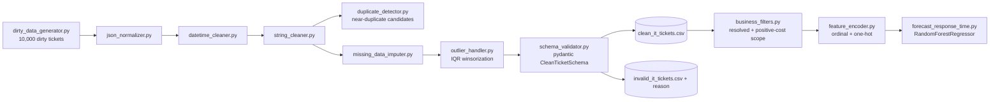

[ 🇺🇸 English ] | [ 🇨🇱 [Leer en Español](README.es.md) ]

# IT Data Wrangling Pipeline


Advanced **Data Engineering & Cleaning** project applied to IT/SaaS support operations. Generates a synthetic support-ticket dataset with the defects typical of real production data, and turns it into a clean, typed, validated, ML-ready dataset via a modular cleaning pipeline — closing the loop with a real baseline forecasting model trained on the pipeline's own output.

## Business Impact & Key Performance Indicators

Numbers from a real run (`python -m src.pipeline`, 10,000-ticket dataset from `dirty_data_generator.py`):

| Metric | Result | What it means |
|---|---|---|
| Rows processed | 9,950 (of 10,000 generated) | Fuzzy company-name deduplication collapsed duplicate-with-variation rows before validation |
| Valid rows after cleaning | 8,446 (84.9%) | Pass the full `pydantic` schema: types, email format, closed vocabulary, plausible cost range |
| Invalid rows, surfaced for review | 1,504 (15.1%), reason logged | Nothing is silently dropped -- every rejected row carries its `validation_error` for audit |
| Near-duplicate tickets flagged | 285 candidate pairs | Same customer + category, created minutes apart, near-identical company name -- a double-submission pattern exact dedup misses |
| Outliers winsorized | 245 in `cost` (global IQR), 1,398 in `response_time_hours` (per-category IQR) | See the honest finding on IQR vs. skewed data below |
| **Forecast model (RandomForest) vs. mean baseline** | MAE 20.29h vs. 31.47h (**-35.5%**) | R²=0.380 -- the cleaned, filtered, encoded dataset carries real, usable signal for a downstream model |
| Test suite | 37/37 passing | Covers all 9 modules: generation, cleaning, outlier handling, duplicate detection, filtering, encoding, validation |

## Goal

IT operations data almost never arrives clean: different source systems write dates in different formats, free-text fields accumulate typos and duplicates, amounts arrive in whichever currency format the entering system used, and metadata JSON payloads vary freely event to event. This project demonstrates a professional pipeline for turning that kind of "dirty" data into a clean, validated schema ready for analysis or a data-warehouse load — explicitly separating what can be corrected from what must be flagged invalid for human review, rather than forcing a made-up value. It goes one step further than cleaning alone: the cleaned data is filtered to a modeling-appropriate scope, encoded into ML-ready features, and actually used to train and evaluate a real forecasting model, so "ready for ML" is a demonstrated property, not just a claim.

## Project Architecture



```
it-data-wrangling-pipeline/
├── data/
│   ├── raw/                          # messy_it_tickets.csv (generated, not tracked)
│   └── processed/                    # clean/invalid/near-duplicate CSVs (not tracked)
├── notebooks/
│   └── 01_dirty_data_eda.ipynb       # Diagnosis of the raw dataset's defects
├── src/
│   ├── generators/
│   │   └── dirty_data_generator.py   # Generates the synthetic dirty dataset (causal: category+priority -> response time)
│   ├── cleaners/
│   │   ├── json_normalizer.py        # Flattens variable-depth nested JSON
│   │   ├── datetime_cleaner.py       # Normalizes dates/timezones to UTC ISO 8601
│   │   ├── string_cleaner.py         # Whitespace, currencies, fuzzy name unification
│   │   ├── missing_data_imputer.py   # Conditional-mean / linear-interpolation imputation
│   │   ├── outlier_handler.py        # IQR winsorization, global and per-group
│   │   └── duplicate_detector.py     # Near-duplicate (double-submission) ticket detection
│   ├── filters/
│   │   └── business_filters.py       # Scope filtering: resolved tickets, positive cost, date range
│   ├── features/
│   │   └── feature_encoder.py        # Ordinal (priority) + one-hot (category/status) encoding
│   ├── models/
│   │   └── forecast_response_time.py # RandomForest baseline vs. mean, real MAE/R²/feature importance
│   ├── validators/
│   │   └── schema_validator.py       # pydantic schema: separates valid from invalid rows
│   └── pipeline.py                   # Orchestrates the full raw -> clean -> ML-ready flow
├── tests/                            # Unit tests (pytest) for every module above
├── requirements.txt
├── LICENSE
├── README.md
└── README.es.md
```

## Synthetic Dataset

`src/generators/dirty_data_generator.py` produces `data/raw/messy_it_tickets.csv` with 10,000 support tickets (~20 distinct client companies) intentionally including:

- **Mixed dates and timezones**: at least 6 distinct date formats (ISO, `dd/mm/yyyy`, `mm/dd/yyyy` in 12h, month name, etc.) combined with numeric offsets and timezone abbreviations (`UTC`, `Z`, `EST`, `PST`, `CET`).
- **`user_metadata`**: nested JSON of variable depth (0 to 3 levels), with lists, or empty/`null`.
- **Company typos and duplicates**: inconsistent casing, legal suffixes (`Inc.`, `LLC`, `Corp.`), double spaces, character substitution, and duplicate-with-variation rows representing double-capture of the same ticket.
- **Mixed currencies**: `"$1,200.50"` (US format), `"1200,50 €"` (European format), currency code as a suffix (`"1,050.75 USD"`), and some negative refunds.
- **Inconsistent missingness**: real `NaN`, placeholder strings (`"null"`, `"N/A"`, `"-"`, `"?"`), and fully empty rows simulating corrupted exports.

## Cleaning Modules (`src/cleaners/`)

| Module | What it does |
|---|---|
| `json_normalizer.py` | Flattens `user_metadata` into flat columns (`user_metadata_browser_name`, etc.), tolerating any depth and null/malformed values. |
| `datetime_cleaner.py` | Parses any of the dataset's formats/timezones and normalizes to UTC ISO 8601. Honest, documented limitation: without locale metadata, a date like `"07/09/2024"` is genuinely ambiguous (day/month vs. month/day) — a consistent convention is assumed, and only retried with the other one if the first fails outright. |
| `string_cleaner.py` | Trims/collapses whitespace, parses amounts with mixed decimal separators to `float`, normalizes categorical-field casing, and uses `rapidfuzz` (`fuzz.WRatio` + `utils.default_process`) to collapse typo/variant company names to a canonical value. |
| `missing_data_imputer.py` | Two numeric imputation strategies: category-conditional mean (`cost` by `category`) and linear interpolation respecting temporal order (`response_time_hours` by `created_at`). |
| `outlier_handler.py` | IQR (Tukey) winsorization -- global for `cost`, **per-category** for `response_time_hours` (see honest finding below for why the two need different treatment). |
| `duplicate_detector.py` | Detects near-duplicate tickets (same `customer_email` + `category`, created within minutes, near-identical `company_name`) -- a double-submission signature exact `DataFrame.duplicated()` misses because `ticket_id` always differs and the resent `company_name` usually carries a typo. Flags candidate pairs for review; never auto-merges or drops. |

Deliberately **not** everything missing gets imputed: a missing company name, agent, or category has no "correct" value to invent, so those rows are surfaced by the schema validator instead of being filled with a silent placeholder.

## Schema Validation (`src/validators/schema_validator.py`)

A `pydantic` model (`CleanTicketSchema`) defines the contract for a clean row: types, email format, closed vocabulary for `priority`/`status`/`category`, and a plausible `cost` range. `validate_dataframe()` splits the cleaned DataFrame into `(valid_rows, invalid_rows)` — the latter carrying a `validation_error` column for audit, rather than silently discarding whatever automated cleaning couldn't resolve with confidence.

## Data Filtering (`src/filters/business_filters.py`)

Distinct from schema validation: a filtered-out row isn't wrong, it's just out of scope for a specific analysis. `filter_resolved_tickets()` keeps only tickets with a real `resolved_at` (an open ticket's `response_time_hours` is an interpolated placeholder, not a real outcome — training a forecast on it would leak imputed values into the target). `filter_positive_cost()` drops refunds (negative cost, a real and valid business event, but a different process than "cost to resolve"). `filter_by_date_range()` restricts to an analysis window. `apply_ml_scope_filters()` chains the two filters the forecasting model below actually uses.

## Feature Encoding (`src/features/feature_encoder.py`)

The step that turns a validated, filtered DataFrame into something scikit-learn can train on. `priority` is encoded **ordinally** (`low=0 ... critical=3`) because severity has a real order a model should see as continuous; `category`/`status` are **one-hot** encoded because they have no natural order and an ordinal encoding would invent a false relationship between them.

## Forecasting Model (`src/models/forecast_response_time.py`)

A real baseline `RandomForestRegressor` trained on the cleaned → filtered → encoded output, predicting `response_time_hours`. This is the point of the whole pipeline made concrete: not "the data is ready for ML" as a claim, but a trained model with measured, out-of-sample metrics.

`category` and `priority` are **causally** linked to `response_time_hours` in the generator (`dirty_data_generator.py::_resolution_hours` — Billing/Account resolve fast, Bug Report/Feature Request are engineering work and take longer; Critical tickets get escalated and resolved faster, Low tickets get deprioritized), specifically so this model has real signal to recover, not noise to overfit.

| Metric | Value |
|---|---|
| Train / test rows | 5,856 / 1,465 |
| RandomForest MAE | **20.29h** |
| Mean-baseline MAE | 31.47h |
| **MAE improvement over baseline** | **35.5%** |
| RandomForest R² | 0.380 |

**Top feature importances**: `priority_encoded` (0.282) and `category_Feature Request`/`Bug Report`/`Technical` (0.193/0.136/0.056 combined) dominate — confirming the model recovered the actual injected causal structure, checked against known ground truth rather than just trusted.

**Two honest findings, not smoothed over**:
- **`cost` shows importance 0.282, nearly tied with `priority`, despite having *no* causal link to `response_time_hours` in the generator** (`cost` is drawn independently). This is a known artifact of scikit-learn's default impurity-based `feature_importances_`, which is biased toward high-cardinality continuous features even when they carry no real signal — documented here rather than mistaken for a genuine driver. A permutation-importance or SHAP pass would be the correct next step to confirm `cost`'s true (near-zero) contribution.
- **Per-category IQR still winsorizes ~16% of `response_time_hours` values**, more than `cost`'s ~2.5% under a single global IQR. Switching from global to per-category IQR (see `outlier_handler.py`) fixed the worse problem (a global rule over-flagging entire high-scale categories as anomalous), but within-category the multiplicative log-normal noise used to generate realistic ticket-to-ticket variability still produces a heavier right tail than a linear IQR rule expects — a real, documented limitation of IQR-based methods on skewed distributions, not tuned away to make the number look better.

## Installation

```bash
python -m venv .venv
source .venv/bin/activate      # On Windows: .venv\Scripts\activate
pip install -r requirements.txt
```

## Usage

Generate the dirty dataset:

```bash
python -m src.generators.dirty_data_generator
```

Run the full cleaning pipeline:

```bash
python -m src.pipeline
```

Downloads/generates nothing on its own — it reads `data/raw/messy_it_tickets.csv`, applies every cleaner in order (including near-duplicate detection and outlier winsorization), imputes what can be reasonably imputed, validates the resulting schema, and prints a summary. Writes `data/processed/clean_it_tickets.csv` (valid rows), `data/processed/invalid_it_tickets.csv` (rejected rows, with the reason), and `data/processed/near_duplicate_candidates.csv` (candidate double-submission pairs).

Train and evaluate the baseline forecasting model (needs `clean_it_tickets.csv`, i.e. run the pipeline first):

```bash
python -m src.models.forecast_response_time
```

Unit tests:

```bash
pytest tests/
```

## Tech Stack

- **pandas / numpy** — data manipulation and transformation
- **pydantic** — strongly-typed schema validation
- **rapidfuzz** — fuzzy matching for name unification and near-duplicate detection
- **scikit-learn** — RandomForest baseline forecasting model
- **openpyxl** — Excel read/write support
- **matplotlib / seaborn** — exploratory visualization
- **pytest** — unit tests

## License

MIT — see [LICENSE](LICENSE).

## Author

**Pablo Reyes** — [github.com/Rxyxs](https://github.com/Rxyxs)
