[ 🇺🇸 English ] | [ 🇨🇱 [Leer en Español](README.es.md) ]

# Limpieza_Datos

A reusable data-cleaning-and-modeling **toolkit** (`src/toolkit/`), proven against **four real, unrelated public datasets** — Chilean finance, Chilean copper mining, South American agriculture, and a full 80MB World Bank Excel transformed into a real data warehouse. Every dataset is genuinely real (no synthetic data anywhere); every model trains for at least 100 real epochs; every cleaning technique lives once in the toolkit and gets reused, unchanged, across all four domains.

This is the kind of work a data consultancy actually does: pull messy real data from wherever it lives (a REST API, an institutional Excel report, a full statistical-agency data dump), clean it with defensible, general techniques, and ship a model with honestly-reported results — including the negative ones.

## Architecture

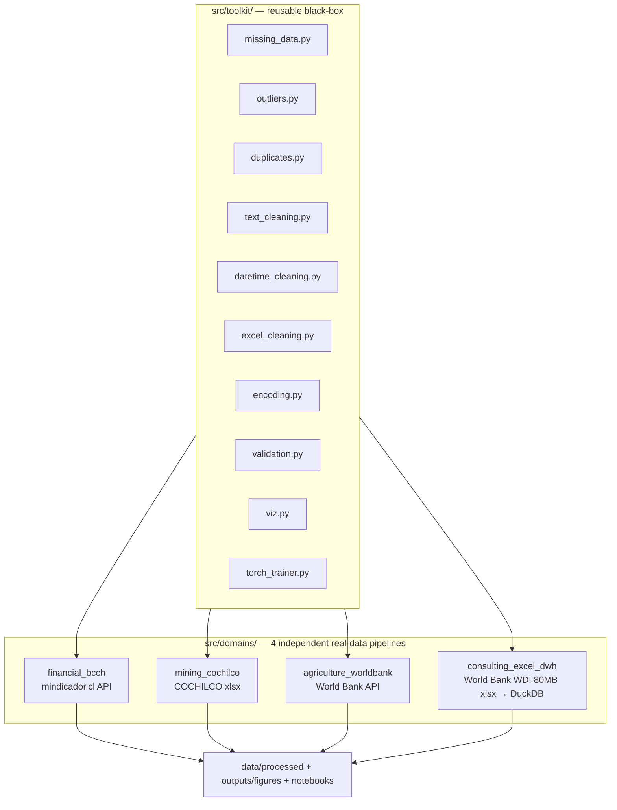
```mermaid
flowchart TB
    subgraph toolkit["src/toolkit/ — reusable black-box"]
        MD[missing_data.py]
        OUT[outliers.py]
        DUP[duplicates.py]
        TXT[text_cleaning.py]
        DT[datetime_cleaning.py]
        EXC[excel_cleaning.py]
        ENC[encoding.py]
        VAL[validation.py]
        VIZ[viz.py]
        TRAIN[torch_trainer.py]
    end

    subgraph domains["src/domains/ — 4 independent real-data pipelines"]
        FIN[financial_bcch<br/>mindicador.cl API]
        MIN[mining_cochilco<br/>COCHILCO xlsx]
        AGR[agriculture_worldbank<br/>World Bank API]
        DWH[consulting_excel_dwh<br/>World Bank WDI 80MB xlsx → DuckDB]
    end

    toolkit --> FIN & MIN & AGR & DWH
    FIN & MIN & AGR & DWH --> RESULTS[data/processed + outputs/figures + notebooks]
```

## The reusable toolkit

| Module | What it does |
|---|---|
| `missing_data.py` | Conditional-mean imputation, time-ordered interpolation, **within-group** interpolation (never leaks across a panel's group boundary), missingness reports |
| `outliers.py` | IQR winsorization (global and per-group), z-score flagging, and `fix_implausible_level_jumps` — a **rolling-median** level-error detector built while fixing a real corrupted data point (see below) |
| `duplicates.py` | Exact and fuzzy near-duplicate detection |
| `text_cleaning.py` | Currency/number parsing (US and Latin-American formats, footnote markers), case normalization, fuzzy name unification |
| `datetime_cleaning.py` | Timezone-aware date parsing, calendar reindexing with forward-fill |
| `excel_cleaning.py` | Multi-row header flattening, header-row detection, footnote stripping, wide-year-to-long reshaping, subtotal-row removal |
| `encoding.py` | Ordinal/one-hot encoding, z-score scaling with inverse transform |
| `validation.py` | Generic pydantic row-by-row schema validation |
| `viz.py` | 9 reusable chart functions (missingness before/after, distribution before/after, correlation heatmap, confusion matrix, model comparison, regression diagnostics, training curve, timeseries, ETL funnel) |
| `torch_trainer.py` | A single early-stopping training loop (`min_epochs=100` floor, best-checkpoint restore) used by all 4 domains' PyTorch models |

See it applied standalone, across all four domains' real data, in [`notebooks/00_toolkit_demo.ipynb`](notebooks/00_toolkit_demo.ipynb).

---

## Domain 1 — Financial system (Banco Central de Chile)

`src/domains/financial_bcch/` · [`notebooks/01_financial_bcch.ipynb`](notebooks/01_financial_bcch.ipynb)

Real daily USD/CLP and UF, plus monthly TPM/IPC/IMACEC, from `mindicador.cl` (Chile's public indicator API, no auth), 2013–2026, **4,990 real trading/calendar days**. The central cleaning problem is frequency alignment — daily and monthly series merged onto one grid via calendar reindexing and forward-fill.

**A real data bug, found and fixed**: the API served a corrupted UF value for two consecutive days in December 2014 (608.15 and 607.38 instead of ~24,627 — a genuine source-side capture error). A naive day-over-day check misses it, because the two bad days look *normal relative to each other*; `fix_implausible_level_jumps` compares each point to a rolling median instead, catching both. This exact scenario is replayed in the toolkit demo notebook.

**A real training bug, found and fixed**: the first MLP attempt used plain `ReLU` and collapsed via "dying ReLU" — every hidden unit landed at zero gradient and the network predicted a constant unrelated to the target's scale (measured R² as low as **-8746** with small hidden layers). Fixed with `LeakyReLU(0.1)` and stronger regularization.

**Task**: predict tomorrow's dollar log-return from lagged returns, rolling volatility, and macro indicators.

| Model | R² | RMSE | MAE |
|---|---|---|---|
| Baseline (train mean) | -0.0012 | 0.00529 | 0.00351 |
| MLP (PyTorch, 400 epochs) | **0.0040** | 0.00527 | 0.00354 |
| XGBoost | -0.0021 | 0.00529 | 0.00348 |

**Honest finding**: all three approaches essentially tie at R²≈0 — consistent with FX market efficiency. No model is reported as a winner because none meaningfully is.

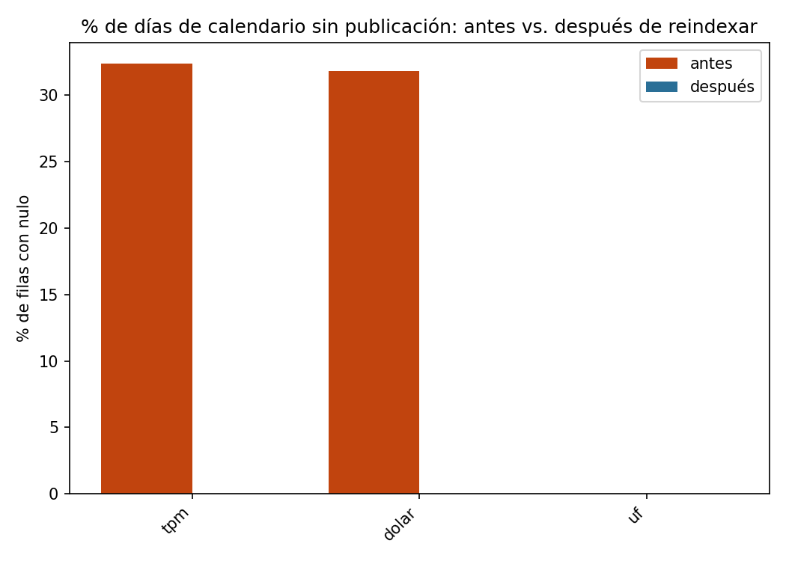
Two bars per series: the orange bar is the % of calendar days with no published value before cleaning, the blue bar is the same metric after `reindex_to_full_calendar` + forward-fill. Dollar and TPM start at ~32% missing (every weekend and public holiday has no quote, since Chile's FX market only trades on business days) and drop to 0% once those gaps are explicitly created as rows and filled with the last known value. UF barely moves because Chile's inflation-indexed accounting unit is, by law, defined for every single calendar day — it has almost nothing to reindex.

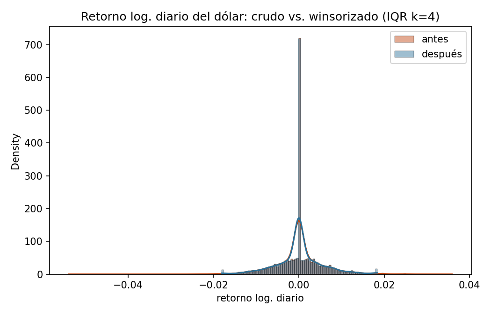
Two overlapping histograms (with a smoothed density curve on top of each) of the daily log-return of the dollar: orange is the raw, untouched distribution; blue is after winsorizing at IQR k=4. The two curves sit almost exactly on top of each other everywhere except the extreme tails, which is the point — winsorization here only clips the handful of statistically implausible days, it does not compress or reshape the bulk of real day-to-day market movement.

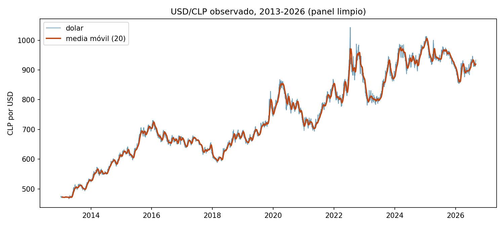
The thin line is the raw daily observed exchange rate for the full 2013–2026 history; the thick line is a 20-day rolling mean laid on top to make the medium-term trend readable through the daily noise. Useful for a gut-check on the whole panel at once: every major real move (the 2015–2016 commodity slump, the 2020 COVID shock, the 2022 peak) should be visible here before trusting any downstream model built on it.

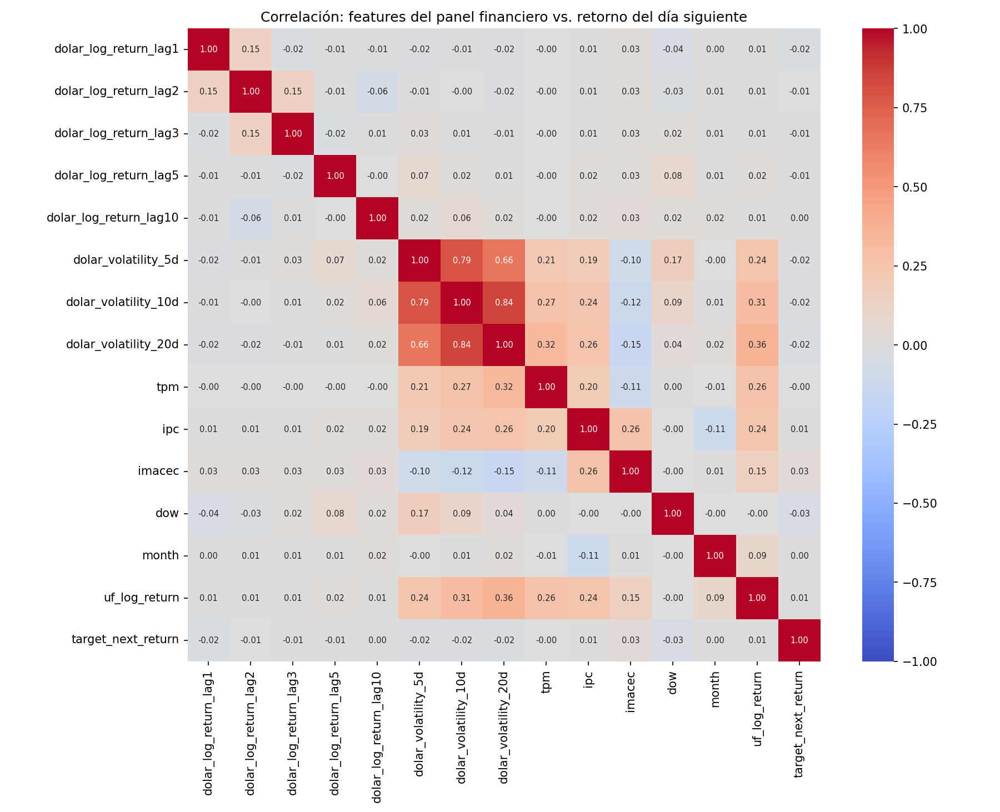
A Pearson correlation matrix (red = positive, blue = negative, white ≈ 0) between every model feature — lagged returns, rolling volatility windows, TPM/IPC/IMACEC — and the actual target column (tomorrow's return), included as its own row/column so its correlation with every feature is visible directly. Every cell touching the target is close to white: no single feature moves together with tomorrow's return in any meaningful linear way, which is exactly what should be expected of an efficient market and previews why every model in the table below lands near R²≈0.

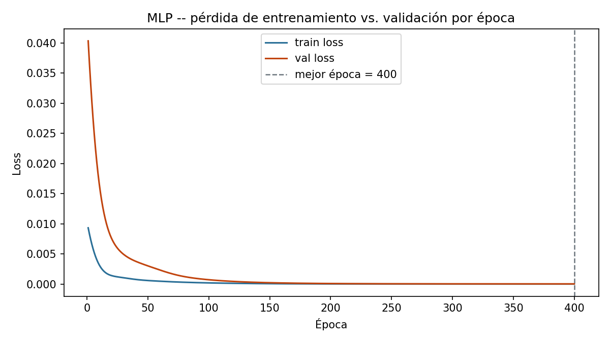
Training loss (blue) and validation loss (orange) plotted against training epoch, with a dashed vertical line marking the epoch whose validation loss was actually kept as the final model (not necessarily the last epoch run — `train_with_early_stopping` restores the best checkpoint, never just the most recent one). The training floor of ≥100 epochs is directly visible as the x-axis length.

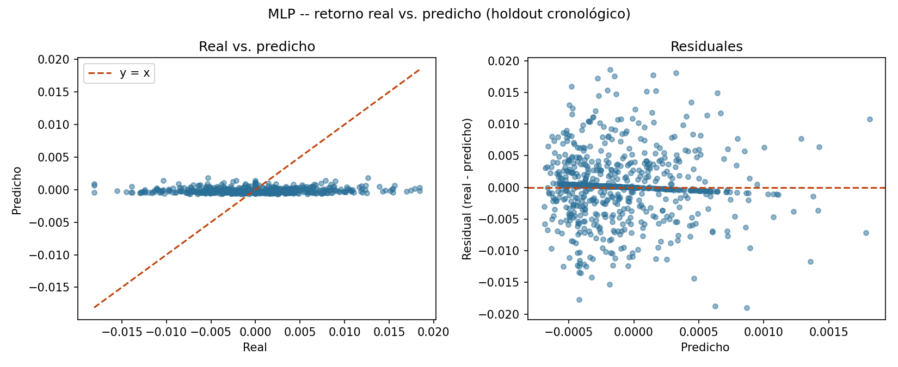
Two panels side by side. Left: every test-set day plotted as (actual return, predicted return), with a dashed diagonal line showing where a perfect model would put every point — the closer the cloud hugs that line, the better the model. Right: the same predictions' residuals (actual − predicted) plotted against the prediction itself, which should look like a flat, structureless band if the model isn't systematically over- or under-predicting in some region. Here both panels show a wide, shapeless scatter with no visible relationship to the diagonal — the honest visual signature of a model with essentially no real predictive power (R²≈0), not a plotting bug.

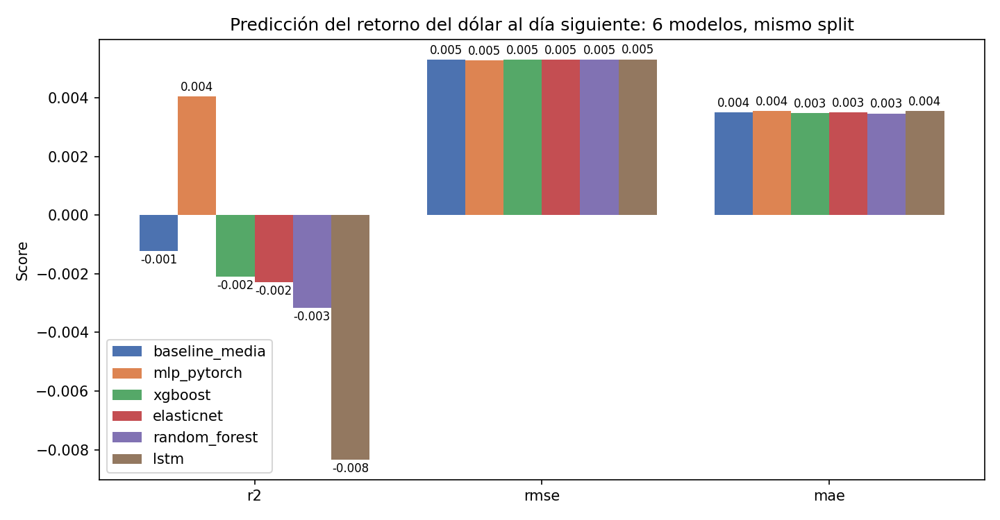
A grouped bar chart with one group of bars per model (baseline, MLP, XGBoost) across three metrics (R², RMSE, MAE), numeric value labeled on top of each bar. All three bars in every metric group sit at essentially the same height — the visual proof that none of the three approaches meaningfully outperforms a model that just predicts the historical average.

---

## Domain 2 — Mining (COCHILCO)

`src/domains/mining_cochilco/` · [`notebooks/02_mining_cochilco.ipynb`](notebooks/02_mining_cochilco.ipynb)

Real monthly copper-mine production by company, published by COCHILCO (Chile's copper commission) as an institutional-report-shaped `.xlsx` — **150 real months** (2014-01 to 2026-06), 38 real mine/company columns after excluding subtotals.

**Three real structural problems, none of them a missing value**:
1. **Row-type contamination**: title rows, annual-summary rows (column A = a bare-text year like `"2024"`), and future-month template rows are mixed in with real monthly rows — filtered by the *type* of the date cell (a real `datetime` object vs. a string that merely *parses* like one; `pd.to_datetime("2024")` silently resolves to `2024-01-01` and would collide with the real January row).
2. **Disguised subtotal columns**: beyond the obvious `Total Codelco`/`TOTAL CHILE`, three more columns (`Chuqui y R.Tomic`, `Angloamerican Sur`, `Capstone Copper`) are undocumented subtotals of other columns — confirmed by exact row-by-row numeric identity, not by name. Naively summing "all columns" overstated national production by ~2–3%.
3. **Genuine structural zeros**: a mine not yet operating, or already closed, is reported as explicit `0.0`, never a blank cell — treated as real, not imputed.

After excluding the 4 subtotal columns, the sum of the remaining 38 matches COCHILCO's own published `TOTAL CHILE` to within 1.1e-13 across all 150 rows.

**Task**: predict next month's national copper production.

| Model | R² | RMSE | MAE |
|---|---|---|---|
| Baseline (seasonal-naive) | 0.129 | 39.61 | 35.42 |
| MLP (PyTorch, 136 epochs, best@111) | 0.252 | 36.72 | 28.61 |
| XGBoost | **0.515** | 29.57 | 23.80 |

**Honest finding**: XGBoost clearly wins; both real models beat the seasonal baseline by a genuine margin. The MLP hit a second, distinct training pathology from the financial domain's: even with `LeakyReLU`, an unscaled target (mean ~450) drove R² to -77 — fixed by z-scoring the target too, not the activation.

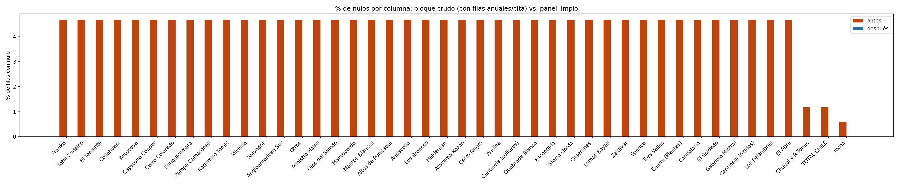
Same before/after bar-pair layout as the financial domain, but the result here is different and itself informative: both bars sit at (or near) 0% for the 38 real mine columns, because — as the writeup above explains — a mine that isn't producing reports an explicit `0.0`, not a blank cell. This chart is the visual confirmation that this domain's cleaning challenge really is structural (wrong rows/columns), not missing values, before any imputation logic gets a chance to (wrongly) treat those zeros as gaps.

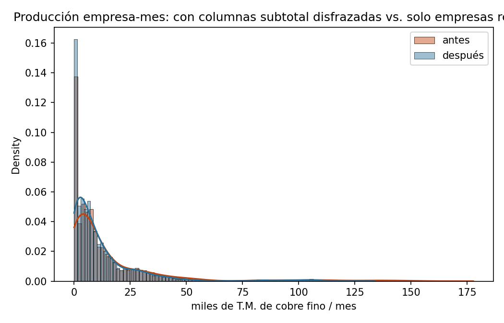
Raw (orange) vs. winsorized (blue) distribution of monthly production values, pooled across all 38 companies but winsorized independently *within* each company's own scale (k=3.0 IQR, non-zero months only) — a company producing hundreds of thousands of tons a month and one producing a few thousand are never compared against the same global cutoff, which would unfairly flag the larger operation's normal variation as "outlier."

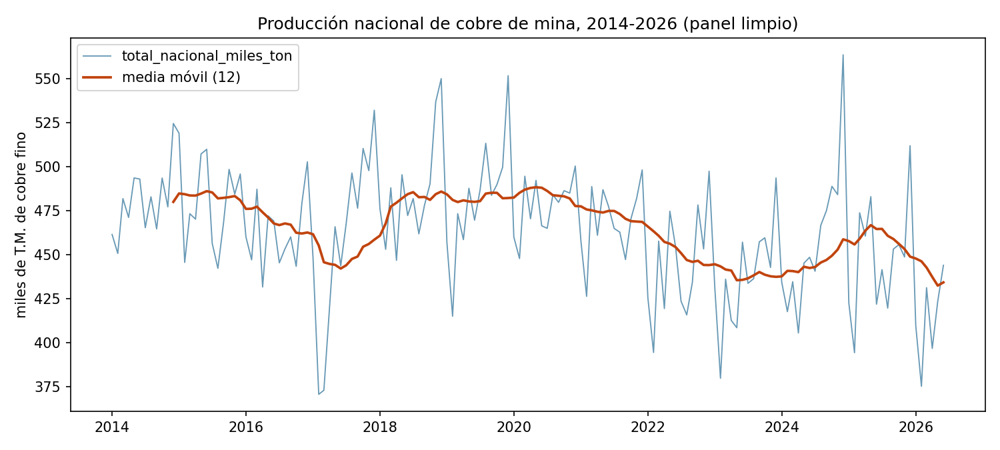
Real total national monthly copper production (the sum of the 38 real mine columns, subtotal columns excluded), 2014 through mid-2026, with a rolling mean overlaid the same way as the financial domain's dollar chart — the right place to eyeball real seasonal dips (Chilean copper output typically softens in the Southern Hemisphere winter) and any longer production trend before trusting the model's seasonal-naive baseline comparison.

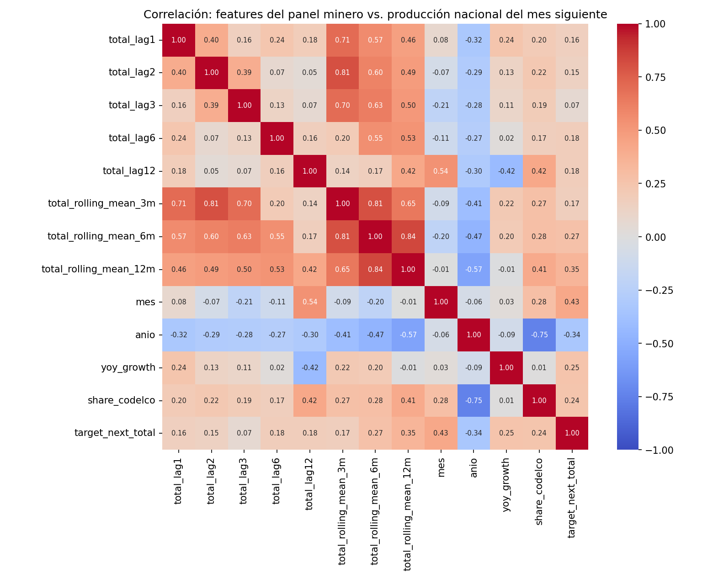
Correlation heatmap between the lag/rolling features and next month's national production. Unlike the financial domain, expect (and the chart shows) visibly strong correlation between production and its own recent lags — copper mining output is highly autocorrelated month to month, which is exactly the structure the seasonal-naive baseline already exploits, and the bar the two real models have to clear.

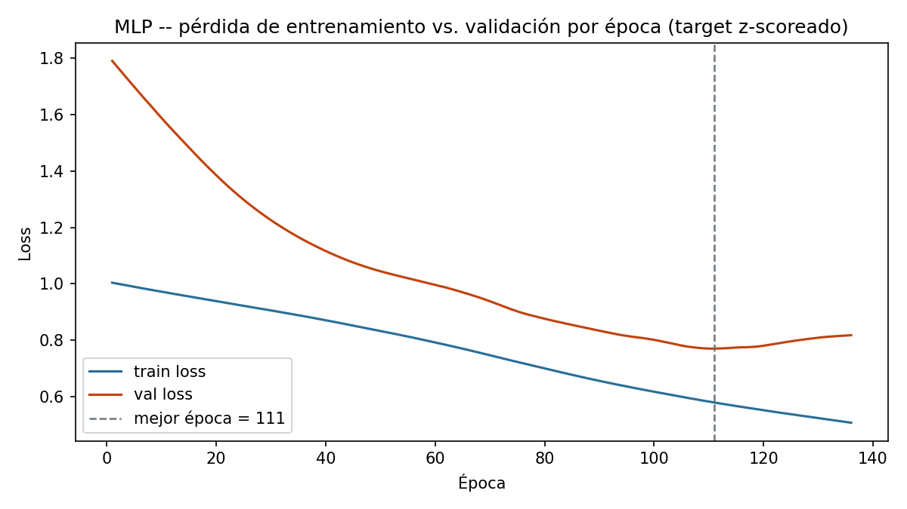
Train/validation loss vs. epoch, same reading as the financial domain's curve. This run is a concrete example of `min_epochs=100` combined with real early stopping doing its job: the model trained past the 100-epoch floor and then stopped itself at epoch 136 once validation loss stopped improving for the configured patience window, restoring the weights from its best epoch (111), not the final one.

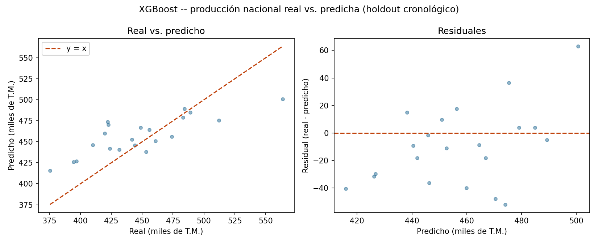
Same actual-vs-predicted-plus-residuals layout as the financial domain's diagnostic chart, but for the mining domain's best real model. Here the point cloud visibly hugs the dashed diagonal far more tightly than in the financial chart — the direct visual counterpart of XGBoost's real R²=0.515, a model that is actually explaining a meaningful share of month-to-month variation, not just matching the financial domain's honest near-zero result.

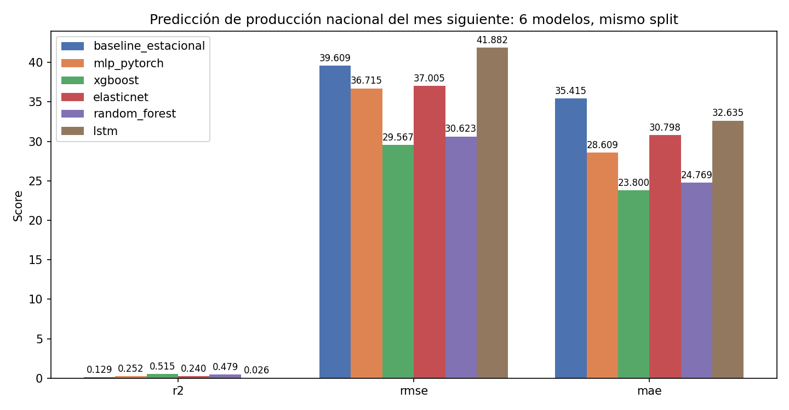
Same grouped-bar format as the financial domain, but here the three bars clearly separate instead of tying: XGBoost's bar is visibly taller on R² and shorter on RMSE/MAE than both the seasonal baseline and the MLP, in every metric — a real, ungrudging win rather than a coin-flip.

---

## Domain 3 — Agriculture (World Bank)

`src/domains/agriculture_worldbank/` · [`notebooks/03_agriculture_worldbank.ipynb`](notebooks/03_agriculture_worldbank.ipynb)

8 real World Bank indicators (`api.worldbank.org`, no auth) for 9 South American countries, 1990–2025 — cereal yield (target), fertilizer use, arable/agricultural/irrigated land, crop production index, rural population, agricultural GDP share.

**Real missingness has two very different faces here**: most indicators are nearly complete per country (34–36 of 36 real years — the rare gap is just the trailing not-yet-reported year, filled by forward interpolation). The exception is genuinely serious: irrigated-land coverage is only 50/324 real country-year cells, and **Peru has zero real observations across its entire 36-year history for that one indicator** — a gap `interpolate_within_group` cannot fix (there is no anchor point inside Peru's own series), resolved instead with cross-country mean imputation, documented rather than disguised as interpolation.

**Task**: predict next year's cereal yield from the other real indicators and lags.

| Model | R² | RMSE | MAE |
|---|---|---|---|
| Baseline (per-country mean) | -0.327 | 1283 | 1194 |
| MLP (PyTorch, 330 epochs, best@305) | 0.872 | 398 | 311 |
| XGBoost | **0.884** | 380 | 302 |

**Honest finding**: both real models beat the baseline by a large, genuine margin — a real contrast with the financial domain. The baseline is negative because yields trend upward over the decades, so a stale historical country mean systematically underestimates the 2020–2025 test period.

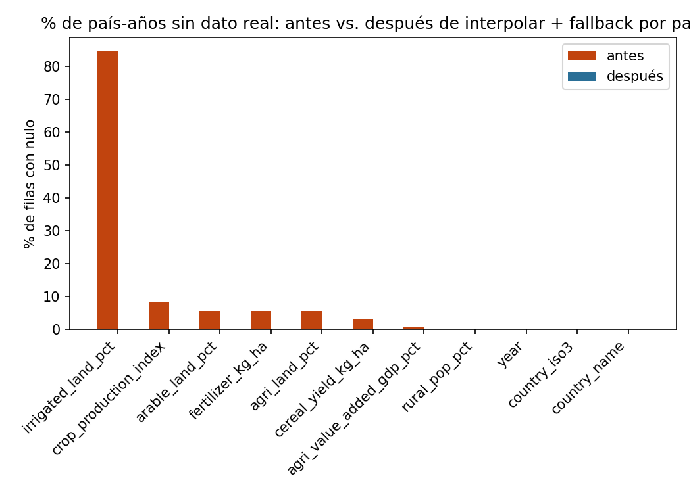
One before/after bar pair per indicator. Most indicators barely move (they were already 95%+ complete, the rare gap being a not-yet-reported trailing year). `irrigated_land_pct` is the visibly different bar in the group — it starts far higher than the rest and does **not** drop to zero after cleaning, because interpolation can only fill a gap that has real data on at least one side of it within the same country, and Peru's entire irrigation series has none; that residual bar height is Peru's cross-country-mean-imputed cells, kept honestly visible rather than hidden by a chart that only shows the "successful" indicators.

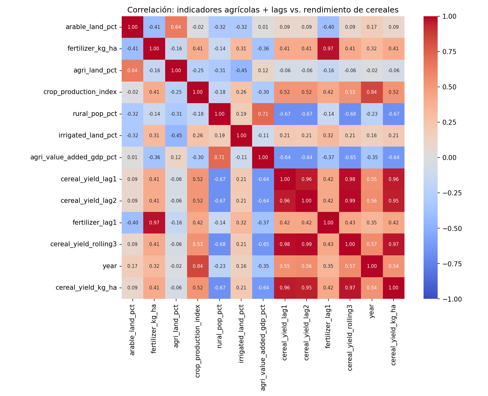
Correlation heatmap between the socioeconomic/agronomic features and next year's cereal yield. Unlike the financial domain's mostly-white row, expect real color here — fertilizer use and the yield's own lags should show visibly strong positive correlation with the target, the direct visual preview of why both real models land well above R²=0.8 in the results table.

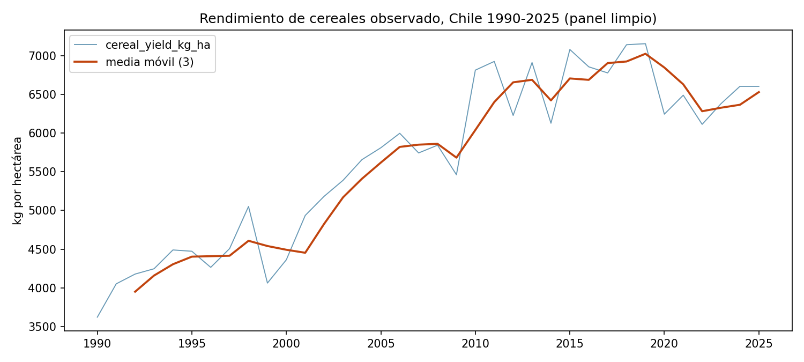
Chile's real annual cereal yield (kg/hectare), 1990–2025 — a single country's series pulled out of the 9-country panel to make the real long-run upward trend legible on its own, the same trend that makes the naive per-country-mean baseline a systematically weak predictor for the most recent test years.

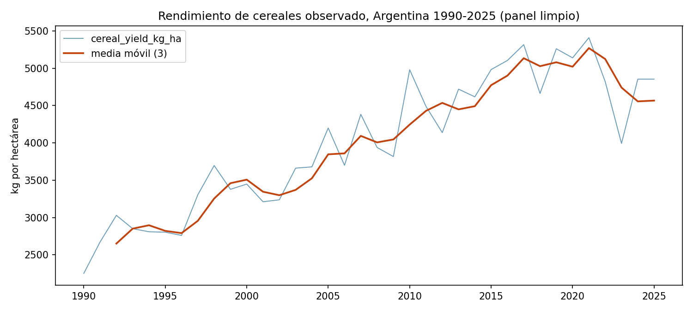
The same real series for Argentina, shown alongside Chile's specifically so the two can be compared directly — a useful sanity check that the panel's country-to-country scale differences (visible here) are genuine agronomic differences, not a units or parsing inconsistency between countries.

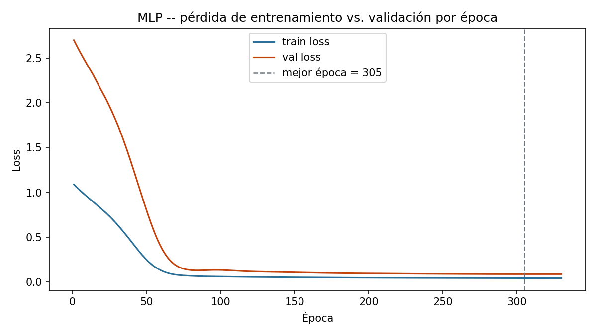
Train/validation loss vs. epoch. This run illustrates the `min_epochs=100` floor working as intended on a domain with real signal: the model needed the full runway past epoch 100 to keep improving, early-stopping only once it plateaued at epoch 330, with its best real checkpoint saved from epoch 305.

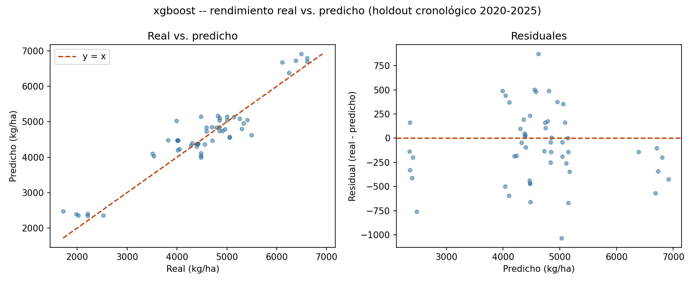
Actual-vs-predicted scatter plus residuals, same layout as the other three domains, for this domain's best model. The point cloud sits visibly close to the dashed diagonal across nearly the full yield range — the visual counterpart of a real R²≈0.88, not a cherry-picked good-looking subset.

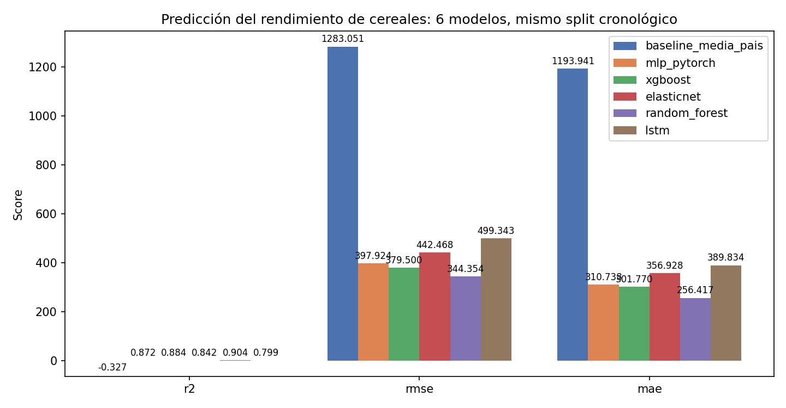
Grouped bars per model per metric. The baseline's R² bar actually dips *below* zero (the axis is drawn to show it honestly rather than clipped at 0), visually making the point that "the historical average" is a genuinely bad predictor here — while both real models' bars stand clearly, similarly tall.

---

## Domain 4 — Excel cleaning for consultancies: data lake → data warehouse

`src/domains/consulting_excel_dwh/` · [`notebooks/04_consulting_excel_dwh.ipynb`](notebooks/04_consulting_excel_dwh.ipynb)

The **full** World Development Indicators file from the World Bank: a real ~80MB Excel, 6 sheets, **401,394 real country×indicator rows** in the `Data` sheet — exactly the kind of file a consultancy receives from a client or public agency and has to turn into a queryable warehouse, not a CSV that's already tidy.

**The technique**: the `Data` sheet cannot be loaded whole into a DataFrame on every run (iterating it read-only alone takes ~50 seconds) — `fetch.py` streams it row by row (`openpyxl`, `read_only=True`) and only materializes 10 curated real indicators, a deliberate landing-zone→staging pattern for files too large to load naively. The `Country` sheet mixes real countries with regional/income aggregates ("World", "OECD members"...) distinguishable only by an empty `Region` field — filtered out before anything is modeled, or a "country" perfectly correlated with the average of the others would inflate the panel's apparent signal.

**Result**: a real DuckDB star schema (`dim_country`, `dim_indicator`, `fact_indicator_value`) — 217 real countries, 132,600 real fact rows after within-series interpolation recovered 53,003 of 61,453 originally-missing cells (86%); the remaining 8,450 are series with no real observation anywhere to interpolate from.

**Task**: predict next year's life expectancy from health spending, water/sanitation access, GDP per capita, and their lags — queried straight out of the warehouse via SQL.

| Model | R² | RMSE | MAE |
|---|---|---|---|
| Baseline (train mean) | -1.608 | 12.16 | 10.37 |
| MLP (PyTorch, 400 epochs) | 0.922 | 2.10 | 1.24 |
| XGBoost | **0.938** | 1.87 | 1.02 |

**Honest finding**: both real models predict life expectancy with real, high precision from genuine socioeconomic drivers. The baseline is strongly negative because life expectancy has a real global upward trend since 1960 that a historical mean systematically underestimates in the 2019–2024 test years.

**A note on the raw data itself**: unfiltered, it includes real, documented humanitarian catastrophes — Cambodia 1976–78 (Khmer Rouge) and Rwanda 1994 (genocide) show life expectancy around 11–12 years in this same warehouse. Kept exactly as the World Bank publishes it, not trimmed for "looking wrong."

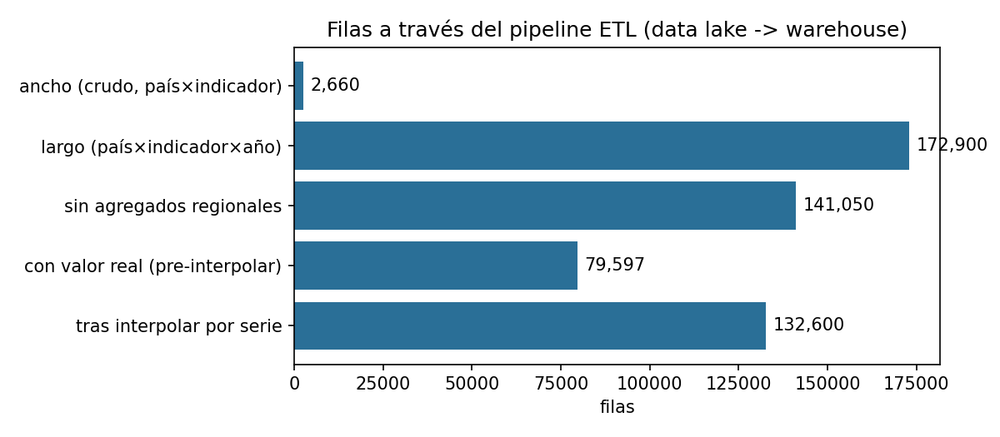
A horizontal bar per pipeline stage, each labeled with its real row count, read top to bottom: the wide raw extract (2,660 country×indicator rows, one per curated indicator) → melted to long format (172,900 country×indicator×year rows, one per real or missing observation) → after excluding regional/income aggregates via the `Country` sheet's `Region` field (141,050) → rows with a real, non-null value before any interpolation (79,597) → after within-series interpolation recovers recoverable gaps (132,600). The gap between any two consecutive bars is a real, countable effect of one specific cleaning step, not an estimate.

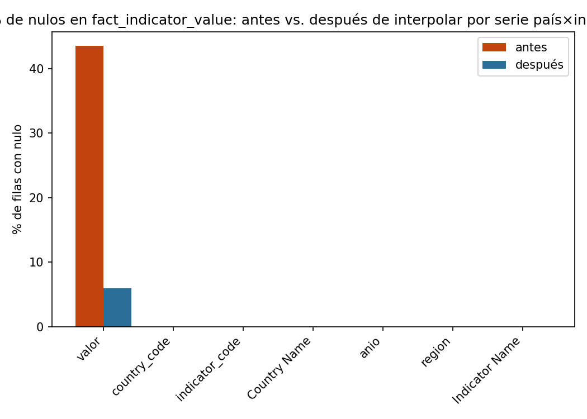
Before/after bar pair per curated indicator, at the fact-table level (country×indicator×year cells) rather than per-column like the other domains' charts — the direct numeric counterpart of the 86% gap-recovery rate quoted in the text above, and a reminder that the remaining post-cleaning bar height (14%) is exactly the set of series with literally no real observation anywhere to interpolate from, not a residual bug.

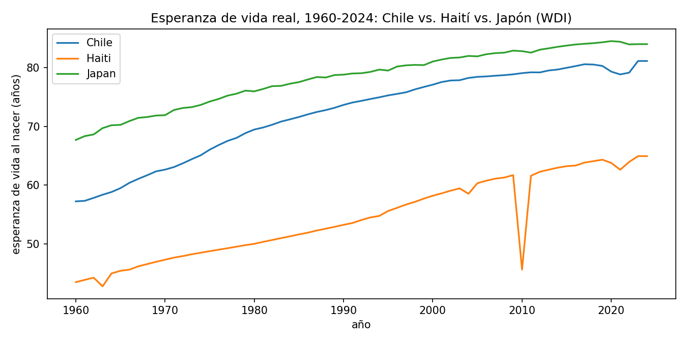
Three real national life-expectancy series pulled straight from the warehouse's fact table via SQL, 1960–2024: Chile (a steady real upward climb), Japan (starting already high and climbing further, among the world's highest), and Haiti (starting far lower and closing the gap much more slowly) — chosen specifically to make the real global inequality in this indicator visible in one chart, not to cherry-pick a flattering example.

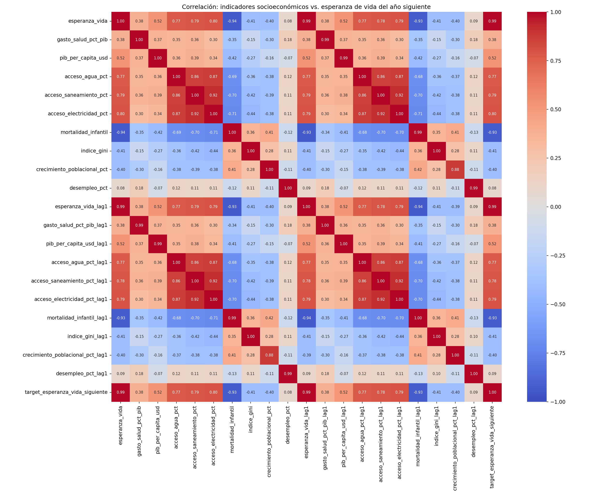
Correlation heatmap between the socioeconomic indicators (health spending, water/sanitation access, GDP per capita, infant mortality, Gini, etc.) and next year's life expectancy. Expect — and the chart shows — strong real correlation from infant mortality and basic-services access in particular, the same real drivers epidemiological literature would predict, which is what makes this domain's high R² a believable result rather than an overfit one.

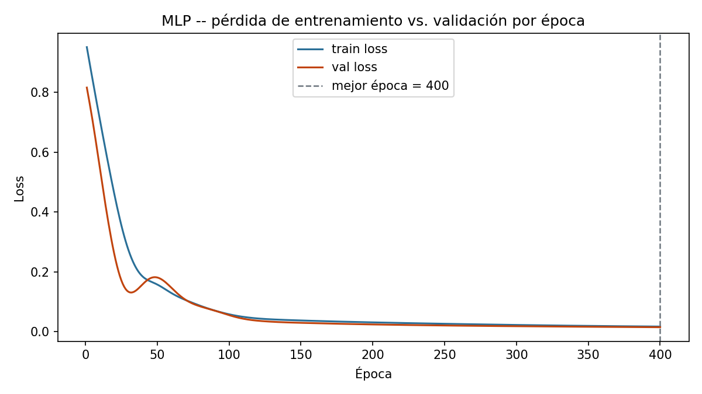
Train/validation loss vs. epoch for the life-expectancy MLP — note that both the features *and* the target were z-score scaled before training here (unlike the financial domain, where only the features were scaled), because the target's real scale (life-expectancy years, mean ~70) is far from a freshly-initialized network's near-zero output range; skipping that step is what originally produced wildly unrealistic predictions (details in `model.py`'s docstring).

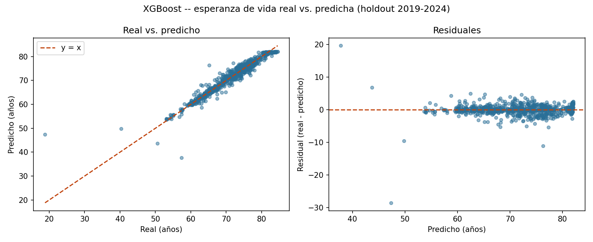
Actual-vs-predicted scatter plus residuals for the domain's best model. The cloud sits tightly along the dashed diagonal across almost the entire real range of the axis (roughly 40 to 85 years), including the countries near the low end — the visual counterpart of a real R²=0.938, the strongest result of all four domains.

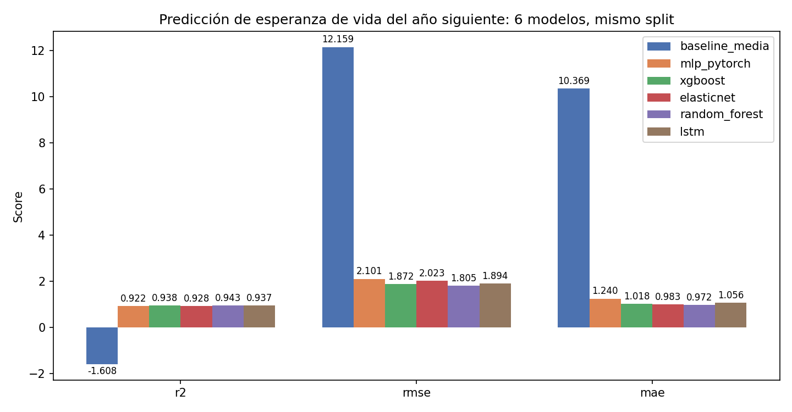
Grouped bars per model per metric — the train-mean baseline's R² bar is drawn clearly negative (not clipped at zero), the sharpest such contrast of any domain in this project, because a 1960s-era global average is a particularly bad predictor for a 2019–2024 test period given how much the real global trend has moved since then.

---

## Tests

```bash
pytest
```

91 tests, all real (no mocks): 62 unit tests on the toolkit itself, plus real smoke tests per domain (schema/plausibility checks against actually-downloaded data, and each domain's central claim — e.g. "the best model beats the baseline by a real margin" — verified as a reproducible assertion, not just stated in this README).

## Installation

```bash
python -m venv .venv
.venv\Scripts\pip install -r requirements.txt   # Windows
```

Then, per domain: `python -m src.domains.<domain>.fetch`, then `.clean`, `.features`, `.model`, `.charts` — or open the matching notebook, which runs the same pipeline with narrative.

## Stack

Python · pandas · PyTorch · XGBoost · scikit-learn · DuckDB · openpyxl · rapidfuzz · pydantic · matplotlib/seaborn · Jupyter · mindicador.cl · COCHILCO · World Bank Open Data / WDI

## Author

Pablo Reyes — Data Scientist, Santiago, Chile.

License: MIT — see [LICENSE](LICENSE).
