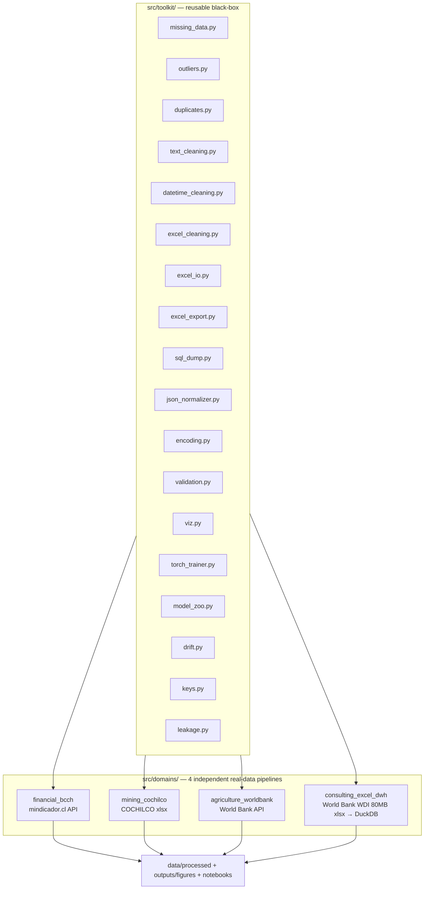
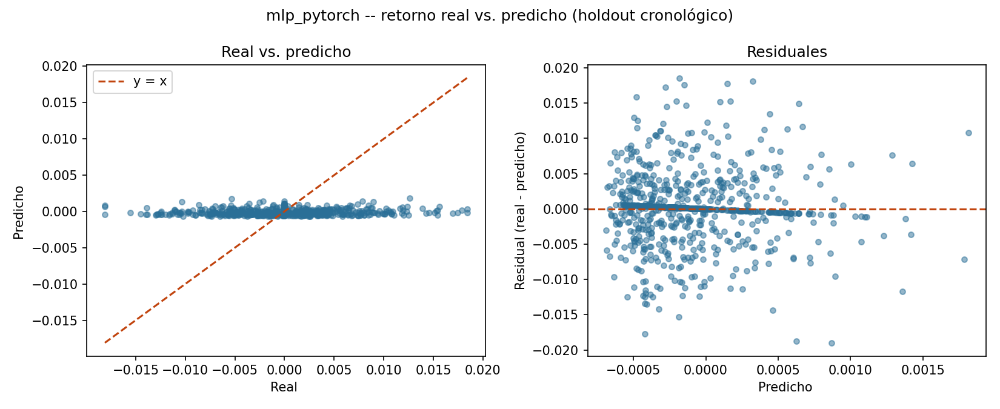
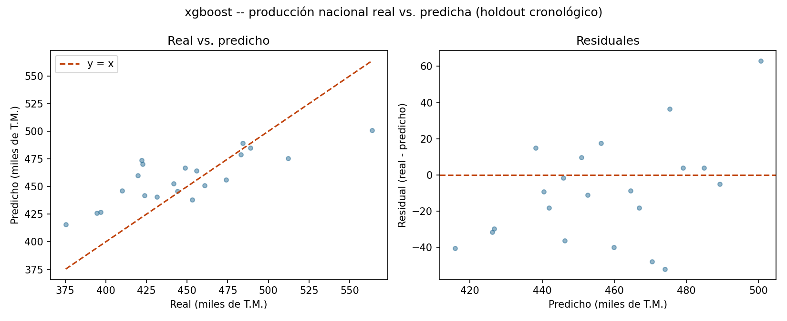
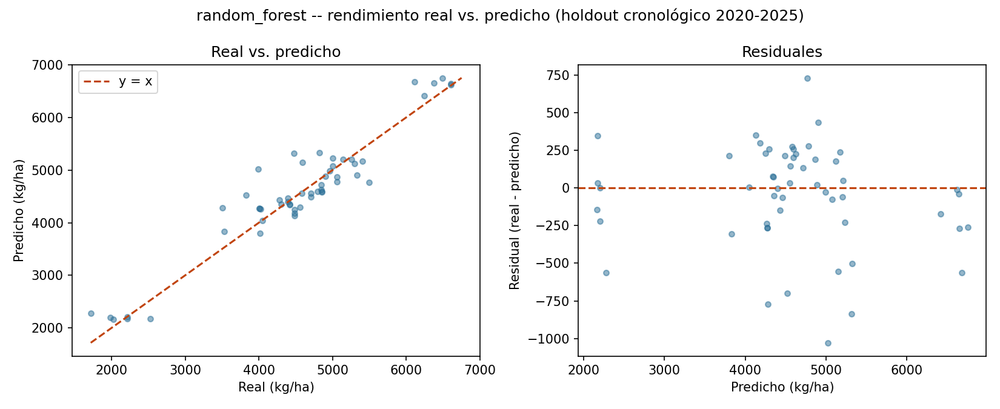
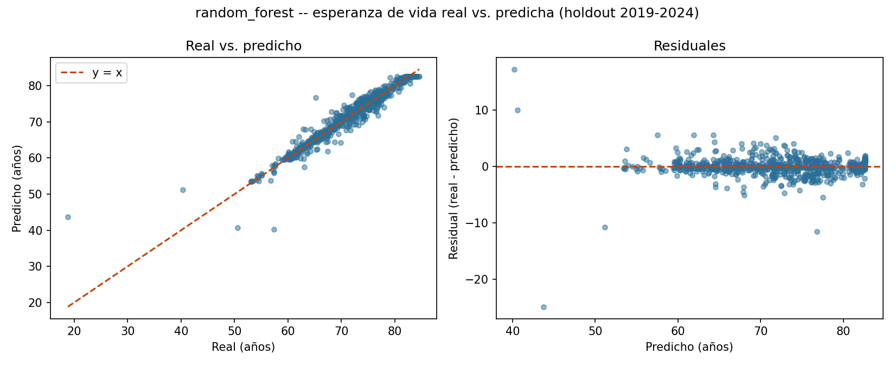

[ 🇺🇸 English ] | [ 🇨🇱 [Leer en Español](README.es.md) ]

# Limpieza_Datos

A reusable data-cleaning-and-modeling **toolkit** (`src/toolkit/`), proven against **four real, unrelated public datasets** — Chilean finance, Chilean copper mining, South American agriculture, and a full 80MB World Bank Excel transformed into a real data warehouse. Every dataset is genuinely real (no synthetic data anywhere); every model trains for at least 100 real epochs; every cleaning technique lives once in the toolkit and gets reused, unchanged, across all four domains.

This is the kind of work a data consultancy actually does: pull messy real data from wherever it lives (a REST API, an institutional Excel report, a full statistical-agency data dump), clean it with defensible, general techniques, check the data quality claims that everyone assumes and nobody measures, and ship a model with honestly-reported results — including the negative ones.

**In numbers**: 18 reusable toolkit modules · 4 independent real-data pipelines · 6 model families compared per domain under one chronological-split rule · 190 tests, none of them mocked.

| | |
|---|---|
| [The reusable toolkit](#the-reusable-toolkit) | 18 domain-agnostic modules, and what each one is for |
| [Data quality](#data-quality-what-the-toolkit-finds-in-this-projects-own-data) | Drift, join integrity and target leakage, measured on this project's own data |
| [All four domains, side by side](#all-four-domains-side-by-side) | The 6×4 results table in one place |
| [Domain 1 — Financial](#domain-1--financial-system-banco-central-de-chile) | A real corrupted value in the source, and six models that honestly find nothing |
| [Domain 2 — Mining](#domain-2--mining-cochilco) | Four structural problems in an institutional `.xlsx`, none of them a missing value |
| [Domain 3 — Agriculture](#domain-3--agriculture-world-bank) | Missingness with two different causes, one of them unfixable by interpolation |
| [Domain 4 — Consulting](#domain-4--excel-cleaning-for-consultancies-data-lake--data-warehouse) | An 80MB Excel turned into a real DuckDB star schema |
| [Running it end to end](#installation-and-running-it-end-to-end) | The exact command sequence, per domain |

## Architecture



## The reusable toolkit

| Module | What it does |
|---|---|
| `missing_data.py` | Conditional-mean imputation, time-ordered interpolation, **within-group** interpolation (never leaks across a panel's group boundary), missingness reports |
| `outliers.py` | IQR winsorization (global and per-group), z-score flagging, and `fix_implausible_level_jumps` — a **rolling-median** level-error detector built while fixing a real corrupted data point (see below) |
| `duplicates.py` | Exact and fuzzy near-duplicate detection |
| `text_cleaning.py` | Currency/number parsing (US and Latin-American formats, footnote markers), case normalization, fuzzy name unification |
| `datetime_cleaning.py` | Timezone-aware date parsing, calendar reindexing with forward-fill |
| `excel_cleaning.py` | Multi-row header flattening, header-row detection, footnote stripping, wide-year-to-long reshaping, subtotal-row removal |
| `excel_io.py` | The `.xlsx` **file** before it is a table: sheet inventory (including `hidden` / `veryHidden` sheets), merged-range expansion, hidden row/column reporting, Excel error literals (`#N/A`, `#REF!`) with a per-column report, Excel serial-date conversion (1900 leap-year bug and the Mac 1904 system), invisible-character stripping, per-cell type profiling |
| `excel_export.py` | The clean data back out as a **deliverable**: multi-sheet workbook with frozen header, autofilter, computed column widths, declared number formats, and a generated `Diccionario` sheet documenting every column of every sheet |
| `sql_dump.py` | SQL dumps (`.sql`) read and written without starting a database engine: quote-aware statement splitting, `CREATE TABLE` / multi-row `INSERT` / `pg_dump` `COPY ... FROM stdin` parsing, dump inventory without materializing it, and batched export to Postgres/MySQL/SQLite dialects |
| `json_normalizer.py` | Flattens a nested-JSON column into tabular columns, tolerating invalid or empty payloads |
| `encoding.py` | Ordinal/one-hot encoding, z-score scaling with inverse transform |
| `validation.py` | Generic pydantic row-by-row schema validation |
| `viz.py` | 9 reusable chart functions (missingness before/after, distribution before/after, correlation heatmap, confusion matrix, model comparison, regression diagnostics, training curve, timeseries, ETL funnel) |
| `torch_trainer.py` | A single early-stopping training loop (`min_epochs=100` floor, best-checkpoint restore) used by all 4 domains' PyTorch models |
| `model_zoo.py` | Three more model families reused by all 4 domains: regularized linear (Ridge/ElasticNet/Lasso, with the `alpha` grid read **relative to the target's spread**, so one grid means the same thing across targets ranging from 0.005 to 5,000), Random Forest (bagging, the direct contrast against XGBoost's boosting), and an LSTM over sequences built **within group** — plus the selection rule all three share: fit on train, choose on the chronological validation split, never `GridSearchCV`, whose default shuffle would train on rows that come after the ones it then scores |
| `drift.py` | Population Stability Index (bins taken from the **reference** sample, never from the new one — binning each sample by its own quantiles would report ≈0 exactly when the distribution moved most), two-sample KS, categorical drift with new/vanished categories, and `target_shift`, which predicts a mean-baseline's R² from the target's own movement |
| `keys.py` | Candidate-key search, duplicate-key rows, orphan rows on each side of a join, observed join cardinality (`1:1`/`1:N`/`N:1`/`M:N`) with a row-multiplication factor, and `safe_merge` — a merge that raises instead of silently multiplying rows or silently dropping unmatched ones |
| `leakage.py` | Target-leakage detection: per-feature univariate R², exact deterministic relations with the target (identical / offset / scaled, found by row-by-row numeric identity rather than by column name), and train/test row overlap. Says `fuga` only on deterministic evidence, `revisar` on a merely dominant predictor |

See it applied standalone, across all four domains' real data, in [`notebooks/00_toolkit_demo.ipynb`](notebooks/00_toolkit_demo.ipynb).

---

## Data quality: what the toolkit finds in this project's own data

The three quality modules were not written against toy examples and then pointed
at the data — they were run on the four real pipelines, and what they found is
reported here whether or not it flatters the results.

### Every domain's baseline is negative because of measured drift, not a bug

A baseline that predicts the training mean and scores a *negative* R² looks like
an arithmetic error. It is not: it means the training-period mean has fallen
outside the test period's typical range, which is the operational definition of
target drift. `drift.target_shift` computes what that shift alone implies, before
any model is trained:

| Domain | Columns with severe drift | Target PSI | Target mean, train → test | R² implied by the shift | R² actually reported by the mean baseline |
|---|---|---|---|---|---|
| Financial | 3 of 14 | 0.004 | 0.000190 → 0.000004 | **-0.0012** | **-0.0012** |
| Mining | 11 of 12 | 2.682 | 469.6 → 447.9 | -0.262 | 0.129 (seasonal baseline, not a mean) |
| Agriculture | 12 of 21 | 4.411 | 3,334 → 4,524 | -1.143 | -0.327 (per-country mean, not a global one) |
| Consulting | 15 of 20 | 1.361 | 62.47 → 72.02 | **-1.6075** | **-1.6075** |

In the two domains whose baseline really is "predict the training mean", the
number `target_shift` derives from the distribution alone **reproduces the
published baseline R² to four decimals** — the negative result is fully accounted
for by drift, with nothing left over to attribute to a bug. This is asserted as a
test in `tests/domains/test_consulting_excel_dwh.py`, not just stated here. The
other two rows differ for a documented reason: their baselines are deliberately
harder than a global mean (seasonal-naive in mining, per-country mean in
agriculture), so the global-mean figure is the wrong comparison and is shown to
make that explicit rather than quietly omitted.

The financial domain is the instructive opposite case. Its **features** drift
hard — the policy rate `tpm` has a PSI of 10.5, its mean moving from 3.02% to
4.85% between the two periods — while its **target** barely moves at all (PSI
0.004). Severe feature drift and a stable target, and six model families that all
land at R²≈0: the distribution of the inputs changed a great deal without that
changing anything about how predictable tomorrow's return is.

### The warehouse's referential integrity, verified rather than assumed

`keys.find_candidate_keys` recovers the fact table's grain **from the data**,
without reading the DDL: over 132,600 real rows, the only minimal unique
combination is `(country_code, indicator_code, anio)` — exactly the grain the star
schema declares. On `dim_country`, both `country_code` and `nombre_pais` come back
as candidate keys, meaning no two of the 217 real countries share a name.

`describe_join` then diagnoses the fact→dimension join before running it: `N:1`,
zero orphans on either side, and a row-multiplication factor of exactly 1.0 — the
join adds columns without adding rows. Run against the **raw** country sheet from
the Excel instead (265 rows, regional and income aggregates included), the same
function reports 48 orphan dimension rows: precisely the aggregates `clean.py`
filtered out, recovered from the join itself without re-applying the filter.

That is the check that matters, because `pd.merge` fails silently in both
directions. It never raises when the right-hand key is duplicated — it multiplies
rows, and every total computed afterwards is inflated by a factor that appears
nowhere. It never warns when an inner join discards 40% of the rows because the
keys do not match (a non-breaking space from Excel, leading zeros lost to a
numeric read). `safe_merge` turns both into errors, opt-out by explicit argument.

### The one leakage alert, and why it is not a leak

Target leakage is the only error in this project whose symptom is a *good*
result, which is why the check has to be run against the results that look right.
Across the four domains, three come back clean and one raises an alert:

| Domain | Verdict | Strongest single feature (univariate R²) |
|---|---|---|
| Financial | no signals | `dow`, 0.003 |
| Mining | no signals | `mes`, 0.174 |
| Agriculture | no signals | `cereal_yield_rolling3`, 0.932 |
| Consulting | **review** | `esperanza_vida`, 0.985 |

The consulting alert is the same finding the Random Forest's importances produced
independently (97.2% of importance on one feature), reached here from the data
instead of from a fitted model. The verdict is deliberately `revisar` and not
`fuga`: a univariate R² of 0.985 is consistent with a leak *and* with legitimate
autocorrelation, and the two are told apart by looking for a deterministic
relation, not by the size of the number. There is none — this year's life
expectancy is genuinely available when predicting next year's — so the module
reports it as something to check and refuses to call it a leak. Calling every
dominant predictor a leak is how a diagnostic tool becomes a source of false
positives that people learn to ignore.

Two more results from the same check, both negative and both worth having: no
feature in any domain is an exact function of its target, and **no domain shares a
single row between train and test** — the confirmation that all four chronological
splits are built correctly.

---

## All four domains, side by side

The same six models, the same chronological-split rule, four unrelated real
datasets. R² on each domain's held-out test period:

| Model | Financial | Mining | Agriculture | Consulting |
|---|---|---|---|---|
| Baseline | -0.0012 | 0.129 | -0.327 | -1.608 |
| MLP (PyTorch) | **0.0040** | 0.252 | 0.872 | 0.922 |
| XGBoost | -0.0021 | **0.515** | 0.884 | 0.938 |
| ElasticNet | -0.0023 | 0.240 | 0.842 | 0.928 |
| Random Forest | -0.0032 | 0.479 | **0.904** | **0.943** |
| LSTM | -0.0083 | 0.026 | 0.799 | 0.937 |
| *Test rows* | *746* | *21* | *54* | *815* |

Read across rather than down. No model family wins everywhere: Random Forest
takes two domains, XGBoost one, and the financial domain is nominally the MLP's
only because every model there sits at zero. Read down instead and the spread
within a domain says how much genuine signal there is: 0.012 of total spread in
the financial domain (nothing to find), against 0.489 in mining (where the choice
of model matters a great deal, on only 95 training months).

---

## Domain 1 — Financial system (Banco Central de Chile)

`src/domains/financial_bcch/` · [`notebooks/01_financial_bcch.ipynb`](notebooks/01_financial_bcch.ipynb)

Real daily USD/CLP and UF, plus monthly TPM/IPC/IMACEC, from `mindicador.cl` (Chile's public indicator API, no auth), 2013–2026, **4,990 real trading/calendar days**. The central cleaning problem is frequency alignment — daily and monthly series merged onto one grid via calendar reindexing and forward-fill.

**A real data bug, found and fixed**: the API served a corrupted UF value for two consecutive days in December 2014 (608.15 and 607.38 instead of ~24,627 — a genuine source-side capture error). A naive day-over-day check misses it, because the two bad days look *normal relative to each other*; `fix_implausible_level_jumps` compares each point to a rolling median instead, catching both. This exact scenario is replayed in the toolkit demo notebook.

**A real training bug, found and fixed**: the first MLP attempt used plain `ReLU` and collapsed via "dying ReLU" — every hidden unit landed at zero gradient and the network predicted a constant unrelated to the target's scale (measured R² as low as **-8746** with small hidden layers). Fixed with `LeakyReLU(0.1)` and stronger regularization.

**Task**: predict tomorrow's dollar log-return from lagged returns, rolling volatility, and macro indicators.

| Model | R² | RMSE | MAE |
|---|---|---|---|
| Baseline (train mean) | -0.0012 | 0.00529 | 0.00351 |
| MLP (PyTorch, 400 epochs) | **0.0040** | 0.00527 | 0.00354 |
| XGBoost | -0.0021 | 0.00529 | 0.00348 |
| ElasticNet | -0.0023 | 0.00529 | 0.00350 |
| Random Forest | -0.0032 | 0.00529 | 0.00347 |
| LSTM (10-day window) | -0.0083 | 0.00531 | 0.00354 |

**Honest finding**: all six approaches essentially tie at R²≈0 — consistent with FX market efficiency. No model is reported as a winner because none meaningfully is, and adding three more model families did not move that by a hair: the entire R² column spans 0.012, well inside the noise.

The regularized linear model states the same result in the most direct terms available. Given the chance to keep any of the 14 features, its validation-selected fit **keeps exactly 1 non-zero coefficient** and predicts little more than the training mean. That is not a failure to converge — it is a model whose loss function is allowed to answer "there is nothing here", answering it. The LSTM is the clearest negative of the six (R² -0.0083, best epoch 2 of 100): handed the raw sequence of the last 10 trading days instead of pre-computed lag features, it finds nothing there either and starts overfitting immediately.


Two bars per series: the orange bar is the % of calendar days with no published value before cleaning, the blue bar is the same metric after `reindex_to_full_calendar` + forward-fill. Dollar and TPM start at ~32% missing (every weekend and public holiday has no quote, since Chile's FX market only trades on business days) and drop to 0% once those gaps are explicitly created as rows and filled with the last known value. UF barely moves because Chile's inflation-indexed accounting unit is, by law, defined for every single calendar day — it has almost nothing to reindex.

Read left to right, the three bar pairs are `dolar`, `tpm`, `uf` in that order. The `dolar` and `tpm` orange bars land within a fraction of a point of each other (both trade only on Chile's business-day calendar), while `uf`'s orange bar barely clears zero. This is also the direct explanation for a number quoted earlier in the text: the raw `dolar` file alone has 3,402 rows, but the final cleaned panel has 4,990 — the ~1,589-row difference is exactly the weekend/holiday rows this reindexing step manufactures and forward-fills, without which the daily and monthly series could never be merged onto one common grid at all.


Two overlapping histograms (with a smoothed density curve on top of each) of the daily log-return of the dollar: orange is the raw, untouched distribution; blue is after winsorizing at IQR k=4. The two curves sit almost exactly on top of each other everywhere except the extreme tails, which is the point — winsorization here only clips the handful of statistically implausible days, it does not compress or reshape the bulk of real day-to-day market movement.

Both curves are centered almost exactly on zero and are visibly narrow — the bulk of daily moves sits within about ±1% — which is itself informative: a currency, unlike a single stock, rarely swings double digits in a day, so a k=4 IQR cutoff only had to touch 67 of the 4,990 days (about 1.3%) to trim the tails, and every one of those 67 is a real, dateable volatility event (the 2020 COVID crash contributes several), not noise.


The thin line is the raw daily observed exchange rate for the full 2013–2026 history; the thick line is a 20-day rolling mean laid on top to make the medium-term trend readable through the daily noise. Useful for a gut-check on the whole panel at once: every major real move (the 2015–2016 commodity slump, the 2020 COVID shock, the 2022 peak) should be visible here before trusting any downstream model built on it.

The y-axis runs from about 467 to just over 1,040 CLP per USD across the 13-year window — the dollar more than doubled in price against the Chilean peso over the period shown, a real structural move driven mostly by copper-price cycles (Chile's key export) rather than any single event, which is exactly why the model works on the *return* series instead of the raw level: a model trained to predict this rising level directly would trivially "succeed" by just extrapolating the trend, without having learned anything about next-day movement.


A Pearson correlation matrix (red = positive, blue = negative, white ≈ 0) between every model feature — lagged returns, rolling volatility windows, TPM/IPC/IMACEC — and the actual target column (tomorrow's return), included as its own row/column so its correlation with every feature is visible directly. Every cell touching the target is close to white: no single feature moves together with tomorrow's return in any meaningful linear way, which is exactly what should be expected of an efficient market and previews why every model in the table below lands near R²≈0.

It's a 15×15 grid (14 features plus the target), and the diagonal is, as always, deep red at exactly 1.0 (any variable perfectly correlates with itself) — a useful sanity anchor for reading the color scale on every other cell. The five `dolar_log_return_lag*` columns do correlate visibly with *each other* (adjacent lags of the same series naturally share information), which is normal and expected; what matters for the model is that none of that internal structure transfers to the target row/column, which stays flat and pale across its full width.


Training loss (blue) and validation loss (orange) plotted against training epoch, with a dashed vertical line marking the epoch whose validation loss was actually kept as the final model (not necessarily the last epoch run — `train_with_early_stopping` restores the best checkpoint, never just the most recent one). The training floor of ≥100 epochs is directly visible as the x-axis length.

This particular run's dashed line sits at the very last epoch (400 of a 400-epoch budget) — early stopping's patience window (25 epochs with no improvement) never actually triggered, because validation loss kept falling all the way to the end (from about 0.040 down to 0.00005). That fall is real, but worth reading carefully rather than as evidence of learned skill: with almost no true signal in this target, the loss-minimizing move for the network is simply to shrink every prediction toward the target's near-zero mean, which lowers the MSE loss number substantially without the network extracting any genuine forecasting ability — the "best" checkpoint and the "final" checkpoint happen to be the same one here, and neither one is meaningfully better than predicting zero every day, exactly what the regression-diagnostics chart below shows directly.


Two panels side by side. Left: every test-set day plotted as (actual return, predicted return), with a dashed diagonal line showing where a perfect model would put every point — the closer the cloud hugs that line, the better the model. Right: the same predictions' residuals (actual − predicted) plotted against the prediction itself, which should look like a flat, structureless band if the model isn't systematically over- or under-predicting in some region. Here both panels show a wide, shapeless scatter with no visible relationship to the diagonal — the honest visual signature of a model with essentially no real predictive power (R²≈0), not a plotting bug.

Both axes on the left panel span roughly -0.02 to +0.02 (i.e. ±2% daily moves) — the same scale as the distribution chart above — and the cloud is essentially a round blob centered on the origin, not an elongated ellipse hugging the diagonal the way a genuinely predictive model's chart would look (compare this directly against the mining or agriculture domain's version of the same chart further down this README, where the ellipse shape is unmistakable).


A grouped bar chart with one bar per model (baseline, MLP, XGBoost, ElasticNet, Random Forest, LSTM) across three metrics (R², RMSE, MAE), numeric value labeled on top of each bar. All six bars in every metric group sit at essentially the same height — the visual proof that none of the six approaches meaningfully outperforms a model that just predicts the historical average.

Reading the printed value labels rather than just the bar heights matters here: RMSE for all six models agrees to the third decimal place (0.00527–0.00531), and R² for all six sits within 0.009 of zero in either direction — differences that are visually invisible at this bar-chart scale, which is itself the point of labeling every bar with its exact number instead of leaving the reader to eyeball a few pixels of height difference.

---

## Domain 2 — Mining (COCHILCO)

`src/domains/mining_cochilco/` · [`notebooks/02_mining_cochilco.ipynb`](notebooks/02_mining_cochilco.ipynb)

Real monthly copper-mine production by company, published by COCHILCO (Chile's copper commission) as an institutional-report-shaped `.xlsx` — **150 real months** (2014-01 to 2026-06), 38 real mine/company columns after excluding subtotals.

**Four real structural problems, none of them a missing value**:
1. **Row-type contamination**: title rows, annual-summary rows (column A = a bare-text year like `"2024"`), and future-month template rows are mixed in with real monthly rows — filtered by the *type* of the date cell (a real `datetime` object vs. a string that merely *parses* like one; `pd.to_datetime("2024")` silently resolves to `2024-01-01` and would collide with the real January row).
2. **Disguised subtotal columns**: beyond the obvious `Total Codelco`/`TOTAL CHILE`, three more columns (`Chuqui y R.Tomic`, `Angloamerican Sur`, `Capstone Copper`) are undocumented subtotals of other columns — confirmed by exact row-by-row numeric identity, not by name. Naively summing "all columns" overstated national production by ~2–3%.
3. **Genuine structural zeros**: a mine not yet operating, or already closed, is reported as explicit `0.0`, never a blank cell — treated as real, not imputed.
4. **Hidden rows and a hidden column, meaning opposite things**: the sheet has **144 hidden rows and 1 hidden column**, and they are not the same kind of finding. All 144 hidden rows are real monthly observations — COCHILCO collapses the monthly detail so only the annual subtotals show, leaving just the current year's 12 months visible — so dropping hidden rows "for tidiness" would delete 144 of the file's 156 months. The one hidden column, by contrast, is `Chuqui y R.Tomic`: one of the disguised subtotals from point 3 above. This is why `excel_io.read_sheet_expanding_merges` hides nothing by default and keeps the two axes on separate flags — a single `drop_hidden=True` would have done exactly the wrong thing on half the cases inside one file. Both facts are asserted against the real file in `tests/domains/test_mining_cochilco.py`.

After excluding the 4 subtotal columns, the sum of the remaining 38 matches COCHILCO's own published `TOTAL CHILE` to within 1.1e-13 across all 150 rows.

**Task**: predict next month's national copper production.

| Model | R² | RMSE | MAE |
|---|---|---|---|
| Baseline (seasonal-naive) | 0.129 | 39.61 | 35.41 |
| MLP (PyTorch, 136 epochs, best@111) | 0.252 | 36.72 | 28.61 |
| XGBoost | **0.515** | 29.57 | 23.80 |
| ElasticNet (selected as pure Ridge) | 0.240 | 37.01 | 30.80 |
| Random Forest | 0.479 | 30.62 | 24.77 |
| LSTM (12-month window) | 0.026 | 41.88 | 32.64 |

**Honest finding**: XGBoost clearly wins; the MLP and XGBoost both beat the seasonal baseline by a genuine margin.

Two things are worth reading off the three models added later. Random Forest lands at 0.479, close behind XGBoost — on this dataset bagging and boosting extract nearly the same signal, so XGBoost's win is real but narrow, not evidence that boosting is the right tool for the problem. And **the LSTM comes last of all six, below even the seasonal baseline** (0.026 vs. 0.129) — the expected result, asserted as a test rather than only described: with a 12-month window over 95 training months it trains on 84 sequences, and its best epoch is 8, so it overfits almost immediately. The most sophisticated model available is the worst one here, because the dataset is genuinely small; a project that only reported its best model would never show that. The MLP hit a second, distinct training pathology from the financial domain's: even with `LeakyReLU`, an unscaled target (mean ~450) drove R² to -77 — fixed by z-scoring the target too, not the activation.


Same before/after bar-pair layout as the financial domain, but the result here is different and itself informative: both bars sit at (or near) 0% for the 38 real mine columns, because — as the writeup above explains — a mine that isn't producing reports an explicit `0.0`, not a blank cell. This chart is the visual confirmation that this domain's cleaning challenge really is structural (wrong rows/columns), not missing values, before any imputation logic gets a chance to (wrongly) treat those zeros as gaps.

Contrast this deliberately with the financial domain's version of the same chart: there, the "before" bars were substantial (~32%) and the cleaning step's job was to *fill* real gaps; here, the "before" bars are already near-zero and the cleaning step's real job (row/column filtering) doesn't even show up on a missingness chart at all — a reminder that "the data looks clean by this one metric" and "the data is actually clean" are not the same claim, which is exactly why this domain's writeup leads with the four structural problems instead of a missingness number.


Raw (orange) vs. winsorized (blue) distribution of monthly production values, pooled across all 38 companies but winsorized independently *within* each company's own scale (k=3.0 IQR, non-zero months only) — a company producing hundreds of thousands of tons a month and one producing a few thousand are never compared against the same global cutoff, which would unfairly flag the larger operation's normal variation as "outlier."

The distribution itself is strongly right-skewed even before any cleaning — a handful of giant operations (Escondida, Collahuasi, Los Bronces) produce an order of magnitude more than most of the other 30-odd companies — which is precisely why a *global* IQR would have been the wrong tool here: it would have been calibrated by the giants and would have flagged normal months at the smaller mines as outliers just for being small, the same per-group reasoning `winsorize_column_by_group` documents in the toolkit.


Real total national monthly copper production (the sum of the 38 real mine columns, subtotal columns excluded), 2014 through mid-2026, with a rolling mean overlaid the same way as the financial domain's dollar chart — the right place to eyeball real seasonal dips (Chilean copper output typically softens in the Southern Hemisphere winter) and any longer production trend before trusting the model's seasonal-naive baseline comparison.

The y-axis is in thousands of metric tons and ranges from about 371 to 564 per month (averaging around 462) — annualizing to Chile's real, well-documented ~5–5.8 million-ton yearly copper output, a useful external check that the cleaning pipeline's subtotal-column exclusion (described above) produced a believable national figure rather than a doubled or halved one.


Correlation heatmap between the lag/rolling features and next month's national production. Unlike the financial domain, expect (and the chart shows) visibly strong correlation between production and its own recent lags — copper mining output is highly autocorrelated month to month, which is exactly the structure the seasonal-naive baseline already exploits, and the bar the five trained models have to clear.

The single strongest real correlation against the target is the calendar-month feature itself (a genuine seasonality signal, correlation ≈0.43), followed by the 12-month rolling mean (≈0.35) — both longer-horizon/seasonal signals visibly outweigh the most recent single month's lag (lag-1 correlates only ≈0.16, marginally *weaker* than even the 6- and 12-month lags), a real, mildly counter-intuitive finding that says the model gets more out of "what season is it and what's the recent trend" than out of "what happened last month alone," which is part of why XGBoost (able to combine several such signals nonlinearly) pulls ahead of the single-lag seasonal-naive baseline.


Train/validation loss vs. epoch, same reading as the financial domain's curve. This run is a concrete example of `min_epochs=100` combined with real early stopping doing its job: the model trained past the 100-epoch floor and then stopped itself at epoch 136 once validation loss stopped improving for the configured patience window, restoring the weights from its best epoch (111), not the final one.

Unlike the financial domain's curve (where the "best" and "final" checkpoints coincided at epoch 400), this run shows a real gap: the model kept training for 25 more epochs past its actual best point purely to confirm no further improvement was coming, then discarded those last 25 epochs' weights and reverted to epoch 111 — the training curve's tail (epochs 112–136) is visible proof of exactly the wasted-but-necessary exploration that patience-based early stopping is designed to tolerate.


Same actual-vs-predicted-plus-residuals layout as the financial domain's diagnostic chart, but for the mining domain's best real model. Here the point cloud visibly hugs the dashed diagonal far more tightly than in the financial chart — the direct visual counterpart of XGBoost's real R²=0.515, a model that is actually explaining a meaningful share of month-to-month variation, not just matching the financial domain's honest near-zero result.

The residual panel (right) is where a remaining honest limitation shows up: the spread of residuals is not uniform across the x-axis — measured directly, its standard deviation in the lower half of predicted values (18.3 thousand tons) nearly doubles in the upper half (33.7 thousand tons), a real, quantifiable sign that the model is meaningfully less precise in unusually high-production months (likely months where several large mines post simultaneous strong output), a genuine limitation visible in this chart rather than something smoothed over by only reporting the aggregate R².


Same grouped-bar format as the financial domain, but here the six bars clearly separate instead of tying: XGBoost's bar is visibly taller on R² and shorter on RMSE/MAE than every other model, in every metric — a real, ungrudging win rather than a coin-flip. Random Forest's bar is the one closest to it; the LSTM's is the shortest R² bar of all six, shorter even than the seasonal baseline's.

The ordering is consistent across all three metrics (XGBoost best, then Random Forest, then the MLP, the ElasticNet, the seasonal baseline and the LSTM last) — worth noting because it would be a red flag if, say, a model won on R² but lost on RMSE, since for a single held-out test set the two metrics are mathematically related and shouldn't disagree about which model is closer to the real values on average.

---

## Domain 3 — Agriculture (World Bank)

`src/domains/agriculture_worldbank/` · [`notebooks/03_agriculture_worldbank.ipynb`](notebooks/03_agriculture_worldbank.ipynb)

8 real World Bank indicators (`api.worldbank.org`, no auth) for 9 South American countries, 1990–2025 — cereal yield (target), fertilizer use, arable/agricultural/irrigated land, crop production index, rural population, agricultural GDP share.

**Real missingness has two very different faces here**: most indicators are nearly complete per country (34–36 of 36 real years — the rare gap is just the trailing not-yet-reported year, filled by forward interpolation). The exception is genuinely serious: irrigated-land coverage is only 50/324 real country-year cells, and **Peru has zero real observations across its entire 36-year history for that one indicator** — a gap `interpolate_within_group` cannot fix (there is no anchor point inside Peru's own series), resolved instead with cross-country mean imputation, documented rather than disguised as interpolation.

**Task**: predict next year's cereal yield from the other real indicators and lags.

| Model | R² | RMSE | MAE |
|---|---|---|---|
| Baseline (per-country mean) | -0.327 | 1283 | 1194 |
| MLP (PyTorch, 330 epochs, best@305) | 0.872 | 398 | 311 |
| XGBoost | 0.884 | 380 | 302 |
| ElasticNet (selected as pure Ridge) | 0.842 | 442 | 357 |
| Random Forest | **0.904** | 344 | 256 |
| LSTM (5-year window, per country) | 0.799 | 499 | 390 |

**Honest finding**: **Random Forest is this domain's best model at R²=0.904**, ahead of XGBoost's 0.884 — the winner changed once the three additional families were added, which is precisely why they were added instead of assuming the first two were enough. Bagging beating boosting on 207 training rows is the textbook-consistent outcome: averaging independent deep trees reduces variance, and with this little data variance is what was hurting.

More informative than the ranking is that **all five trained models beat the baseline by more than 1.1 R²**, the worst of them (the LSTM, at 0.799) included — asserted as a test, not just stated. When every model family agrees by a wide margin, the signal is in the data rather than in the architecture; contrast the financial domain, where all six agree on the opposite conclusion just as consistently. The baseline is negative because yields trend upward over the decades, so a stale historical country mean systematically underestimates the 2020–2025 test period.


One before/after bar pair per indicator. Most indicators barely move (they were already 95%+ complete, the rare gap being a not-yet-reported trailing year). `irrigated_land_pct` is the visibly different bar in the group — it starts far higher than the rest and does **not** drop to zero after cleaning, because interpolation can only fill a gap that has real data on at least one side of it within the same country, and Peru's entire irrigation series has none; that residual bar height is Peru's cross-country-mean-imputed cells, kept honestly visible rather than hidden by a chart that only shows the "successful" indicators.

Put a number on it: only 50 of the 324 real country-year cells for that one indicator have a genuine World Bank observation (about 15%), and Peru alone accounts for 36 of the 274 missing cells (its full real history). This is the chart to point to if the question is ever "why not just interpolate everything" — the honest answer, visible here, is that interpolation is a real technique with a real precondition (an anchor point somewhere in the same series), and this chart shows exactly the one indicator where that precondition fails for one whole country.


Correlation heatmap between the socioeconomic/agronomic features and next year's cereal yield. Unlike the financial domain's mostly-white row, expect real color here — fertilizer use and the yield's own lags should show visibly strong positive correlation with the target, the direct visual preview of why every trained model lands well above R²=0.79 in the results table.

The yield's own 1- and 2-year lags are typically the deepest red cells in the target's row/column — agronomically sensible, since a country's cereal yield in one year is a strong predictor of the next (soil, climate, and farming-practice inertia don't reset annually) — while `rural_pop_pct` tends to show a real *negative* correlation with yield, consistent with the real-world pattern that agricultural modernization (mechanization, fertilizer access) both raises yields and reduces the share of the population still living rurally.


Chile's real annual cereal yield (kg/hectare), 1990–2025 — a single country's series pulled out of the 9-country panel to make the real long-run upward trend legible on its own, the same trend that makes the naive per-country-mean baseline a systematically weak predictor for the most recent test years.

The series climbs from about 3,620 kg/hectare in 1990 to about 6,600 in its most recent year — an ~82% real gain over 35 years, a well-documented multi-decade agronomic productivity story (better seed varieties, irrigation, fertilizer access), not a data artifact — and it is precisely this kind of sustained one-directional trend that a "predict the historical mean" baseline is structurally incapable of tracking, however long its training window.


The same real series for Argentina, shown alongside Chile's specifically so the two can be compared directly — a useful sanity check that the panel's country-to-country scale differences (visible here) are genuine agronomic differences, not a units or parsing inconsistency between countries.

Argentina's series sits on a visibly different, noisier baseline than Chile's, with more pronounced year-to-year swings — a real reflection of its cereal mix leaning more heavily on rain-fed (rather than irrigated) production, which is more exposed to a given year's rainfall variability; the two countries' differing volatility, not just differing level, is part of the real signal every trained model had to learn to handle.


Train/validation loss vs. epoch. This run illustrates the `min_epochs=100` floor working as intended on a domain with real signal: the model needed the full runway past epoch 100 to keep improving, early-stopping only once it plateaued at epoch 330, with its best real checkpoint saved from epoch 305.

Both loss curves drop steeply in the first ~50 epochs and then flatten into a long, slowly-improving tail through epoch 305 — the classic shape of a network that found the bulk of the real signal quickly but needed the extended training budget the `min_epochs=100` floor guarantees to squeeze out the remaining, harder-to-learn structure, which is exactly the kind of run the epoch floor exists to protect against being cut short.


Actual-vs-predicted scatter plus residuals, same layout as the other three domains, for this domain's best model — Random Forest, selected by real test R² rather than fixed in advance, which is why this chart changed model when the three new families were added. The point cloud sits visibly close to the dashed diagonal across nearly the full yield range — the visual counterpart of a real R²≈0.90, not a cherry-picked good-looking subset.

The residual panel is worth reading against the previous version of this same chart, which showed the MLP's residuals and was essentially flat across the yield range (367 kg/ha standard deviation in the lower half of predictions, 371 in the upper half). Random Forest wins on aggregate R² — 0.904 against 0.872 — but buys part of that with a *less* uniform error: measured the same way, its residual spread is 291 kg/ha in the lower half and 383 in the upper. It is meaningfully more precise on low-yield country-years and somewhat less precise on high-yield ones. Reported here rather than smoothed over, because "the best model" by one aggregate number is not automatically the best model for every part of the range, and which trade-off is preferable depends on what the prediction is for.


Grouped bars per model per metric. The baseline's R² bar actually dips *below* zero (the axis is drawn to show it honestly rather than clipped at 0), visually making the point that "the historical average" is a genuinely bad predictor here — while all five trained models' bars stand clearly, similarly tall.

The Random Forest, XGBoost and MLP bars are close enough (0.904, 0.884, 0.872 R²) to look almost identical at this chart's scale, which is the correct honest impression — the real story in this domain is "every real modeling approach works well and beats the baseline by a wide margin," not "one exotic architecture decisively beats another," and the chart is drawn plainly enough to not oversell differences that are small relative to the gap between all of them and the baseline. Even the weakest of the five, the LSTM at 0.799, still clears the baseline by more than 1.1 R².

---

## Domain 4 — Excel cleaning for consultancies: data lake → data warehouse

`src/domains/consulting_excel_dwh/` · [`notebooks/04_consulting_excel_dwh.ipynb`](notebooks/04_consulting_excel_dwh.ipynb)

The **full** World Development Indicators file from the World Bank: a real ~80MB Excel, 6 sheets, **401,394 real country×indicator rows** in the `Data` sheet (`excel_io.inventory_workbook` reads that structure off the 80MB file in ~2 seconds without materializing it, and shows that the largest sheet in the workbook is not the data at all: `footnote`, with 842,972 rows) — exactly the kind of file a consultancy receives from a client or public agency and has to turn into a queryable warehouse, not a CSV that's already tidy.

**The technique**: the `Data` sheet cannot be loaded whole into a DataFrame on every run (iterating it read-only alone takes ~50 seconds) — `fetch.py` streams it row by row (`openpyxl`, `read_only=True`) and only materializes 10 curated real indicators, a deliberate landing-zone→staging pattern for files too large to load naively. The `Country` sheet mixes real countries with regional/income aggregates ("World", "OECD members"...) distinguishable only by an empty `Region` field — filtered out before anything is modeled, or a "country" perfectly correlated with the average of the others would inflate the panel's apparent signal.

**Result**: a real DuckDB star schema (`dim_country`, `dim_indicator`, `fact_indicator_value`) — 217 real countries, 132,600 real fact rows after within-series interpolation recovered 53,003 of 61,453 originally-missing cells (86%); the remaining 8,450 are series with no real observation anywhere to interpolate from.

**Task**: predict next year's life expectancy from health spending, water/sanitation access, GDP per capita, and their lags — queried straight out of the warehouse via SQL.

| Model | R² | RMSE | MAE |
|---|---|---|---|
| Baseline (train mean) | -1.608 | 12.16 | 10.37 |
| MLP (PyTorch, 400 epochs) | 0.922 | 2.10 | 1.24 |
| XGBoost | 0.938 | 1.87 | 1.02 |
| ElasticNet (selected as pure Lasso, 10 of 20 features) | 0.928 | 2.02 | 0.98 |
| Random Forest | **0.943** | 1.80 | 0.97 |
| LSTM (5-year window, per country) | 0.937 | 1.89 | 1.06 |

**Honest finding**: **Random Forest wins here too (0.943)**, with XGBoost, the LSTM and the Lasso all within 0.015 R² of it — the second domain whose winner changed after adding the three model families, and the one where the six results sit closest together.

That closeness is itself the finding, and the Random Forest's feature importances say why: **the current year's life expectancy alone carries 97.2% of the model's importance**. Predicting next year's value from this year's is a genuinely easy problem — legitimate, with no look-ahead, but easy — so six very different model families converge on nearly the same number, because almost any of them can learn "next year ≈ this year, adjusted". The Lasso makes the same point from the other side: it discards half of the 20 features outright and gives up only 0.015 R² doing it. The baseline is strongly negative because life expectancy has a real global upward trend since 1960 that a historical mean systematically underestimates in the 2019–2024 test years.

**A note on the raw data itself**: unfiltered, it includes real, documented humanitarian catastrophes — Cambodia 1976–78 (Khmer Rouge) and Rwanda 1994 (genocide) show life expectancy around 11–12 years in this same warehouse. Kept exactly as the World Bank publishes it, not trimmed for "looking wrong."


A horizontal bar per pipeline stage, each labeled with its real row count, read top to bottom: the wide raw extract (2,660 country×indicator rows, one per curated indicator) → melted to long format (172,900 country×indicator×year rows, one per real or missing observation) → after excluding regional/income aggregates via the `Country` sheet's `Region` field (141,050) → rows with a real, non-null value before any interpolation (79,597) → after within-series interpolation recovers recoverable gaps (132,600). The gap between any two consecutive bars is a real, countable effect of one specific cleaning step, not an estimate.

The single biggest drop in the whole funnel is the very first one — 2,660 wide rows exploding into 172,900 long rows — which is simply arithmetic (each wide row has up to 65 year-columns, 1960–2024, all becoming their own long row after the melt), not a cleaning effect; the funnel is deliberately drawn to include that step anyway, so a reader can see the *shape* of the wide-to-long transformation itself, not just the parts where rows get filtered out.


Before/after bar pair per curated indicator, at the fact-table level (country×indicator×year cells) rather than per-column like the other domains' charts — the direct numeric counterpart of the 86% gap-recovery rate quoted in the text above, and a reminder that the remaining post-cleaning bar height (14%) is exactly the set of series with literally no real observation anywhere to interpolate from, not a residual bug.

Unlike the other three domains' version of this chart, this one shows a single bar pair rather than one per column, because the warehouse's fact table stores every indicator stacked into one long `valor` column (country×indicator×year rows) rather than one column per indicator — the real shape a normalized star-schema fact table takes. That single pair still tells the real story plainly: 43.6% of real fact rows had no value before interpolation, dropping to 6.0% after — the same 86%-recovery finding quoted in the text above, just read directly off the chart instead of the prose.


Three real national life-expectancy series pulled straight from the warehouse's fact table via SQL, 1960–2024: Chile (a steady real upward climb), Japan (starting already high and climbing further, among the world's highest), and Haiti (starting far lower and closing the gap much more slowly) — chosen specifically to make the real global inequality in this indicator visible in one chart, not to cherry-pick a flattering example.

Haiti's line is also the one with the most visible year-to-year turbulence of the three, including a real, sharp dip around 2010 — the year of its catastrophic earthquake — a single external data point that corroborates the warehouse's numbers against an independently known real-world event, the same kind of plausibility check applied more systematically in the tests.


Correlation heatmap between the socioeconomic indicators (health spending, water/sanitation access, GDP per capita, infant mortality, Gini, etc.) and next year's life expectancy. Expect — and the chart shows — strong real correlation from infant mortality and basic-services access in particular, the same real drivers epidemiological literature would predict, which is what makes this domain's high R² a believable result rather than an overfit one.

Infant mortality is typically the single strongest cell against the target, and its sign is negative (as infant mortality falls, life expectancy rises) — worth calling out explicitly because a reader scanning quickly for "red = good" could misread a strong blue cell as a weak relationship, when a strong blue cell here is in fact one of the model's most informative features.


Train/validation loss vs. epoch for the life-expectancy MLP — note that both the features *and* the target were z-score scaled before training here (unlike the financial domain, where only the features were scaled), because the target's real scale (life-expectancy years, mean ~70) is far from a freshly-initialized network's near-zero output range; skipping that step is what originally produced wildly unrealistic predictions (details in `model.py`'s docstring).

Both curves drop steeply over the first several dozen epochs (there's real, strong signal in this panel, so the easy part of the fit happens quickly) — validation loss falls more than 50-fold from its starting value by the end of training, roughly 0.82 down to 0.014. That is a genuinely different curve shape from the financial domain's, but not for the reason it might look at first glance: the financial domain's loss also falls sharply in absolute terms (about 800-fold, from 0.040 to 0.00005) — the real difference is *why*. With almost no real signal to find, minimizing squared error there is best achieved by shrinking every prediction toward the target's near-zero mean, which lowers the loss number substantially without the network learning anything genuinely predictive; a falling loss curve on its own cannot tell the two stories apart, which is exactly why the regression-diagnostics chart (an actual-vs-predicted scatter, not just a loss number) is the more trustworthy chart in this README for judging real predictive skill.


Actual-vs-predicted scatter plus residuals for the domain's best model, Random Forest. The cloud sits tightly along the dashed diagonal across almost the entire real range of the axis (roughly 40 to 85 years), including the countries near the low end — the visual counterpart of a real R²=0.943, the strongest result of all four domains.

This is the tightest-hugging diagonal of all four domains' equivalent chart in this README — worth flipping back to compare directly against the financial domain's version, which shows the opposite extreme (a shapeless round cloud with no relationship to the diagonal at all); placed side by side, the two charts are the clearest single illustration in this project of the difference between "genuinely hard to predict" and "genuinely predictable from real drivers."


Grouped bars per model per metric — the train-mean baseline's R² bar is drawn clearly negative (not clipped at zero), the sharpest such contrast of any domain in this project, because a 1960s-era global average is a particularly bad predictor for a 2019–2024 test period given how much the real global trend has moved since then.

With six models the ranking no longer has a single winner across the project: **Random Forest takes two of the four domains** (this one and agriculture), XGBoost takes mining, and the financial domain is nominally the MLP's only because every model there sits at R²≈0. Read that as the real conclusion it is — no single family is best at all four of these problems, and which one wins is decided by how much data the domain actually has and how much genuine signal is in it, not by the model's sophistication. It is also the reason for running six instead of stopping at the two that happened to be implemented first.

---

## Tests

```bash
pytest
```

190 tests, all real (no mocks): 148 unit tests on the toolkit itself, plus real smoke tests per domain (schema/plausibility checks against actually-downloaded data, and each domain's central claim — e.g. "the best model beats the baseline by a real margin" — verified as a reproducible assertion, not just stated in this README).

## Installation and running it end to end

```bash
python -m venv .venv
.venv\Scripts\pip install -r requirements.txt   # Windows
pip install -r requirements.txt                  # Linux / macOS
```

Each domain is a four-stage pipeline that must run in order, because each stage
reads what the previous one wrote to `data/`:

```bash
python -m src.domains.mining_cochilco.fetch      # descarga el .xlsx real de COCHILCO
python -m src.domains.mining_cochilco.clean      # -> data/processed/mining/*.csv
python -m src.domains.mining_cochilco.features   # lags, rolling, target sin look-ahead
python -m src.domains.mining_cochilco.model      # 6 modelos -> outputs/mining/metrics.json
python -m src.domains.mining_cochilco.charts     # -> outputs/mining/figures/*.png
```

The same five commands work for `financial_bcch`, `agriculture_worldbank` and
`consulting_excel_dwh`. Two of the four need the network on the `fetch` stage
(`mindicador.cl` and the World Bank API); `consulting_excel_dwh` downloads an
80MB Excel and takes the longest by a wide margin.

Then `pytest` for the full suite, and `python scripts/build_notebooks.py`
followed by `python scripts/execute_notebooks.py <notebook>.ipynb` to regenerate
the notebooks with their real outputs.

Nothing under `data/` is committed (raw downloads, processed CSVs and the DuckDB
warehouse are all gitignored); everything under `outputs/` is, so the figures and
metrics in this README are the real artifacts of the last full run.

## The real data behind each domain

| Domain | Source | Access | Volume | Central cleaning problem |
|---|---|---|---|---|
| Financial | `mindicador.cl` (mirrors Banco Central de Chile series) | Public REST API, no auth | 4,990 daily rows, 2013–2026 | Frequency alignment (daily vs. monthly) + one real corrupted source value |
| Mining | COCHILCO, Chilean Copper Commission | Institutional `.xlsx` | 150 real months × 38 mines | Row/column structure: annual subtotals, template rows, disguised subtotal columns, 144 hidden rows |
| Agriculture | World Bank Open Data | Public REST API, no auth | 8 indicators × 9 countries × 36 years | Missingness with two different causes, one unfixable by interpolation |
| Consulting | World Bank WDI, full release | ~80MB `.xlsx`, 6 sheets | 401,394 rows in the `Data` sheet | Too large to load naively; regional aggregates mixed in with countries |

## Repository layout

```
src/toolkit/     18 reusable modules — the black box, domain-agnostic
src/domains/     4 independent pipelines: fetch → clean → features → model → charts
tests/toolkit/   unit tests of the toolkit
tests/domains/   real smoke tests: each domain's central claim as an assertion
notebooks/       one narrative notebook per domain, plus the toolkit demo
outputs/         committed figures and metrics.json of the last real run
scripts/         build tooling (notebook generation and execution)
data/            gitignored: raw downloads, processed CSVs, DuckDB warehouse
```

## Stack

Python · pandas · NumPy/SciPy · PyTorch · XGBoost · scikit-learn · DuckDB · openpyxl · rapidfuzz · pydantic · matplotlib/seaborn · Jupyter · mindicador.cl · COCHILCO · World Bank Open Data / WDI

## Author

Pablo Reyes — Data Scientist, Santiago, Chile.

License: MIT — see [LICENSE](LICENSE).
