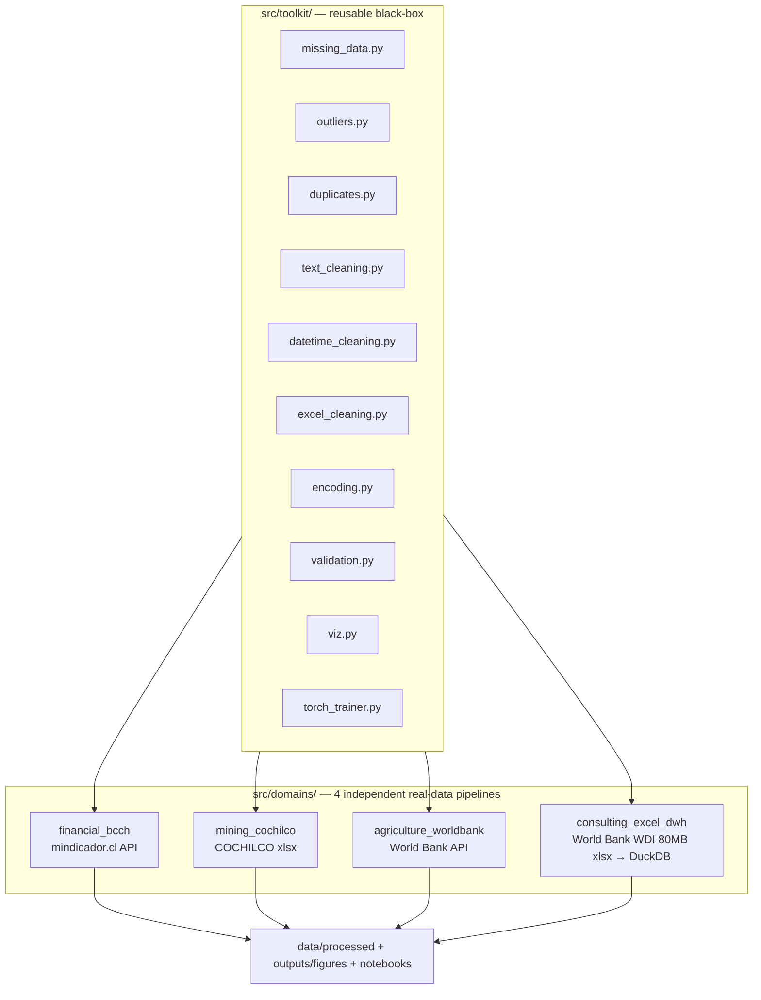

[ 🇺🇸 English ] | [ 🇨🇱 [Leer en Español](README.es.md) ]

# Limpieza_Datos

A reusable data-cleaning-and-modeling **toolkit** (`src/toolkit/`), proven against **four real, unrelated public datasets** — Chilean finance, Chilean copper mining, South American agriculture, and a full 80MB World Bank Excel transformed into a real data warehouse. Every dataset is genuinely real (no synthetic data anywhere); every model trains for at least 100 real epochs; every cleaning technique lives once in the toolkit and gets reused, unchanged, across all four domains.

This is the kind of work a data consultancy actually does: pull messy real data from wherever it lives (a REST API, an institutional Excel report, a full statistical-agency data dump), clean it with defensible, general techniques, and ship a model with honestly-reported results — including the negative ones.

## Architecture



## The reusable toolkit

| Module | What it does |
|---|---|
| `missing_data.py` | Conditional-mean imputation, time-ordered interpolation, **within-group** interpolation (never leaks across a panel's group boundary), missingness reports |
| `outliers.py` | IQR winsorization (global and per-group), z-score flagging, and `fix_implausible_level_jumps` — a **rolling-median** level-error detector built while fixing a real corrupted data point (see below) |
| `duplicates.py` | Exact and fuzzy near-duplicate detection |
| `text_cleaning.py` | Currency/number parsing (US and Latin-American formats, footnote markers), case normalization, fuzzy name unification |
| `datetime_cleaning.py` | Timezone-aware date parsing, calendar reindexing with forward-fill |
| `excel_cleaning.py` | Multi-row header flattening, header-row detection, footnote stripping, wide-year-to-long reshaping, subtotal-row removal |
| `encoding.py` | Ordinal/one-hot encoding, z-score scaling with inverse transform |
| `validation.py` | Generic pydantic row-by-row schema validation |
| `viz.py` | 9 reusable chart functions (missingness before/after, distribution before/after, correlation heatmap, confusion matrix, model comparison, regression diagnostics, training curve, timeseries, ETL funnel) |
| `torch_trainer.py` | A single early-stopping training loop (`min_epochs=100` floor, best-checkpoint restore) used by all 4 domains' PyTorch models |

See it applied standalone, across all four domains' real data, in [`notebooks/00_toolkit_demo.ipynb`](notebooks/00_toolkit_demo.ipynb).

---

## Domain 1 — Financial system (Banco Central de Chile)

`src/domains/financial_bcch/` · [`notebooks/01_financial_bcch.ipynb`](notebooks/01_financial_bcch.ipynb)

Real daily USD/CLP and UF, plus monthly TPM/IPC/IMACEC, from `mindicador.cl` (Chile's public indicator API, no auth), 2013–2026, **4,990 real trading/calendar days**. The central cleaning problem is frequency alignment — daily and monthly series merged onto one grid via calendar reindexing and forward-fill.

**A real data bug, found and fixed**: the API served a corrupted UF value for two consecutive days in December 2014 (608.15 and 607.38 instead of ~24,627 — a genuine source-side capture error). A naive day-over-day check misses it, because the two bad days look *normal relative to each other*; `fix_implausible_level_jumps` compares each point to a rolling median instead, catching both. This exact scenario is replayed in the toolkit demo notebook.

**A real training bug, found and fixed**: the first MLP attempt used plain `ReLU` and collapsed via "dying ReLU" — every hidden unit landed at zero gradient and the network predicted a constant unrelated to the target's scale (measured R² as low as **-8746** with small hidden layers). Fixed with `LeakyReLU(0.1)` and stronger regularization.

**Task**: predict tomorrow's dollar log-return from lagged returns, rolling volatility, and macro indicators.

| Model | R² | RMSE | MAE |
|---|---|---|---|
| Baseline (train mean) | -0.0012 | 0.00529 | 0.00351 |
| MLP (PyTorch, 400 epochs) | **0.0040** | 0.00527 | 0.00354 |
| XGBoost | -0.0021 | 0.00529 | 0.00348 |

**Honest finding**: all three approaches essentially tie at R²≈0 — consistent with FX market efficiency. No model is reported as a winner because none meaningfully is.


Dollar and TPM lose ~32% of calendar days (weekends/holidays); UF barely loses any — it is quoted for every calendar day, not just business days.


Only the statistically extreme tail (IQR k=4) is trimmed — real market volatility (e.g. the 2020 COVID shock) is preserved, not smoothed away.


Full 2013–2026 history with a 20-day rolling mean.


No individual feature correlates strongly with next-day return — consistent with the modeling result.


Real training run, ≥100 epochs, best checkpoint marked.


A flat, scattered cloud is the visual signature of R²≈0.


Baseline, MLP, and XGBoost essentially tie.

---

## Domain 2 — Mining (COCHILCO)

`src/domains/mining_cochilco/` · [`notebooks/02_mining_cochilco.ipynb`](notebooks/02_mining_cochilco.ipynb)

Real monthly copper-mine production by company, published by COCHILCO (Chile's copper commission) as an institutional-report-shaped `.xlsx` — **150 real months** (2014-01 to 2026-06), 38 real mine/company columns after excluding subtotals.

**Three real structural problems, none of them a missing value**:
1. **Row-type contamination**: title rows, annual-summary rows (column A = a bare-text year like `"2024"`), and future-month template rows are mixed in with real monthly rows — filtered by the *type* of the date cell (a real `datetime` object vs. a string that merely *parses* like one; `pd.to_datetime("2024")` silently resolves to `2024-01-01` and would collide with the real January row).
2. **Disguised subtotal columns**: beyond the obvious `Total Codelco`/`TOTAL CHILE`, three more columns (`Chuqui y R.Tomic`, `Angloamerican Sur`, `Capstone Copper`) are undocumented subtotals of other columns — confirmed by exact row-by-row numeric identity, not by name. Naively summing "all columns" overstated national production by ~2–3%.
3. **Genuine structural zeros**: a mine not yet operating, or already closed, is reported as explicit `0.0`, never a blank cell — treated as real, not imputed.

After excluding the 4 subtotal columns, the sum of the remaining 38 matches COCHILCO's own published `TOTAL CHILE` to within 1.1e-13 across all 150 rows.

**Task**: predict next month's national copper production.

| Model | R² | RMSE | MAE |
|---|---|---|---|
| Baseline (seasonal-naive) | 0.129 | 39.61 | 35.42 |
| MLP (PyTorch, 136 epochs, best@111) | 0.252 | 36.72 | 28.61 |
| XGBoost | **0.515** | 29.57 | 23.80 |

**Honest finding**: XGBoost clearly wins; both real models beat the seasonal baseline by a genuine margin. The MLP hit a second, distinct training pathology from the financial domain's: even with `LeakyReLU`, an unscaled target (mean ~450) drove R² to -77 — fixed by z-scoring the target too, not the activation.


Confirms zero genuinely blank cells among the real monthly rows.


Per-company winsorization (k=3.0, non-zero months only).


Real monthly national copper production, 2014–2026.


≥100 epochs, early-stopped at epoch 136, best checkpoint at 111.


---

## Domain 3 — Agriculture (World Bank)

`src/domains/agriculture_worldbank/` · [`notebooks/03_agriculture_worldbank.ipynb`](notebooks/03_agriculture_worldbank.ipynb)

8 real World Bank indicators (`api.worldbank.org`, no auth) for 9 South American countries, 1990–2025 — cereal yield (target), fertilizer use, arable/agricultural/irrigated land, crop production index, rural population, agricultural GDP share.

**Real missingness has two very different faces here**: most indicators are nearly complete per country (34–36 of 36 real years — the rare gap is just the trailing not-yet-reported year, filled by forward interpolation). The exception is genuinely serious: irrigated-land coverage is only 50/324 real country-year cells, and **Peru has zero real observations across its entire 36-year history for that one indicator** — a gap `interpolate_within_group` cannot fix (there is no anchor point inside Peru's own series), resolved instead with cross-country mean imputation, documented rather than disguised as interpolation.

**Task**: predict next year's cereal yield from the other real indicators and lags.

| Model | R² | RMSE | MAE |
|---|---|---|---|
| Baseline (per-country mean) | -0.327 | 1283 | 1194 |
| MLP (PyTorch, 330 epochs, best@305) | 0.872 | 398 | 311 |
| XGBoost | **0.884** | 380 | 302 |

**Honest finding**: both real models beat the baseline by a large, genuine margin — a real contrast with the financial domain. The baseline is negative because yields trend upward over the decades, so a stale historical country mean systematically underestimates the 2020–2025 test period.


≥100 epochs, early-stopped at epoch 330, best checkpoint at 305.


---

## Domain 4 — Excel cleaning for consultancies: data lake → data warehouse

`src/domains/consulting_excel_dwh/` · [`notebooks/04_consulting_excel_dwh.ipynb`](notebooks/04_consulting_excel_dwh.ipynb)

The **full** World Development Indicators file from the World Bank: a real ~80MB Excel, 6 sheets, **401,394 real country×indicator rows** in the `Data` sheet — exactly the kind of file a consultancy receives from a client or public agency and has to turn into a queryable warehouse, not a CSV that's already tidy.

**The technique**: the `Data` sheet cannot be loaded whole into a DataFrame on every run (iterating it read-only alone takes ~50 seconds) — `fetch.py` streams it row by row (`openpyxl`, `read_only=True`) and only materializes 10 curated real indicators, a deliberate landing-zone→staging pattern for files too large to load naively. The `Country` sheet mixes real countries with regional/income aggregates ("World", "OECD members"...) distinguishable only by an empty `Region` field — filtered out before anything is modeled, or a "country" perfectly correlated with the average of the others would inflate the panel's apparent signal.

**Result**: a real DuckDB star schema (`dim_country`, `dim_indicator`, `fact_indicator_value`) — 217 real countries, 132,600 real fact rows after within-series interpolation recovered 53,003 of 61,453 originally-missing cells (86%); the remaining 8,450 are series with no real observation anywhere to interpolate from.

**Task**: predict next year's life expectancy from health spending, water/sanitation access, GDP per capita, and their lags — queried straight out of the warehouse via SQL.

| Model | R² | RMSE | MAE |
|---|---|---|---|
| Baseline (train mean) | -1.608 | 12.16 | 10.37 |
| MLP (PyTorch, 400 epochs) | 0.922 | 2.10 | 1.24 |
| XGBoost | **0.938** | 1.87 | 1.02 |

**Honest finding**: both real models predict life expectancy with real, high precision from genuine socioeconomic drivers. The baseline is strongly negative because life expectancy has a real global upward trend since 1960 that a historical mean systematically underestimates in the 2019–2024 test years.

**A note on the raw data itself**: unfiltered, it includes real, documented humanitarian catastrophes — Cambodia 1976–78 (Khmer Rouge) and Rwanda 1994 (genocide) show life expectancy around 11–12 years in this same warehouse. Kept exactly as the World Bank publishes it, not trimmed for "looking wrong."


Row counts through raw wide → long → aggregates excluded → interpolated.


Chile vs. Haiti vs. Japan, real 1960–2024 history.


---

## Tests

```bash
pytest
```

91 tests, all real (no mocks): 62 unit tests on the toolkit itself, plus real smoke tests per domain (schema/plausibility checks against actually-downloaded data, and each domain's central claim — e.g. "the best model beats the baseline by a real margin" — verified as a reproducible assertion, not just stated in this README).

## Installation

```bash
python -m venv .venv
.venv\Scripts\pip install -r requirements.txt   # Windows
```

Then, per domain: `python -m src.domains.<domain>.fetch`, then `.clean`, `.features`, `.model`, `.charts` — or open the matching notebook, which runs the same pipeline with narrative.

## Stack

Python · pandas · PyTorch · XGBoost · scikit-learn · DuckDB · openpyxl · rapidfuzz · pydantic · matplotlib/seaborn · Jupyter · mindicador.cl · COCHILCO · World Bank Open Data / WDI

## Author

Pablo Reyes — Data Scientist, Santiago, Chile.

License: MIT — see [LICENSE](LICENSE).
