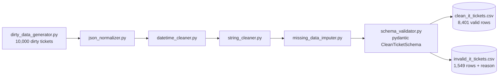

[ 🇺🇸 English ] | [ 🇨🇱 [Leer en Español](README.es.md) ]

# IT Data Wrangling Pipeline


Advanced **Data Engineering & Cleaning** project applied to IT/SaaS support operations. Generates a synthetic support-ticket dataset with the defects typical of real production data, and turns it into a clean, typed, validated dataset via a modular cleaning pipeline.

## Business Impact & Key Performance Indicators

Numbers from a real run (`python -m src.pipeline`, 10,000-ticket dataset from `dirty_data_generator.py`):

| Metric | Result | What it means |
|---|---|---|
| Rows processed | 9,950 (of 10,000 generated) | Fuzzy company-name deduplication collapsed duplicate-with-variation rows before validation |
| Valid rows after cleaning | 8,401 (84.4%) | Pass the full `pydantic` schema: types, email format, closed vocabulary, plausible cost range |
| Invalid rows, surfaced for review | 1,549 (15.6%), reason logged | Nothing is silently dropped -- every rejected row carries its `validation_error` for audit |
| Test suite | 18/18 passing | One unit test per cleaning module (`json_normalizer`, `datetime_cleaner`, `string_cleaner`, `missing_data_imputer`) |

## Goal

IT operations data almost never arrives clean: different source systems write dates in different formats, free-text fields accumulate typos and duplicates, amounts arrive in whichever currency format the entering system used, and metadata JSON payloads vary freely event to event. This project demonstrates a professional pipeline for turning that kind of "dirty" data into a clean, validated schema ready for analysis or a data-warehouse load — explicitly separating what can be corrected from what must be flagged invalid for human review, rather than forcing a made-up value.

## Project Architecture



```
it-data-wrangling-pipeline/
├── data/
│   ├── raw/                          # messy_it_tickets.csv (generated, not tracked)
│   └── processed/                    # clean_it_tickets.csv + invalid_it_tickets.csv (not tracked)
├── notebooks/
│   └── 01_dirty_data_eda.ipynb       # Diagnosis of the raw dataset's defects
├── src/
│   ├── generators/
│   │   └── dirty_data_generator.py   # Generates the synthetic dirty dataset
│   ├── cleaners/
│   │   ├── json_normalizer.py        # Flattens variable-depth nested JSON
│   │   ├── datetime_cleaner.py       # Normalizes dates/timezones to UTC ISO 8601
│   │   ├── string_cleaner.py         # Whitespace, currencies, fuzzy name unification
│   │   └── missing_data_imputer.py   # Conditional-mean / linear-interpolation imputation
│   ├── validators/
│   │   └── schema_validator.py       # pydantic schema: separates valid from invalid rows
│   └── pipeline.py                   # Orchestrates the full raw -> clean flow
├── tests/
│   └── test_cleaners.py              # Unit tests (pytest) for each cleaning module
├── requirements.txt
├── LICENSE
├── README.md
└── README.es.md
```

## Synthetic Dataset

`src/generators/dirty_data_generator.py` produces `data/raw/messy_it_tickets.csv` with 10,000 support tickets (~20 distinct client companies) intentionally including:

- **Mixed dates and timezones**: at least 6 distinct date formats (ISO, `dd/mm/yyyy`, `mm/dd/yyyy` in 12h, month name, etc.) combined with numeric offsets and timezone abbreviations (`UTC`, `Z`, `EST`, `PST`, `CET`).
- **`user_metadata`**: nested JSON of variable depth (0 to 3 levels), with lists, or empty/`null`.
- **Company typos and duplicates**: inconsistent casing, legal suffixes (`Inc.`, `LLC`, `Corp.`), double spaces, character substitution, and duplicate-with-variation rows representing double-capture of the same ticket.
- **Mixed currencies**: `"$1,200.50"` (US format), `"1200,50 €"` (European format), currency code as a suffix (`"1,050.75 USD"`), and some negative refunds.
- **Inconsistent missingness**: real `NaN`, placeholder strings (`"null"`, `"N/A"`, `"-"`, `"?"`), and fully empty rows simulating corrupted exports.

## Cleaning Modules (`src/cleaners/`)

| Module | What it does |
|---|---|
| `json_normalizer.py` | Flattens `user_metadata` into flat columns (`user_metadata_browser_name`, etc.), tolerating any depth and null/malformed values. |
| `datetime_cleaner.py` | Parses any of the dataset's formats/timezones and normalizes to UTC ISO 8601. Honest, documented limitation: without locale metadata, a date like `"07/09/2024"` is genuinely ambiguous (day/month vs. month/day) — a consistent convention is assumed, and only retried with the other one if the first fails outright. |
| `string_cleaner.py` | Trims/collapses whitespace, parses amounts with mixed decimal separators to `float`, normalizes categorical-field casing, and uses `rapidfuzz` (`fuzz.WRatio` + `utils.default_process`) to collapse typo/variant company names to a canonical value. |
| `missing_data_imputer.py` | Two numeric imputation strategies: category-conditional mean (`cost` by `category`) and linear interpolation respecting temporal order (`response_time_hours` by `created_at`). |

Deliberately **not** everything missing gets imputed: a missing company name, agent, or category has no "correct" value to invent, so those rows are surfaced by the schema validator instead of being filled with a silent placeholder.

## Schema Validation (`src/validators/schema_validator.py`)

A `pydantic` model (`CleanTicketSchema`) defines the contract for a clean row: types, email format, closed vocabulary for `priority`/`status`/`category`, and a plausible `cost` range. `validate_dataframe()` splits the cleaned DataFrame into `(valid_rows, invalid_rows)` — the latter carrying a `validation_error` column for audit, rather than silently discarding whatever automated cleaning couldn't resolve with confidence.

## Installation

```bash
python -m venv .venv
source .venv/bin/activate      # On Windows: .venv\Scripts\activate
pip install -r requirements.txt
```

## Usage

Generate the dirty dataset:

```bash
python -m src.generators.dirty_data_generator
```

Run the full cleaning pipeline:

```bash
python -m src.pipeline
```

Downloads/generates nothing on its own — it reads `data/raw/messy_it_tickets.csv`, applies every cleaner in order, imputes what can be reasonably imputed, validates the resulting schema, and prints a summary. Writes `data/processed/clean_it_tickets.csv` (valid rows) and `data/processed/invalid_it_tickets.csv` (rejected rows, with the reason).

Unit tests:

```bash
pytest tests/
```

## Tech Stack

- **pandas / numpy** — data manipulation and transformation
- **pydantic** — strongly-typed schema validation
- **rapidfuzz** — fuzzy matching for name unification
- **openpyxl** — Excel read/write support
- **matplotlib / seaborn** — exploratory visualization
- **pytest** — unit tests

## License

MIT — see [LICENSE](LICENSE).

## Author

**Pablo Reyes** — [github.com/Rxyxs](https://github.com/Rxyxs)
